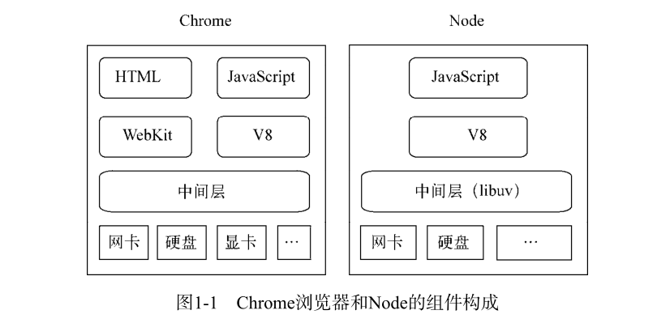
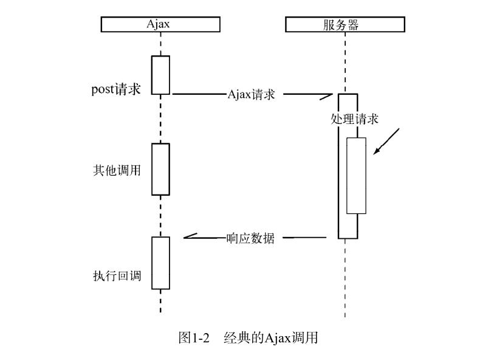
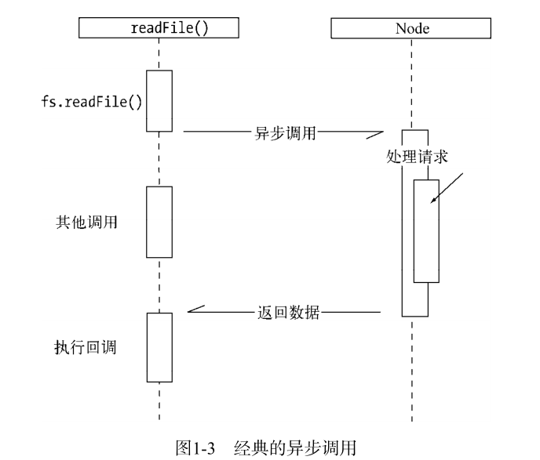
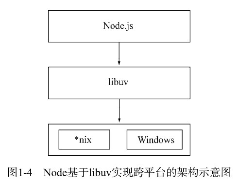
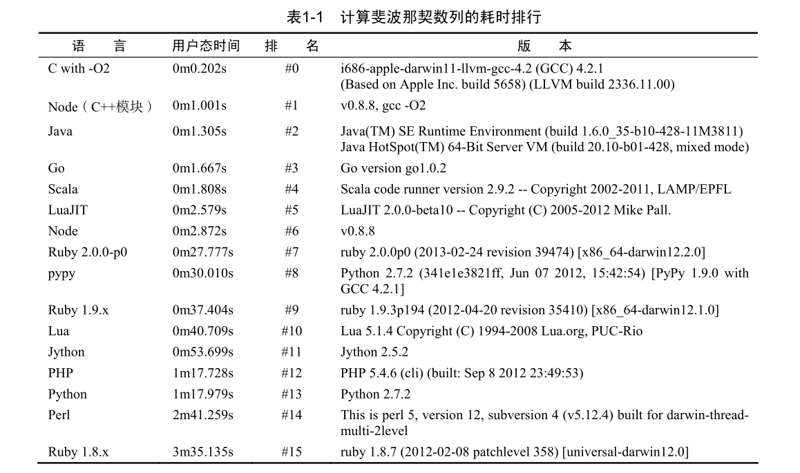
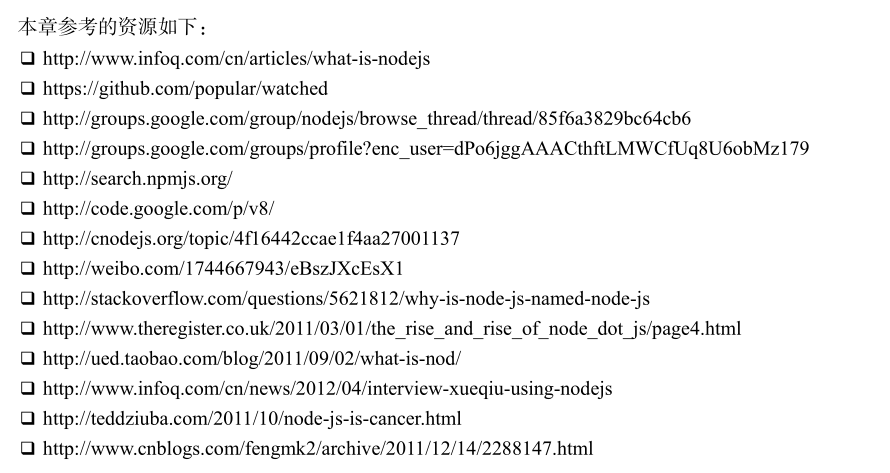
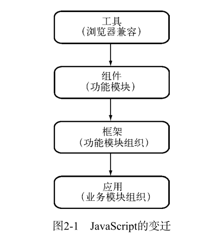
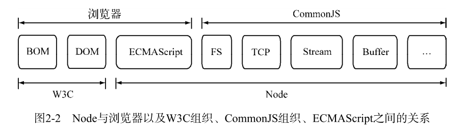
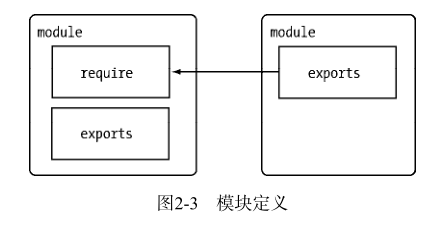
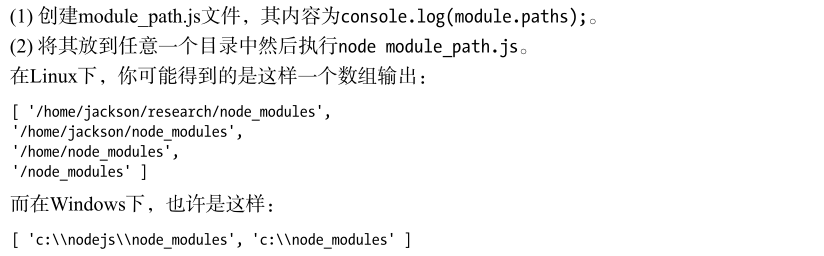

(注1：大体看了一下目录，感觉Node并不好学，概念很晦涩，也是自己不熟悉后端有关吧)

(注2：现在是2020年11月9日，11个月过去了，Node视频我也学了一点了，我觉得是时候可以稍微看看这本书了。)

(注3：我觉得现在有必要再把操作系统拿过来学一下了，就看这个刚考完研的学生讲的的[操作系统视频](https://www.bilibili.com/video/BV1LW411q7Kk?from=search&seid=16303634005756326075)吧，之前看过，没看完，讲的还挺通俗的。)

# 前言

[Ryan Dahl](https://en.wikipedia.org/wiki/Ryan_Dahl)

[什么是图灵完备？](https://www.zhihu.com/question/20115374)

2006年至今，我们时常可以看到JavaScript的新闻，刚开始只是JavaScript引擎性能的提升，到后来发现很多是来自HTML5和Node创造的奇迹。如果只看表面，很容易让人感觉这又是一颗卫星。这种现象让人觉得不可信，所以出现了以下各种版本的误解。

* Node肯定是几个前端工程师在实验室里捣鼓出来的。
* 为了后端而后端，有意思吗？
* 怎么又发明了一门新语言？
* JavaScript承担的责任太重了。
* 直觉上，JavaScript不应该运行在后端。
* 前端工程师要逆袭了。

一方面，大家看到JavaScript在各个地方放出异彩，其他语言的开发者既羡慕它的成果，又担心它对当前所从事的语言造成冲击；另一方面，人们还是有JavaScript只能做前端脚本的定势思维。究其原因，还是因为人们缺乏历史观层次上的认知，所以会产生一些莫须有的惴惴不安。

1995年，JavaScript随网景公司发布的Netscape Navigator 2.0发布，它最早命名为LiveScript，随后更名为JavaScript，它出自如今的Mozilla公司的CTO——Brendan Eich之手，其产生来源于网景公司发布的Netscape Navigator浏览器需要一种脚本语言来协助浏览器做一些简单的动态操作。当时网景公司与Sun公司合作密切，不懂技术的管理层希望得到一个Java的脚本版语言，以期能像Java一样风靡。Brendan Eich原本进入网景公司是希望做Scheme语言的开发，但是却接到了一个不喜欢的任务，但迫于当时形势，不得不完成此事，于是JavaScript之父在10天的时间里仓促完成了JavaScript的设计，当时的项目代号是Mocha，名字叫LiveScript。

这门语言除了看起来像Java外，本质与Java语言相去甚远，管理层期望的Java Script其实借鉴了C、Scheme、Self、Java的设计。尽管仓促，但是这门语言还是借鉴了其他语言的不少优点，如函数式、原型链继承等。处于Java阴影下的这门语言获得了它最终的名字：JavaScript至今，仍然还有许多人分不清Java与JavaScript的关系，就像分不清雷锋与雷峰塔一样。

虽然JavaScript的产生与Netscape Navigator浏览器的需求有关系，但它并非只是设计出来用于浏览器前端的。早在1994年，网景公司就公布了其Netscape Enterprise Server中的一种服务器端脚本实现，它的名字叫LiveWire，是最早的服务器端Javascript，甚至早于浏览器中的JavaScript公布。对于这门**图灵完备**的语言，网景早就开始尝试将它用在后端。

随后，微软在第一次浏览器大战时，于1996年发布的IE3.0中也包含了它的脚本语言：JScript基于商标的原因，它叫JScript，但是与JavaScript兼容。在1997年年初，微软在它的服务器IS 3.0中也包含了JScript，这就是我们在ASP中能使用的脚本语言。鉴于微软处处与网景针锋相对，出于保护自己的目的，网景公司推进了JavaScript的标准化进程，于1996年11月将JavaScript递交给ECMA国际标准组织，在1997年7月公布了第一个版本，是为ECMA-262号标准，又称ECMAScript。

可以看到，JavaScript一早就能运行在前后端，但风云变幻，在前后端各自的待遇却不尽相同。伴随着Java、PHP、NET等服务器端技术的风靡，与前端浏览器中的JavaScript越来越重要相比，服务器端JavaScript逐渐式微。只剩下Rhino、SpiderMonkey用于工具。

然而，这个世界是变化的。第一次浏览器大战落幕后的Javascript的世界有些平静，但依然在萌生一些变化。Google对Ajax的应用让JavaScript变得越来越重要。Firefox的发布掀起了对IE的反攻，迎来了第二次浏览器大战，竞争令JavaScript的性能不断提升，Chrome的加入令它高潮迭出。CommonJS规范的提出，不断在完善JavaScript。 ECMAScript标准的不断推进，令语言更加精炼简洁，不停地去芜存菁。

浏览器端JavaScript在web应用中盛行，甚至让人们忘掉了JavaScript可以在服务器端运行这码事。但是，服务器端JavaScript现在回来了，因为Node诞生了。Node的诞生离不开上述的历史契机，服务器端JavaScript在漫长的历史中长期停滞留下空白，但Node重新将这个领域激活。Ryan Dahl基于对高性能Web服务器的探索，无意间促成了服务器端JavaScript领域的焕然一新。Node凭借v8的高性能和异步1/0模型将JavaScript重新推向了一个高潮。现在，Node不仅满足Javascript同时运行在前后端，而且性能还十分高效。与传统印象中的不同，它甚至可比于当前的高效脚本语言。

奇妙的反应还在继续，前后端要跨语言开发的现状已经开始改变，因为语言堆栈的不同，开发者的分工也进行了细分：前端工程师和后端工程师。专业技能因为分工而精进，但也将技能变为专利，似乎前端工程师不能进行后端开发，后端工程师搞不定前端开发，犹如树立的墙。但Node的出现令这种分工的界限又开始模糊了。同时一些后端工程师也关注到Node，他们甚至不关心前后端语言是否一致，而是赤裸裸地表示对Node高性能的垂涎，如实时、高并发等。

大量的前后端工程师加入了Node的开发阵营，GitHub上JavaScript是最活跃的开发语言，NPM社区第三方模块恐怖的增长速度和下载量都昭示着这个过程不可逆，在这里吼一声万能的NPM，总能找到你需要的解决方案。很多不断涌现的项目和创意都因为Node和前端开发能共用种语言而独特。换言之，Node的本意是提供一个高性能的面向网络的执行平台，但无意间促成了JavaScript社区的繁荣，并进而形成强大的生态系统。

## 阅读建议

本书并非完全按照顺序递进式介绍，如第2章是从代码组织结构看待Node，第3章是从运行结构看Node，第4章则是从编程结构看Node，第5章则是Node中内存结构的揭示，第6章谈及的是Node中的数据在I/O流中的结构或状态，第7章是Node在网络服务角度的介绍，第8章是Node在HTTP上的展现，第9章讨论了Node的单机集群结构，第10章是从单元测试和性能测试的角度去关注Node，第11章虽然已经脱离了Node编码的范畴，但是站在产品化的角度看待Node，也会颇有收获。

下面是各章的详细介绍。

第1章：这一章简要介绍了Node，从中可以了解Node的发展历程及其带来的影响和价值。

第2章：这一章介绍了Node的模块机制，从中可以了解到Node是如何实现CommonJS模块和包规范的。在这一章中，我们详细解释了模块在引用过程中的编译、加载规则。另外，我们还能读到更深度的关于Node自身源代码的组织架构。

第3章：这一章展示了在Node中我们将异步I/O作为主要设计理念的原因。另外，还会介绍到异步I/O的详细实现过程。

第4章：这一章主要介绍异步编程，其中有常见的异步编程问题介绍，也有详细的解决方案。
在这一章中，我们可以接触到Promise、事件、高阶函数是如何进行流程控制的。

第5章：这一章主要介绍了Node中的内存控制，主要内容有垃圾回收、内存限制、查看内存、内存泄漏、大内存应用等细节。

第6章：这一章介绍了前端JavaScript里不能遇到的Buffer。由于Node中会涉及频繁的网络和磁盘I/O，处理字节流数据会是很常见的行为，这部分场景与纯粹的前端开发完全不同。

第7章：这一章介绍了Node支持的TCP、UDP、HTTP编程，还附赠了WebSocket与TLS、HTTPS的介绍。

第8章：这一章介绍了构建Web应用的过程中用到的大多数技术细节，如数据处理、路由、MVC、模板、RESTful等。

第9章：这一章介绍了Node的多进程技术，以及如何借助多进程的方式来提升应用的可用性和性能。

第10章：这一章介绍了Node的单元测试和性能测试技巧。

第11章：“行百里者半九十”，完成产品开发的代码编写后，才完成了项目的第一步。这一章介绍了将Node产品化所需要注意到的细节，如项目工程化、代码部署、日志、性能、监控报警、稳定性、异构共存等。

附录A：详细介绍了Node的安装步骤。

附录B：讨论了Node的调试技巧。

附录C：探讨了团队实践或多人协作过程中需要关注的编码规范问题，它可以很好地规避一些低级的、明显的错误。

附录D：作为企业开发者，必须关注模块仓库的搭建管理。在这一章中，我们介绍了如何通过搭建私有NPM来解决企业隐私安全等方面的问题。

# 第1章：Node简介

Node应该是如今最火热的技术了，从本章开始，我们将逐步揭示它的诸多细节。

## Node的诞生历程

Node的诞生历程如下所示。

* 2009年3月，Ryan Dahl在其博客上宣布准备基于V8创建一个轻量级的Web服务器并提供一套库。
* 2009年5月，Ryan Dahl在GitHub上发布了最初的版本，
* 2009年12月和2010年4月，两届JSConf大会都安排了Node的讲座。
* 2010年年底，Node获得硅谷云计算服务商Joyent公司的资助，其创始人Ryan Dahl加入Joyent公司全职负责Node的发展
* 2011年7月，Node在微软的支持下发布了其Windows版本。
* 2011年11月，Node超越Ruby on Rails，成为GitHub上关注度最高的项目（随后被Bootstrap项目超越，目前仍居第二）。
* 2012年1月底，Ryan Dahl在对Node架构设计满意的情况下，将掌门人的身份转交给Isaac Z.Schlueter，自己转向一些研究项目。Isaac Z.Schlueter是Node的包管理器NPM的作者，之后Node的版本发布和bug修复等工作由他接手。
* 截至笔者执笔之日（2013年7月13日），发布的Node稳定版为v0.10.13，非稳定版为v0.11.4，NPM的官方模块数达到34 943个，模块的周下载量为1479万次。
* 随后，Node的发布计划主要集中在性能提升上，在v0.14之后，正式发布出v1.0版本。

## Node的命名和起源

在Node的官方网站（http://nodejs.org）之外，Node具有很多别称：`Nodejs`、`NodeJS`、`Node.js`等。本书在写作过程中遵循官方的说法，将会一直使用Node这个名字，但是在当前语境之外，为了与其余表示节点的技术或名词相区别，均可以带上`.js`表明它是Node。在听到这些词汇时，应该意识到，它们说的是一码事。除了本书的封面和此处会用到Node.js外，其余地方都会以Node作为正式称谓。

Node名字的来由，其实跟它的起源是有密切关系的。

### 为什么是JavaScript

Ryan Dahl是一名资深的**C/C++程序员**，在创造出Node之前，他的主要工作都是围绕**高性能Web服务器**进行的。经历过一些尝试和失败之后，他找到了设计高性能，Web服务器的几个要点：**事件驱动**、**非阻塞I/O**。

所以Ryan Dahl最初的目标是写一个基于**事件驱动、非阻塞I/O的Web服务器**，以达到更高的性能，提供Apache等服务器**之外的选择**。他提到，大多数人不设计一种更简单和更有效率的程序的主要原因是他们用到了阻塞I/O的库。写作Node的时候，Ryan Dahl曾经评估过C、Lua、Haskell、Ruby等语言作为备选实现，结论为：C的开发门槛高，可以预见不会有太多的开发者能将它用于日常的业务开发，所以舍弃它；Ryan Dahl觉得自己还不足够玩转Haskell，所以舍弃它；Lua自身已经含有很多阻塞/0库，为其构建非阻塞I/O库也不能改变人们继续使用阻塞I/O库的习惯，所以也舍弃它；而Ruby的虚拟机由于性能不好而落选。

相比之下，JavaScript比C的开发门槛要低，比Lua的历史包袱要少。尽管服务器端JavaScript存在已经很多年了，但是后端部分一直没有市场，可以说**历史包袱为零**，为其导入非阻塞I/O库没有额外阻力。另外，JavaScript在浏览器中**有广泛的事件驱动方面的应用**，暗合Ryan Dahl喜好基于事件驱动的需求。当时，第二次浏览器大战也渐渐分出高下，Chrome浏览器的JavaScrip引擎V8摘得性能第一的桂冠，而且其基于新BSD许可证发布，自然受到Ryan Dahl的欢迎。考虑到**高性能**、**符合事件驱动**、**没有历史包袱**这3个主要原因，JavaScript成为了Node的实现语言。

[事件驱动](<https://baike.baidu.com/item/%E4%BA%8B%E4%BB%B6%E9%A9%B1%E5%8A%A8/9597519>)

[为什么基于事件驱动的服务器能实现高并发？](<https://www.zhihu.com/question/64727674>)

[怎样理解阻塞非阻塞与同步异步的区别？](<https://www.zhihu.com/question/19732473>)

### 为什么叫Node

起初，Ryan Dahl称他的项目为`web.js`，就是一个Web服务器，但是项目的发展超过了他最初单纯开发一个Web服务器的想法，变成了**构建网络应用的一个基础框架**，这样可以在它的基础上构建更多的东西，诸如服务器、客户端、命令行工具等。Node发展为一个强制不共享任何资源的单线程、单进程系统，包含十分适宜网络的库，为构建大型分布式应用程序提供基础设施，其目标也是成为一个构建快速、可伸缩的网络应用平台。它自身非常简单，通过通信协议来组织许多Node，非常容易通过扩展来达成构建大型网络应用的目的。**每一个Node进程都构成这个网络应用中的一个节点，这是它名字所含意义的真谛**。

## Node给JavaScript带来的意义

V8给Chrome浏览器带来了一个强劲的心脏，使得它在浏览器大战中脱颖而出，也使得Ryan Dahl在语言评估中为选择JavaScript增加了一个极大的**权重值**。这里我们要谈谈Node给JavaScript带来的一个新局面。鉴于Node之前那些**不给力的后端JavaScript实现**，在性能和编程模型等方面没能达到与其他语言一较高下的程度，这里先撇开不谈，先谈谈Node与浏览器的对比。

Chrome浏览器和Node的组件构成如图1-1所示。我们知道浏览器中除了V8作为JavaScrip引擎外，还有一个WebKit布局引擎。**HTML5**在发展过程中定义了更多更丰富的API。在实现上，浏览器提供了越来越多的功能暴露给JavaScript和HTML标签。这个愿景美好，但对于前端浏览器的发展现状而言，HTML5标准统一的过程是相对缓慢的。JavaScript作为一门图灵完备的语言，**长久以来却限制在浏览器的沙箱中运行**，它的能力**取决于浏览器中间层提供的支持有多少**。

除了HTML、WebKit和显卡这些UI相关技术没有支持外，Node的结构与Chrome十分相似。

它们都是基于事件驱动的**异步架构**，浏览器通过事件驱动来服务界面上的交互，Node通过事件驱动来服务I/O，这个细节将在**第3章**中详述。在Node中，JavaScript可以随心所欲地访问本地文件，可以搭建WebSocket服务器端，可以**连接数据库**，可以如Web Workers一样玩转多进程。如今，**JavaScript可以运行在不同的地方，不再继续限制在浏览器中与CSS样式表、DOM树打交道**。如果HTTP协议栈是水平面，Node就是浏览器在协议栈另一边的倒影。**Node不处理UI(所以没有DOM,BOM)**，但用与浏览器相同的机制和原理运行。**Node打破了过去JavaScript只能在浏览器中运行的局面。前后端编程环境统一，可以大大降低前后端转换所需要的上下文交换代价**。

对于前端工程师而言，自己所熟悉的JavaScript如今竟然**可以在另一个地方放出异彩**，不谈其他原因，仅仅因为好奇，就值得去关注和探究它。

> 随着Node的出现，关于JavaScript的想象总是无限的。目前，社区已经出现`node-webkit`这样的项目，这个项目在2012年的沪JS会议上首次介绍给了公众。如同上文提及的关于浏览器的优势和限制，在node-webkit项目中，它将Node中的事件循环和WebKit的事件循环融合在一起，既可以通过它享受HTML、CSS带来的UI构建，也能通过它访问本地资源，将两者的优势整合到一起。桌面应用程序的开发可以完全通过HTML、CSS、JavaScript完成。

## Node的特点

> Node并不是一门语言，而是运行平台。

作为后端JavaScript的**运行平台**，Node保留了前端浏览器JavaScript中那些熟悉的接口，没有改写语言本身的任何特性，依旧基于作用域和原型链，区别在于它将前端中广泛运用的思想迁移到了服务器端。下面我们来看看Node相较其他语言的一些特点。

### 异步I/O

关于异步I/O，向前端工程师解释起来或许会容易一些，因为发起Ajax调用对于前端工程师而言是再熟悉不过的场景了。下面的代码用于发起一个Ajax请求：

~~~javascript
$.post（"/ur1’，{title:'深入浅出Node.js"}，function（data）{
	console.1og（'收到响应’）；
});
console.1og('发送Ajax结束')；
~~~

**熟悉异步**的用户必然知道，**“收到响应”是在“发送Ajax结束”之后输出的**。在调用`$.post()`后，后续代码是被立即执行的，**而“收到响应”的执行时间是不被预期的**。我们只知道**它将在这个异步请求结束后执行**，但并不知道具体的时间点。异步调用中对于结果值的捕获是符合“Don't call me，I will call you”的原则的，这也是**注重结果，不关心过程**的一种表现。图1-2是一个经典的Ajax调用。

在Node中，异步I/O也很常见。以**读取文件**为例，我们可以看到它与前端Ajax调用的方式是极其类似的：

~~~javascript
var fs = require（'fs'）;
fs.readFile（"/path'，function(err,file){
	console.log('读取文件完成')
});
console.1og('发起读取文件');
~~~

这里的**“发起读取文件”是在“读取文件完成”之前输出的**。同样，“读取文件完成”的执行也取决于读取文件的异步调用何时结束。图1-3是一个经典的异步调用。

**在Node中，绝大多数的操作都以异步的方式进行调用(所以我希望通过学习Node来熟悉异步操作)**。Ryan Dahl排除万难，**在底层构建了很多异步I/O的API**，**从文件读取到网络请求等**，均是如此。这样的意义在于，在Node中，我们可以从语言层面很自然地进行并行I/O操作。**每个调用之间无须等待之前的I/O调用结束**。在编程模型上可以极大提升效率。

下面的两个文件读取任务的耗时**取决于最慢的那个文件读取的耗时**：

~~~javascript
fs.readFile（'/path1'，function(err，file){
	console.1og（'读取文件1完成’）；
});

fs.readFile（'/path2'，function(err，file){
	console.1og（'读取文件2完成’）；
}）；
~~~

而对于**同步I/O**而言，它们的耗时是两个任务的耗时之和。这里异步带来的优势是显而易见的。

关于异步I/O是如何提升效率的及其本身的机制和实现，我们将在第3章中详述。

> 11个月前看这本书的时候，完全看不懂，现在11个月过去了，我也看了一些Node的视频(还远远没有看完)，现在明显比11个月前进步了，起码到现在为止是能看懂的，代码也可以读懂。

### 事件与回调函数

随着Web 2.0时代的到来，JavaScript在前端担任了更多的职责，**事件**也得到了广泛的应用。Node不像Rhino那样受Java的影响很大，而是将前端浏览器中应用广泛且成熟的事件引入后端，配合异步I/O，**将事件点暴露给业务逻辑。**

下面的例子展示的是Ajax异步提交的服务器端处理过程。Node创建一个Web服务器，并侦听8080端口。**对于服务器**，我们为其**绑定了request事件**，**对于请求对象**，我们为其**绑定了data事件和end事件**：

~~~javascript
var http = require('http');
var querystring = require('querystring');

//侦听服务器的request事件
http.createServer(function(req，res){
	var postData = '';
	req.setEncoding('utf8');
  
	//侦听请求的data事件
	req.on（'data',function(trunk){
	postData += trunk；
});
 
	//侦听请求的end事件
	req.on('end'，function(){
	res.end(postData);
	});
}).listen(8080);

console.log（'服务器启动完成'）;
~~~

> 这个代码就没怎么看懂了。

相应地，我们在前端**为Ajax请求绑定了success事件**，在发出请求后，只需关心请求成功时执行相应的业务逻辑即可，相关代码如下：

~~~javascript
$.ajax(
	'url':'/url',
	'method':'POST',
	'data':{},
	'success':function（data）{
	//success 事件
	}
});
~~~

相比之下，**无论在前端还是后端，事件都是常用的**。对于其他语言来说，这种俯拾皆是JavaScript的熟悉感觉是基本不会出现的。

事件的编程方式具有轻量级、松耦合、只关注事务点等优势，但是在**多个异步任务**的场景下，**事件与事件之间各自独立**，**如何协作**是一个问题。

从前面可以看到，**回调函数无处不在**。这是因为在JavaScript中，**我们将函数作为第一等公民来对待**，可以将函数作为对象传递给方法作为实参进行调用。

与其他的Web后端编程语言相比，**Nodel除了异步和事件外，回调函数是一大特色**。纵观下来，回调函数也是最好的接受异步调用返回数据的方式。但是这种编程方式对于很多习惯**同步思路**编程的人来说，也许是十分不习惯的。**代码的编写顺序与执行顺序并无关系，这对他们可能造成阅读上的障碍**。在**流程控制**方面，因为穿插了异步方法和回调函数，与常规的同步方式相比，变得**不那么一目了然**了。

在转变为异步编程思维后，通过**对业务的划分**和**对事件的提炼**，在流程控制方面处理业务的复杂度与同步方式实际上是一致的。

关于流程控制和事件协作的方法和技巧，我们将在第4章中进一步探讨。

### 单线程

Node保持了JavaScript在浏览器中**单线程**的特点。而且在Node中，**JavaScript与其余线程是无法共享任何状态的**。单线程的**最大好处**是**不用像多线程编程那样处处在意状态的同步问题**，这里**没有死锁的存在**，也**没有线程上下文交换所带来的性能上的开销**。

同样，单线程也有它自身的弱点，这些弱点是学习Node的过程中必须要面对的。**积极面对这些弱点**，可以享受到Node带来的好处，也能避免潜在的问题，使其得以高效利用。**单线程的弱点**具体有以下3方面。

* **无法利用多核CPU**
* 错误会引起**整个应用退出**，应用的健壮性值得考验。
* 大量计算占用CPU导致**无法继续调用异步I/O(不知道什么意思)**

像浏览器中**JavaScript与UI共用一个线程**一样，**JavaScript长时间执行会导致UI的渲染和响应被中断**。在Node中，**长时间的CPU占用也会导致后续的异步I/O发不出调用，已完成的异步I/O的回调函数也会得不到及时执行**。

最早解决这种大计算量问题的方案是Google公司开发的Gears。它启用一个完全独立的进程，将需要计算的程序发送给这个进程，在结果得出后，通过事件将结果传递回来。这个模型将计算量分发到其他进程上，以此来降低运算造成阻塞的几率。后来，HTML5定制了**Web Workers**的标准，Google放弃了Gears，全力支持Web Workers，Web Workers能够创建工作线程来进行计算，以解决JavaScript大计算阻塞UI渲染的问题。工作线程为了不阻塞主线程，通过消息传递的方式来传递运行结果，这也使得工作线程不能访问到主线程中的UI。

Node采用了与Web Workers相同的思路来解决单线程中大计算量的问题：`child_process`。

**子进程**的出现，意味着Node可以从容地应对单线程在健壮性和**无法利用多核CPU**方面的问题。通过将计算分发到各个子进程，可以**将大量计算分解掉**，然后再通过进程之间的事件消息来传递结果，这可以很好地保持应用模型的简单和低依赖。通过`Master-Worker`的管理方式，也可以很好地管理各个工作进程，以达到更高的健壮性。

关于如何通过子进程来充分利用硬件资源和提升应用的健壮性，这是一个值得探究的话题。怎样才能使我们既享受到无忧无虑的单线程编程，又高效利用资源呢？请挪步到第9章。

### 跨平台

起初，Node只可以在**Linux平台**上运行。如果想在Windows平台上学习和使用Node，则必须通过Cygwin或者MinGW，随着Node的发展，**微软注意到了它的存在**，并**投入了一个团队**帮助Node实现Windows平台的兼容，在v0.6.0版本发布时，Node已经能够直接在Windows平台上运行了图1-4是Node基于libuv实现跨平台的架构示意图。

兼容Windows和*nix平台主要得益于Node在架构层面的改动，它在操作系统与Node上层模块系统之间构建了一层平台层架构，即libuv。目前，libuv已经成为许多系统实现跨平台的基础组件。关于libuv的设计，我们将在第3章中介绍。

通过良好的架构，Node的第三方C++模块也可以借助ibuv实现跨平台。目前，除了没有保持更新的C++模块外，大部分C++模块都能实现跨平台的兼容。

## Node的应用场景

在进行技术选型之前，需要了解一项新技术具体适合什么样的场景，毕竟**合适的技术用在合适的场景**可以起到意想不到的效果。关于Node，探讨得较多的主要有**I/O密集型**和**CPU密集型**。

### I/O密集型(经常要输入输出)

在Node的推广过程中，无数次有人问起Node的应用场景是什么。如果将所有的脚本语言拿到一处来评判，那么**从单线程的角度**来说，Node处理I/O的能力是值得竖起拇指称赞的。通常，**说Node擅长I/O密集型的应用场景基本上是没人反对的**。Node面向网络且擅长并行I/O，能够有效地组织起更多的硬件资源，从而提供更多好的服务
.

I/O密集的优势主要在于Node**利用事件循环的处理能力**，而不是启动每一个线程为每一个请求服务，资源占用极少。

### 是否不擅长CPU密集型业务

换一个角度，在CPU密集的应用场景中，Node是否能胜任呢？实际上，V8的执行效率是十分高的。单以执行效率来做评判，v8的执行效率是毋庸置疑的。

我们将相同的斐波那契数列计算（F~o~=0，F~1~=1，F~n~=F~(n-1)~+F~(n-2)~(n≥2)分别用各种脚本语言写了算法实现，并进行了n=40的计算，以比较性能。这个测试主要偏重CPU栈操作，表1-1是其中一次运算耗时的排行。在这些脚本语言中（其中C和Go语言是静态语言，用于参考），Node是足够高效的，它优秀的运算能力主要来自V8的深度性能优化。

这样的测试结果尽管不能完全反映出各个语言的性能优劣，但已经可以表明Node在性能上不俗的表现。从另一个角度来说，这可以表明**CPU密集型应用其实并不可怕**。CPU密集型应用给Node带来的挑战主要是：**由于JavaScript单线程的原因，如果有长时间运行的计算（比如大循环），将会导致CPU时间片不能释放，使得后续I/O无法发起。但是适当调整和分解大型运算任务为多个小任务，使得运算能够适时释放，不阻塞I/O调用的发起，这样既可同时享受到并行异步I/O的好处，又能充分利用CPU**。

关于CPU密集型应用，Node的**异步I/O**已经解决了在单线程上CPU与I/O之间阻塞无法重叠利用的问题，I/O阻塞造成的性能浪费远比CPU的影响小。对于长时间运行的计算，如果它的耗时超过普通阻塞I/O的耗时，那么应用场景就需要重新评估，因为这类计算比阻塞I/O还影响效率，甚至说就是一个纯计算的场景，根本没有I/O。此类应用场景或许应当采用多线程的方式进行计算。Node虽然没有提供多线程用于计算支持，但是还是有以下两个方式来充分利用CPU。

* Node可以通过编写C/C++扩展的方式更高效地利用CPU，将一些V8不能做到性能极致的地方通过C/C++来实现。由上面的测试结果可以看到，通过C/C++扩展的方式实现斐波那契数列计算，速度比Java还快。
* 如果单线程的Node不能满足需求，甚至用了C/C++扩展后还觉得不够，那么通过子进程的方式，将一部分Node进程当做常驻服务进程用于计算，然后利用进程间的消息来传递结果，将计算与I/O分离，这样还能充分利用多CPU。

**CPU密集不可怕，如何合理调度是诀窍**。

### 与遗留系统和平共处

有人会说："JavaScript一统前后端了，将来会不会干掉其他的语言？”言语中充满了危机感。

在Web端，过去大多都是同步的方式编写的程序，这种串行调用下层应用数据的过程中充斥着串行的等待时间，**如果采用多线程来解决这种串行等待，又或多或少地显得小题大作**。在Node中，语言层面即可天然并行的特性在这种场景中显得十分有效。**对于已有的稳定系统，并非意味着我们要抛弃掉**。

LinkedIn在他们的移动版网站上的实践非常典型地说明了这个问题。旧有的系统具有非常稳定的数据输出，持续为传统网站服务，同时为移动版提供数据源，**Node将该数据源当做数据接口，发挥异步并行的优势，而不用关心它背后是用什么语言实现的**。

这方面，国内的**雪球财经**也有很好的实践。雪球财经是从旧有的Java项目中分离出一个子项目，在这个子项目中，没有继续采用`Java/JSP`而是采用Node来完成Web端的开发，使得前端工程师在HTTP协议栈的两端能够高效灵活地开发，避免了Java烦琐的表达；另一方面，又利用Java作为后端接口和中间件，使其具有良好的稳定性。两者互相结合，取长补短。

### 分布式应用

阿里巴巴的数据平台对Node的分布式应用算是一个典型的例子。**分布式应用意味着对可伸缩性的要求非常高**。数据平台通常要在一个数据库集群中去寻找需要的数据。阿里巴巴开发了中间层应用NodeFox，ITier，将数据库集群做了划分和映射，查询调用依旧是针对单张表进行SQL查询，中间层分解查询SQL，并行地去多台数据库中获取数据并合并。NodeFox能实现对多台MySQL数据库的查询，如同查询一台MySQL一样，而iTier更强大，查询多个数据库如同查询单个数据库一样，这里的多个数据库是指不同的数据库，如MySQL或其他的数据库。

**这个案例其实也是高效利用并行I/O的例子**。**Node高效利用并行I/O的过程，也是高效使用数据库的过程**。对于Node，这个行为只是一次普通的I/O，对于数据库而言，却是一次复杂的计算，所以也是进而充分压榨硬件资源的过程。

## Node的使用者

在短短四年多的时间里，Node变得非常热门，使用者也非常多。这些使用者对于Node的各自倚重点也各不相同。经过整理，主要有下面几类。

* **前后端编程语言环境统一。**这类倚重点的代表是雅虎。雅虎开放了Cocktail框架，利用自己深厚的前端沉淀，将YU13这个前端框架的能力借助Node延伸到服务器端，使得使用者摆脱了日常工作中一边写JavaScript一边写PHP所带来的上下文交换负担。

* **Node带来的高性能I/O用于实时应用**。Voxer将Node应用在实时语音上。国内腾讯的朋友网将Node应用在长连接中，以提供实时功能，花瓣网、蘑菇街等公司通过socket.io实现实时通知的功能。

* **并行I/O使得使用者可以更高效地利用分布式环境**。阿里巴巴和eBay是这方面的典型。阿里巴巴的NodeFox和eBay的ql.io都是借用Node并行I/O的能力，更高效地使用已有的数据。

* **并行I/O，有效利用稳定接口提升Web渲染能力**。雪球财经和Linkedin的移动版网站均是这种案例，撇弃同步等待式的顺序请求，大胆采用并行I/O，加速数据的获取进而提升Web的渲染速度
  。

* **云计算平台提供Node支持**。微软将Node引人Azure的开发中，阿里云、百度均纷纷在云服务器上提供Node应用托管服务，Joyent更是云计算中提供Node支持的代表。这类平台看重JavaScript带来的开发上的优势，以及低资源占用、高性能的特点。

* **游戏开发领域**。游戏领域对实时和并发有很高的要求，**网易开源了pomelo实时框架**，可以应用在游戏和高实时应用中。

* **工具类应用**。过去依赖Java或其他语言构建的前端工具类应用，纷纷被一些前端工程师用Node重写，用前端熟悉的语言为前端构建熟悉的工具

## 参考资源

本章参考的资源如下：

> 现在是2020年11月11日，截止到这里复习完。

# 第2章：模块机制

[Web 1.0、2.0、3.0 分别是什么意思？](https://www.zhihu.com/question/19911163)

**首先**，我想从模块为你娓娓道来Node。

JavaScript自诞生以来，曾经没有人拿它当做一门真正的编程语言，认为它不过是一种**网页小脚本**而已，在**Web 1.0时代**，这种脚本语言在网络中主要有两个作用广为流传，一个是**表单校验**，另一个是**网页特效**。另一方面，由于仓促地被创造出来，所以它自身的各种陷阱和缺点也被各种编程人员广为诟病。直到**Web 2.0时代**，前端工程师利用它大大提升了网页上的用户体验。在这个过程中，B/S应用展现出比C/S应用优越的地方。至此，JavaScript才被广泛重视起来。

在Web 2.0流行的过程中，各种**前端库和框架**被开发出来，它们最初用于**兼容**各个版本的浏览器，随后随着更多的用户需求在前端被实现，JavaScript也从表单校验跃迁到应用开发的级别上。

在这个过程中，它大致经历了**工具类库**、**组件库**、**前端框架**、**前端应用**的变迁，如图2-1所示。

经历了长长的**后天努力**过程，JavaScript不断被类聚和抽象，以更好地组织业务逻辑。从另一个角度而言，它也道出了JavaScript先天就缺乏的一项功能：**模块**。

在其他高级语言中，Java有类文件，Python有import机制，Ruby有require，PHP有include和require。**而JavaScript通过`< script>`标签引入代码的方式显得杂乱无章，语言自身毫无组织和约束能力。人们不得不用命名空间等方式人为地约束代码，以求达到安全和易用的目的**。

但是看起来凌乱的JavaScript编程现状并不代表着社区没有进步，JavaScript的本地化编程之路一直在探索中。**在Node出现之前，服务器端JavaScript基本没有市场**，与欣欣向荣的前端JavaScript应用相比，Rhino等后端JavaScript运行环境基本只是用于小工具，但是经历十多年的发展后，**社区**也为JavaScript制定了相应的规范，其中**`CommonJS`规范的提出算是最为重要的里程碑**。

## CommonJS规范

CommonJS规范为JavaScript制定了一个美好的愿景——希望JavaScript能够在**任何地方(Common)**运行。

### CommonJS的出发点

在JavaScript的发展历程中，它主要在浏览器前端发光发热。由于官方规范(ECMAScript)规范化的时间较早，规范涵盖的范畴非常小。这些规范中包含词法、类型、上下文、表达式、声明（statement）、方法、对象等语言的基本要素。**在实际应用中，JavaScript的表现能力取决于宿主环境中的API支持程度**。在**Web 1.0**时代，只有对DOM，BOM等基本的支持。随着**Web 2.0**的推进，HTML5崭露头角，它将Web网页带进**Web应用的时代**，在浏览器中出现了更多、更强大的API供JavaScript调用，这得感谢W3C组织对HTML5规范的推进以及各大浏览器厂商对规范的大力支持。但是，Web在发展，浏览器中出现了更多的标准API，这些过程发生在前端，**后端JavaScript的规范却远远落后**。对于JavaScript自身而言，它的规范依然是薄弱的，还有以下缺陷：

* **没有模块系统**。
* **标准库较少**。ECMAScript仅定义了部分核心库，对于文件系统，I/O流等常见需求却没有标准的API，就HTML5的发展状况而言，w3C标准化在一定意义上是在推进这个过程，但是它**仅限于浏览器端**。
* **没有标准接口**。在JavaScript中，几乎没有定义过如Web服务器或者数据库之类的标准统一接口。
* **缺乏包管理系统**。这导致JavaScript应用中基本没有自动加载和安装依赖的能力。

CommonJS规范的提出，主要是为了弥补当前JavaScript没有标准的缺陷，以达到像Python、Ruby和Java具备开发大型应用的基础能力，而不是停留在小脚本程序的阶段。他们期望那些用CommonJS API写出的应用可以具备**跨宿主环境执行**的能力，这样不仅可以利用JavaScript开发富客户端应用，而且还可以编写以下应用。

* 服务器端JavaScript应用程序。
* 命令行工具。
* 桌面图形界面应用程序
* 混合应用（Titanium和Adobe AIR等形式的应用）。

如今，CommonJS中的大部分规范虽然依旧是**草案**，但是已经初显成效，为JavaScript开发大型应用程序指明了一条非常棒的道路。目前，它依旧在成长中，这些规范涵盖了**模块**、**二进制**、**Buffer**、**字符集编码**、**I/O流**、**进程环境**、**文件系统**、**套接字**、**单元测试**、**Web服务器网关接口**、**包管理**等。

**理论和实践总是相互影响和促进的**，Node能以一种比较成熟的姿态出现，离不开CommonJS规范的影响。在服务器端，CommonJS能以一种寻常的姿态写进各个公司的项目代码中，离不开Node优异的表现。实现的优良表现离不开规范最初优秀的设计，规范因实现的推广而得以普及。

图2-2是Node与浏览器以及W3C组织、CommonJS组织、ECMAScript之间的关系，共同构成了一个繁荣的生态系统。

Node借鉴CommonJS的Modules规范实现了一套非常易用的模块系统，NPM对Packages规范的完好支持使得Node应用在开发过程中事半功倍。在本章中，我们主要就**Node的模块**和**包**的实现进行展开说明。

### CommonJS的模块规范

CommonJS对模块的定义十分简单，主要分为**模块引用**、**模块定义**和**模块标识**3个部分。

**1.模版引用**

模块引用的示例代码如下：

~~~javascript
var math = require('math');
~~~

在CommonJS规范中，存在`require()`方法，这个方法接受**模块标识**，以此**引入一个模块的AP到当前上下文中**。

**2.模块定义**

在模块中，上下文提供`require()`方法来引入外部模块。对应引入的功能，上下文提供了**exports对象**用于**导出当前模块的方法或者变量**，并且它是**唯一导出的出口**。在模块中，还存在一个**module对象**，它代表模块自身，而**exports是module的属性**。在Node中，**一个文件就是一个模块**，**将方法挂载在exports对象上作为属性即可定义导出的方式**：

~~~javascript
//math.js
exports.add = function(){
    var sum = 0,
        i = 0,
        args = arguments,
        I = args.length;
    	while(i < I){
            sum += args[i++]
        }
    	return sum;
};
~~~

> 第一步：exports先导出。

在另一个文件中，我们通过`require()`方法**引入模块**后，就能**调用定义的属性或方法**了：

~~~javascript
//program.js
var math = require('math');
exports.increment = function(val){
    return math.add(val,1)
};
~~~

> 第二步：require再导入。

**3.模块标识**

[三种编程命名规则（匈牙利法，小驼峰法，大驼峰法）](https://blog.csdn.net/liaoxiaoli99/article/details/6372557)

模块标识其实就是**传递给`require()`方法的参数**，它必须是符合**小驼峰命名**的**字符串**，或者以`.`、`..`开头的**相对路径**，**或者绝对路径**。它**可以没有文件名后缀`.js`**

模块的定义十分简单，接口也十分简洁。它的意义在于将类聚的方法和变量等限定在私有的作用域中，同时支持引入和导出功能以**顺畅地连接上下游依赖**。如图2-3所示，**每个模块具有独立的空间，它们互不干扰，在引用时也显得干净利落。**

## Node的模块实现

Node在实现中**并非完全按照规范实现**，而是**对模块规范进行了一定的取舍**，同时也增加了少许自身需要的特性。尽管规范中`exports`，`require`和`module`听起来十分简单，但是Node在实现它们的过程中究竟经历了什么，这个过程需要知晓。

在Node中引入模块，需要经历如下3个步骤。

（1）路径分析
（2）文件定位
（3）编译执行

在Node中，模块分为两类：**一类**是Node提供的模块，称为**核心模块**；**另一类**是用户编写的模块，称为**文件模块**。

* 核心模块部分在Node源代码的编译过程中，编译进了二进制执行文件。在Node进程启动时，部分核心模块就被直接加载进内存中，所以这部分核心模块引入时，文件定位和编译执行这两个步骤可以省略掉，并且在路径分析中优先判断，所以它的加载速度是最快的。
* 文件模块则是在运行时动态加载，需要完整的路径分析、文件定位、编译执行过程，速度比核心模块慢。

接下来，我们展开详细的模块加载过程。

### 优先从缓存加载

展开介绍路径分析和文件定位之前，我们需要知晓的一点是，与前端浏览器会缓存静态脚本文件以提高性能一样，Node对引入过的模块都会进行缓存，以**减少二次引入时的开销**。不同的地方在于，浏览器仅仅缓存文件，而Node缓存的是编译和执行之后的对象。

不论是核心模块还是文件模块，`require()`方法对相同模块的二次加载都一律采用**缓存优先**的方式，这是第一优先级的。不同之处在于核心模块的缓存检查先于文件模块的缓存检查。

### 路径分析和文件定位

因为标识符有几种形式，对于不同的标识符，模块的查找和定位有不同程度上的差异。

**1.模块标识符分析**

前面提到过，`require()`方法接受一个标识符作为参数。在Node实现中，正是基于这样一个标识符进行模块查找的。模块标识符在Node中主要分为以下几类。

* 核心模块，如http、fs、path等。
* `.`或`..`开始的**相对路径**文件模块。
* 以`/`开始的**绝对路径**文件模块。
* 非路径形式的文件模块，如自定义的connect模块。

★**核心模块**

核心模块的优先级仅次于缓存加载，它在Node的源代码编译过程中已经编译为二进制代码，其加载过程最快。

如果试图加载一个与核心模块标识符相同的自定义模块，那是不会成功的。如果自己编写了一个http用户模块，想要加载成功，必须选择一个不同的标识符或者换用路径的方式。

★**路径形式的文件模块**

以`.`、`..`和`/`开始的标识符，这里都被当做文件模块来处理。在分析路径模块时，`require()`方法会将路径转为真实路径，并以真实路径作为索引，将编译执行后的结果存放到缓存中，以使二次加载时更快。

由于文件模块给Node指明了确切的文件位置，所以在查找过程中可以节约大量时间，其加载速度慢于核心模块。

★**自定义模块**

自定义模块指的是非核心模块，也不是路径形式的标识符。它是一种特殊的文件模块，可能是一个文件或者包的形式。这类模块的查找是最费时的，也是所有方式中最慢的一种。

在介绍自定义模块的查找方式之前，需要先介绍一下**模块路径**这个概念。

模块路径是Node在定位文件模块的具体文件时制定的查找策略，**具体表现为一个路径组成的数组**。关于这个路径的生成规则，我们可以手动尝试一番。

可以看出，模块路径的生成规则如下所示。

* 当前文件目录下的`node_modules`目录。
* 父目录下的`node_modules`目录。
* 父目录的父目录下的`node_modules`目录。
* 沿路径向上逐级递归，直到根目录下的`node_modules`目录。

它的生成方式与JavaScript的原型链或作用域链的查找方式十分类似。在加载的过程中，Node会逐个尝试模块路径中的路径，直到找到目标文件为止。可以看出，当前文件的路径越深，模块查找耗时会越多，这是自定义模块的加载速度是最慢的原因。

**2.文件定位**

从缓存加载的优化策略使得二次引人时不需要路径分析、文件定位和编译执行的过程，大大提高了再次加载模块时的效率。

但在文件的定位过程中，还有一些细节需要注意，这主要包括文件扩展名的分析、目录和包的处理。

* 文件扩展名分析

`require()`在分析标识符的过程中，会出现标识符中不包含文件扩展名的情况。CommonJS模块规范也允许在标识符中不包含文件扩展名，这种情况下，Node会按`.js`、`.json`、`.node`的次序补足扩展名，依次尝试。

在尝试的过程中，需要调用fs模块同步阻塞式地判断文件是否存在。因为Node是单线程的所以这里是一个会引起性能问题的地方。

小诀窍是：如果是`node`和`json`文件，在传递给`require()`的标识符中带上扩展名，会加快一点速度。另一个诀窍是：**同步配合缓存，可以大幅度缓解Node单线程中阻塞式调用的缺陷**。

* 目录分析和包

在分析标识符的过程中，`require()`通过分析文件扩展名之后，可能没有查找到对应文件，但却得到一个目录，这在引入自定义模块和逐个模块路径进行查找时经常会出现，此时Node会将目录当做一个包来处理。

在这个过程中，Node对CommonJS包规范进行了一定程度的支持。首先，Node在当前目录下查找`package.json`（CommonJs包规范定义的包描述文件），通过`JSON.parse()`解析出包描述对象，从中取出main属性指定的文件名进行定位。如果文件名缺少扩展名，将会进入扩展名分析的步骤。

而如果main属性指定的文件名错误，或者压根没有package.json文件，Node会将index当做默认文件名，然后依次查找`index.js`，`index.json`，`index.node`。

如果在目录分析的过程中没有定位成功任何文件，则自定义模块进入下一个模块路径进行查找。如果模块路径数组都被遍历完毕，依然没有查找到目标文件，则会抛出查找失败的异常。

### 模块编译

在Node中，每个文件模块都是一个对象，它的定义如下：

~~~javascript
function Module(id, parent) {
	this.id = id;
	this.exports = {};
	this.parent = parent;
	if (parent && parent.children) {
		parent.children.push(this);
	}
	this.filename = null;
	this.loaded = false;
	this.children = [];
}
~~~

编译和执行是引入文件模块的最后一个阶段。定位到具体的文件后，Node会新建一个模块对象，然后根据路径载入并编译。对于不同的文件扩展名，其载入方法也有所不同，具体如下所示。

* **js文件**。通过fs模块同步读取文件后编译执行。
* **node文件**。这是用C/C++编写的扩展文件，通过`dlopen()`方法加载最后编译生成的文件。
* **json文件**。通过fs模块同步读取文件后，用`JSON.parse()`解析返回结果。
* 其余扩展名文件。它们都被当做`.js`文件载入。

每一个编译成功的模块都会将其文件路径作为索引缓存在`Module._cache`对象上，以提高二次引人的性能。

根据不同的文件扩展名，Node会调用不同的读取方式，如json文件的调用如下：

~~~javascript
// Native extension for .json
Module._extensions['.json'] = function(module, filename) {
	var content = NativeModule.require('fs').readFileSync(filename, 'utf8');
	try {
		module.exports = JSON.parse(stripBOM(content));
    }catch (err) {
		err.message = filename + ': ' + err.message;
	 throw err;
	}
};
~~~

其中，`Module.extensions`会被赋值给`require()`的`extensions`属性，所以通过在代码中访问`require.extensions`可以知道系统中已有的扩展加载方式。编写如下代码测试一下：

~~~javascript
console.log(require.extensions);
~~~

得到的执行结果如下：

~~~javascript
{'.js': [ Function], '.json': [ Function], '.node': [ Function] }
~~~

如果想对自定义的扩展名进行特殊的加载，可以通过类似`require.extensions['.ext']`的方式实现。早期的CoffeeScript文件就是通过添加`require.extensions['.coffee']`扩展的方式来实现加载的。但是从v0.10.6版本开始，官方不鼓励通过这种方式来进行自定义扩展名的加载，而是期望先将其他语言或文件编译成JavaScript文件后再加载，这样做的好处在于不将烦琐的编译加载等过程引入Node的执行过程中。

在确定文件的扩展名之后，Node将调用具体的编译方式来将文件执行后返回给调用者。

**1.JavaScript模块的编译**

回到CommonJS模块规范，我们知道每个模块文件中存在着`require`，`exports`，`module`这3个变量，但是它们在模块文件中并没有定义，那么从何而来呢？甚至在Node的API文档中，我们知道每个模块中还有`_filename`、`_dirname`这两个变量的存在，它们又是从何而来的呢？如果我们把直接定义模块的过程放诸在浏览器端，会存在污染全局变量的情况。

事实上，在编译的过程中，Node对获取的JavaScript文件内容进行了头尾包装。在头部添加了`(function（exports,require,module,filename,dirname){n，在尾部添加了\n});`。一个正常的JavaScript文件会被包装成如下的样子：

~~~javascript
(function (exports, require, module, __filename, __dirname) {
	var math = require('math');
	exports.area = function (radius) {
		return Math.PI * radius * radius;
	};
});
~~~

这样每个模块文件之间都进行了作用域隔离。包装之后的代码会通过vm原生模块的`runInThisContext()`方法执行（类似eval，只是具有明确上下文，不污染全局），返回一个具体的function对象。最后，将当前模块对象的exports属性、`require()`方法、`module`（模块对象自身），以及在文件定位中得到的完整文件路径和文件目录作为参数传递给这个`function()`执行。

这就是这些变量并没有定义在每个模块文件中却存在的原因。在执行之后，模块的exports属性被返回给了调用方。exports属性上的任何方法和属性都可以被外部调用到，但是模块中的其余变量或属性则不可直接被调用。

至此，require，exports，module的流程已经完整，这就是Node对CommonJS模块规范的实现。

此外，许多初学者都曾经纠结过为何存在exports的情况下，还存在`module.exports`。理想情况下，只要赋值给exports即可：

> 这个我看李鹏周的视频看懂了，老师讲的很清楚。

~~~javascript
exports = function () {
	// My Class
};
~~~

但是通常都会得到一个失败的结果。其原因在于，**exports对象是通过形参的方式传入的，直接赋值形参会改变形参的引用，但并不能改变作用域外的值**。测试代码如下：

~~~javascript
var change = function (a) {
	a = 100;
	console.log(a); // => 100
};

var a = 10;
change(a);
console.log(a); // => 10
~~~

如果要达到require引入一个类的效果，请赋值给module.exports对象。这个迂回的方案不改变形参的引用。

**2.C/C++模块的编译**

Node调用`process.dlopen()`方法进行加载和执行。在Node的架构下，`dlopen()`方法在Windows和"nix平台下分别有不同的实现，通过libuv兼容层进行了封装。

实际上，.node的模块文件并不需要编译，因为它是编写C/C++模块之后编译生成的，所以这里只有加载和执行的过程。在执行的过程中，模块的exports对象与`.node`模块产生联系，然后返回给调用者。

C/C+模块给Node使用者带来的优势主要是执行效率方面的，劣势则是C/C++模块的编写门槛比JavaScript高。

**3.JSON文件的编译**

`.json`文件的编译是3种编译方式中最简单的。Node利用fs模块同步读取JSON文件的内容之后，调用`JSON.parse()`方法得到对象，然后将它赋给模块对象的exports，以供外部调用。

JSON文件在用作项目的配置文件时比较有用。如果你定义了一个JSON文件作为配置，那就不必调用fs模块去异步读取和解析，直接调用`require()`引入即可。此外，你还可以享受到模块缓存的便利，并且二次引入时也没有性能影响。

这里我们提到的模块编译都是指文件模块，即用户自己编写的模块。在下一节中，我们将展开介绍核心模块中的JavaScript模块和C/C+模块。

## 核心模块

