(注1：现在是2020年10月12日，时隔9个月之后我觉得现在有必要开始重新再学习Node.js了，Vue框架部分我学到了Webpack了，还没学完，就是因为学习Webpack让我感觉有必要提前把Node.js学了(之前打算学完Vue之后再开始学习Node.js了，现在打算双管齐下了，感觉效果应该会更加好一点，不过要保持学习的热度，还是以Vue视频为主，但是Node.js至少每天要看一节视频吧，不然学着学着就忘了。)

(注2：视频是黑马的，老师叫李鹏周，感觉这套视频很不错。[黑马 Node.js 7天教程（李鹏周）完整版](https://www.bilibili.com/video/BV13T4y1A7qQ?from=search&seid=7884977738924309342))

(注3：我觉得把Node.js课程学完了，就可以学那个用`Node.js` + `Express`做一个个人博客的实战项目了。)

(注4：哈哈，这个老师原来是学美术出身的。计算机是屌丝最容易逆袭的职业，见的东西多了你就不怕了，可以为所欲为了。)

(注5：老师很推荐朴灵的《深入浅出Node.js》，至少翻了3遍，书都翻烂了。我以后有时间也要继续看下去啊。)

(注6：现在是2020年12月2日，这个文档目录结构感觉写的很乱，看得我是越来越不爽了，以后有时间把它要重新弄一下。)

(注7：现在是2020年12月10日，我这段时间一直在做Vue项目，一直就没有看Node视频了，但是我现在觉得还是要起码一天看一节视频吧，保持一下大脑的热度，不然到时候全忘光了，就不好再捡起来了。)

(注8：越写到后面越觉得这个博客结构很乱。)

(注9：现在是2021年5月7日，我要开始看接下来的4节内容了。)

(注10：现在是2021年7月15日，我看我这篇博文最早是2020年1月5日写的，没想到时间不知不觉都过去超过1年半了，这7天的课程我还没看完。。。。。我的个亲娘啊。。。。。。现在正在看第6天的视频课程，开始做项目了，是仿写[CNode 社区](https://cnodejs.org)的一个留言板功能。不过随着时间的推移，我对于Node的熟悉程度肯定是要比1年半前更加熟悉的了。)

# Node.js介绍

## 为什么要学习Node.js

* 企业需求

  * 具有服务端开发经验更佳
  * font-end(前端)——移动端也是前端的一种(凡是界面都属于前端)
  * back-end(后端)——Node.js
  * 全栈开发工程师
    * 全干
  * 基本的网站开发能力
    * 服务端
    * 前端
    * 运维部署

  * 多人社区

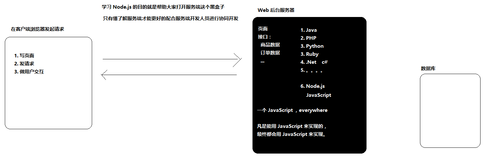

> 前端是没有能力直接操作数据库的，因为它里面需要有一定的权限认证。只能间接的通过服务器操作数据库(服务器会做一个中间处理)。
>
> 以前在前端基本上就是写个界面，发个请求，做个交互。现在学Node.js就是为了帮助我们打开服务端这个黑盒子。只有你懂了后端才能更好的配合后端程序员进行协同开发。
>
> 前端主要的就是3个：HTML + CSS + JS,但是能打开服务端的黑盒子的语言就有很多了：Node.js,Java,PHP,Python,Ruby(国外出名,Github网站就是Ruby做的),Net一大堆。我们这里选择的是Node.js。
>
> 原因就是：不用为了后端而重新再学习一门新的语言了，因为Node.js用C++语言开发的，但是可以在上面运行JavaScript。

## Node.js是什么

* Node.js不是一门语言([node.js是语言吗？](https://m.html.cn/qa/node-js/12135.html))

* Node.js不是库，不是框架

* Node.js是一个JavaScript**运行时**（运行时英文名叫runtime，也可以理解为运行环境）

* **Node.js是一个平台**

简单点来讲，**Node.js可以用来解析和执行JavaScript代码**，以前只有**浏览器**可以解析和执行JavaScript代码，

而现在JavaScript可以**完全脱离浏览器来运行**，一切都归功于Node.js。类似于Java运行在JVM（java虚拟机）上一样。

### 官网介绍

* Node.js is a JavaScript **runtime** built on Chrome's V8 JavaScript engine.

* Node.js uses an event-driven,non-blocking I/O model that makes it lightweight and efficent.

* Node.js's package ecosytem,npm , is the largest ecosytem of open source libraries in the world.

> Node.js是一个构建在在ChromeV8 JS引擎的JavaScript**运行时**
>
> Node.js使用**事件驱动**、**非阻塞I/O模型（异步）**让它变得更轻量和高效
>
> Node.js的包生态系统，**npm**,是世界上最大的开源库生态系统（绝大多数JavaScript相关的**包**都存放在了npm上，你就不用去各自的官网上下载了，只用一条**命令**就可以下载各种各样的包了）

[运行时（runtime）是什么意思？应该怎样深入且直观地理解？](https://www.zhihu.com/question/20607178)

(随着课程的学习你就慢慢会明白什么是事件驱动和非阻塞I/O模型了，现在不懂不要急，更不用妄自菲薄。 慢慢学，总会学会的，这就是时间的魔力。)

### Chrome V8引擎

> Node的核心就是V8引擎。

[JavaScript引擎](https://zh.wikipedia.org/wiki/JavaScript%E5%BC%95%E6%93%8E)

> 引擎就是发动机的意思，代码就是汽油，发动机(引擎)可以把汽油点燃产生动力，供汽车(浏览器)行驶。

* **代码**只是具有**特定格式的字符串**而已
* **引擎**可以认识它，引擎可以帮你去**解析和执行**
* Google Chrome的V8引掌是目前公认的**解析执行**JavaScript代码**最快**的
* Node.js的作者把Google Chrome中的V8引擎**移植**了击来，开发了一个**独立的JavaScript运行时环境(没有BOM和DOM)**

> Node.js的发动机和谷歌浏览器的发动机一模一样，都是V8，所以它也很快。

### Node.js构成

* 浏览器中的JavaScript由**ECMAScript、BOM、DOM**三部分组成

* Node.js中的JavaScript不包含BOM和DOM，只有**ECMAScript**（因为服务端不操作页面，所有没有BOM和DOM）

* 在Node.js这个JavaScript执行环境中为JavaScript提供了一些**服务器级别的API**，例如
  * 文件读写
  * 网络服务的构建
  * 网络通信
  * http服务器等

我们学Node.js其实就是在学**Web服务器开发**,主要就是学API，当然还可以做一些工具的环境基础，例如Webpack脚手架等。

## Node.js能做什么

* Web服务器后台(PHP，Java能干的，Node.js都能做)
* 命令行工具
  * npm(基于Node开发的)
  * git(基于C语言开发的)
  * hexo(基于Node开发的)

对于前端开发工程师来说，接触Node最多的是它的**命令行工具**，自己写的很少，主要是使用第三方的，比如：

`Webpack`、`gulp`、`npm`等等。

## 预备知识

* HTML
* CSS
* JavaScript
* 简单的命令行操作(`cd`、`ls`、`dir`、`mkdir`、`rm`等)
* 拥有服务端开发经验更佳(学过Java,PHP之后，再学Node会更容易一些。)

## 一些资源

* 《深入浅出Node.js》
  * 朴灵
  * 偏理论，几乎没有任何实战内容
  * 理解原理底层有帮助
  * 结合课程的学习去看效果更好
* 《Node.js权威指南》
  * API讲解
  * 也没有实战，没有业务
* JavaScript标准参考教程（alpha）：http://javascript.ruanyifeng.com/
* Node入门：http://www.nodebeginner.org/index-zh-cn.html
* 官方API文档：https://nodejs.org/dist/latest-v6.x/docs/api/
* 中文文档（版本比较旧，凑合看）：http://www.nodeclass.com/api/node.html 
* Node.js 包教不包会：https://github.com/alsotang/node-lessons

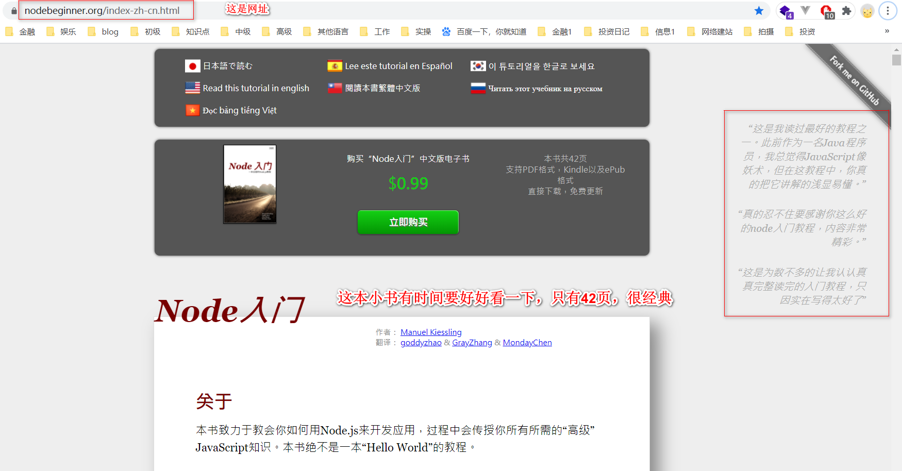

> 看书和学习是一样的，凡是不太好理解，比较难的东西，不可能是你想象当中随便学学就会的，不管你是看书，还是看博客，还是看别人的视频，还是课堂面授，都是一个**过程**，不可能简单的一个小时，两个小时就彻底的掌握了，不可能的，它是一个**过程**。我一遍不会的就两遍，两遍不会的就三遍，书读百遍，其义自见。

## 这门课能学到什么

* B/S编程模型

  * Browser-Server
  * back-end
  * 任何服务端技术这种B/S编程模型都是一样的，和语言无关
  * Node只是我们学习B/S编程模型的一个工具而已

* 模块化编程(非常棒，以后所有的编程方式都用模块化了)

  * CommonJS
  * RequireJS
  * SeaJS
  * `@import('文件路径')`
  * 以前认知的JavaScript只能通过`<script>`标签来加载
  * 在Node中可以像`@import()`一样来引用加载JavaScript脚本文件

* Node常用API

* 异步编程

  * 回调函数
  * Promise
  * async
  * generator

* Express开发框架(第三方东西，老师说没难度)

* ES6

  * 在课程中穿插讲解
  * 它只是一个新的语法而已
  * 不仅浏览器可以用，Node中同样也可以用

  > 学习Node不仅会帮助大家打开服务器端黑盒子，同时会帮助你学习以后的前端高级内容。例如：`Vue.js` ， `React` , `Angular`等前端框架。

# 起步

## 安装Node.js环境

* 查看当前Node坏境的版本号
* 下载：https://nodejs.org/en/download/
* 安装
  * 傻瓜式的一路next就可以了
  * 对于已经装过的，重新安装就会升级
* 确认Node环境是否安装成功
  * 打开命令行，输入`node--version`
  * 或者`node -v`
* 环境变量


## 基础知识

> 在Node中写JavaScript代码，没有HTML页面，也没有BOM和DOM,文件是`.js`为后缀名的文件。
>
> 要运行Node.js代码，首先要在VS Code终端或CMD命令行或gitbash命令行切换(使用cd命令)到这个文件目录中去。
>
> 或者选择这个文件代码，按住shift + 右键，有一个在命令提示符中打开(但是我试了好像不行)。
>
> 执行代码时输入`node + 要执行的js文件`(后缀名加不加都行)，然后回车即可。

### Hello node.js

~~~javascript
// Node.js中没有BOM,DOM,但是基本的ECMAScript语法还是有的
// var foo = 'bar';
var foo = 'hello node.js';

console.log(foo);
~~~

#### 步骤

* 创建编写JavaScript脚本文件
* 打开终端，定位到脚本文件所属目录
* 输入`node + 文件名`执行对应的文件

#### 注意

* node 和文件名之间要有空格
* 文件名不要使用node.js来命名，也就是说除了node这个名字你随便起，而且最好不要用中文

（我试了一下，用node.js来命令也是可以的了，我的版本是V12.13.0）

### 终端的多重选择

* 可以用CMD或PowerShell

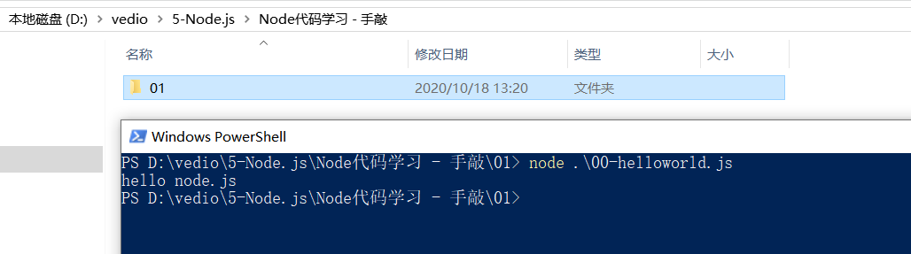

* 可以用Git Bash

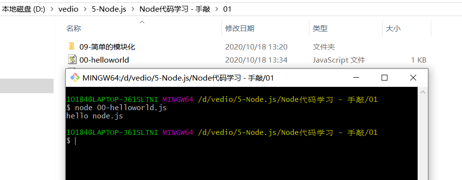

* 可以用VS Code 里面的终端

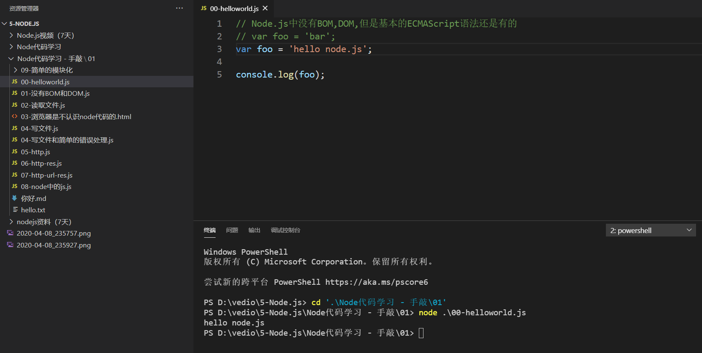

### 没有BOM和DOM

~~~javascript
//在Node中，采用ECMAScript进行编码
//没有BOM,DOM，只有ECMAScript
//和浏览器中的JavaScript不一样
//报错：ReferenceError: window is not defined
console.log(window);
console.log(document);
~~~

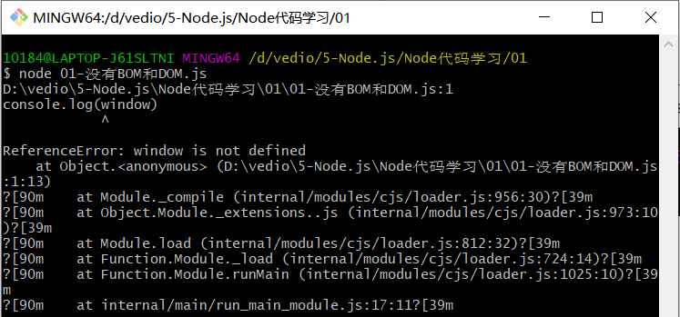

### 浏览器不认识node代码

~~~javascript
<!DOCTYPE html>
<html lang="en">

<head>
	<meta charset="UTF-8">
	<title>Document</title>
</head>

<body>
	<script src="00-helloworld.js"></script>
	<!-- 不报错 -->

	<script src="01-没有BOM和DOM.js"></script>
	<!-- 不报错 -->

	<script src="02-读取文件.js"></script>
	<!-- 报错:Uncaught ReferenceError: require is not defined-->

	<!-- 同样都是js代码，放到不同的环境(浏览器环境/node环境)，解析的结果是不一样的 -->
	<!-- 而且2种环境执行方式也不一样，浏览器环境通过在浏览器中打开执行，
			 node环境通过输入命令在黑洞洞里(命令框)执行 -->
</body>
</html>
~~~

# 读写文件

## 读文件

~~~javascript
//浏览器中的JavaScript是没有文件操作的能力的(不能进行读写)
//但是Node中的JavaScript具有文件操作的能力
// Node面向的是服务端，所以专门为JS提供了这样的能力

// fs是filesystem的简写，就是文件系统的意思
// 在Node中如果想要进行文件操作，就必须引入fs这个核心模块
// 在fs这个核心模块中，就提供了所有的文件操作相关的API
// 例如fs.readFile就是用来读取文件的

// 1.使用require方法加载fs核心模块
// 这个字符串叫fs,就是核心模块
var fs = require('fs');

// 2.读取文件
// 第一个参数：要读取的文件路径
// 第二个参数是一个回调函数(这个回调函数接收2个参数：error和data)
// 		error
// 		   如果读取失败，error就是错误对象
// 		   如果读取成功，error就是null
// 		data
// 		   如果读取失败，data就是null
// 		   如果读取成功，data就是读取到的数据

// 		上面解释太绕，看下面的解释

// 		读取成功
// 			data 数据
// 			error null
// 		读取失败
// 			data  undefined(没有数据)
// 			error  错误对象(错误信息以对象形式表示)
fs.readFile('./data/hello1.txt', function (error, data) { 
// fs.readFile('./data/hello1.txt', function (error,data) { 
	
	// console.log(data);
	// 直接打印，输出的是十六进制数据

	//<Buffer 68 65 6c 6c 6f 20 6e 6f 64 65 6a 73 0d 0a 0d 0a e4 bd 
  // a0 e5 a5 bd e9 aa 9a e5 95 8a>
	// 默认文件中存储的都是二进制数据 0 1
	// 这里为什么看到的不是0和1呢？原因是二进制转为十六进制了
	// 但是无论是二进制还是十六进制，人类都不认识

	// 所以我们可以通过toString()方法把其转为我们能认识的字符
	// 但是这样写，如果读取文件失败(比如文件名写错了)它也不报错,也没有提示信息
	
	console.log(error);
	console.log(data);
	// 如果文件读取成功，error会输出null,data会输出读取的数据
	// 如果文件读取成功，error会输出一个对象形式的错误信息,data会输出undefined

	// 写法1
	// if (error) { 
	// 	console.log('读取文件失败了');
	// 	return 
	// 	// return表示不要让它执行后续代码了
	// }
	// console.log(data.toString());

	// 写法2：
	// 在这里就可以通过判断error来确认是否有错误发生
	if (error) {
		console.log('读取文件失败了');
	} else { 
		console.log(data.toString());
	}
})
~~~

## 写文件

> 有时候是会出现文件写入不成功的情况的，比如文件名中你加了特殊字符。

~~~javascript
// 凡是涉及到文件操作(文件读写)的，都要引入fs核心模块(API)
// 必须要加这一行

var fs = require("fs");

// 读文件要给路径：读哪里的文件
// 写文件也要给路径：在哪里写

// 写文件有3个参数
// 第一个参数：文件路径
// 第二个参数：要写的文件内容
// 第三个参数：回调函数(Node里面几乎没有不回调的,因为它是异步的，所以要回调)

// 第三个参数(回调函数)只接收一个参数(形参)error(叫其他名字也行，习惯叫error)就可以了
// 回调函数只需要一个参数的原因：它是写文件，不是读，读要知道结果，写不需要，
// 写文件只需要知道写成功了还是失败了即可

//	error
// 			成功：
// 				文件写入成功
// 				error是null
// 			失败：
// 				文件写入失败
// 				error是错误对象

// fs.writeFile('./data/你好.md', '大家好，我是Node.js', function (error) { 
fs.writeFile('./data/你好>.md', '大家好，我是Node.js', function (error) { 
	// 文件名中出现了特殊字符>号，会导致写入文件报错
	console.log('文件写入成功');
	console.log(error);

	if (error) {
		console.log('写入失败');
	} else { 
		console.log('写入成功');
	}
})
~~~

# http

> 网页中所有的路径其实都是url路径，不是文件路径。

## 最简单的http服务

 ~~~javascript
//接下来，我们要干一件使用Node很有成就感的一件事
//你可以使用Node非常轻松的构建一个Web服务器
//在Node中专门提供了一个核心模块：http
//http这个模块的职责就是帮你创建编写服务器的

// 就像你操作文件一样，先加载核心模块：require http

// 1.加载http核心模块
var http = require('http')
// 变量名可以随便起，但是模块名是固定的
// 但是变量名最好起个有意义的名字


// 2.使用http.createServer()方法创建一个Web服务器
// 返回一个Server实例
// 服务器都是用代码写出来的
// Apache就是一个服务器，它是别人写好的封装好的一个软件
// 而我们这里是在写代码开发服务器
var server = http.createServer();

// 3.服务器用来干嘛的?
//      提供服务的：对于数据的服务
//      浏览器输入地址敲回车：发送请求
//      服务器：接收请求，处理请求，给个反馈(发送响应)

server.on('request', function () { 
    // 注册request请求事件
    // 当服务器收到请求之后，会自动触发服务器的request请求事件，然后执行第二段参数：回调处理函数
    console.log('收到客户端的请求了');
    // 只要客户端发请求过来，服务器都会输出一个信息
    // 服务器如果启动成功后，就开始等待客户端发送请求，一旦发送请求就会打印这句话
})

// 4.虽然前面已经设置好了，但是你得先启动你的服务器
// 怎么启动呢？绑定端口号就可以启动服务器了
// 端口号是干什么的？为什么要绑定它？--服务器是干嘛的？是用来网络通信的，凡是涉及到网络通信的都要有端口号
// 端口号范围1-65535，只要不被占用(这个是前提！！)，在里面随便选个数字都行，老师习惯写3000

// server.listen(3000);

// 也可以给它第二个参数，回调函数
server.listen(3000, function () { 
    console.log('服务器启动成功了，可以通过http://127.0.0.1:3000/或者localhost来进行访问');
    // 由于服务器的启动需要时间，第二个参数算是服务器启动的日志
})

// 当你输入node .\05-http.js后终端和以前的不一样(光标一直闪，你也输入不了东西)，
// 没关系，这个时候表明服务器已经启动了，你不要把窗口给关了

// 现在这个服务还很弱，只能发请求(回车)，然后服务器输出一句话"收到客户端的请求了"
// 发一次请求服务器回一句话，发一次请求服务器再回一句话，其他的就做不了了
 ~~~

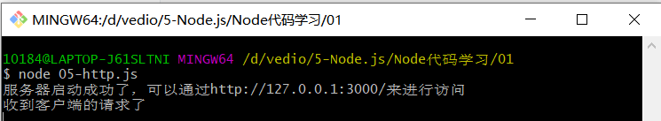

> 在客户端输入http://127.0.0.1:3000/会显示收到客户端的请求，回一次车就会显示一次'收到客户端的请求了'
>
> 按住Ctrl+C会将Node当前服务关闭（**代码一旦改了，必须要重启才会生效**）

## 发送响应

> **切记：代码一旦改了，必须要重启才会生效**

~~~javascript
var http = require('http')

var server = http.createServer()

// request请求事件处理函数，需要接收2个参数
//      Request     请求对象：可以用来获取客户端的一些请求信息，如请求路径
//      Response    响应对象：可以用来给客户端发送响应消息
server.on('request', function (request, response) { 
     //http://127.0.0.1:3000/
    //http://127.0.0.1:3000/a/a
    //http://127.0.0.1:3000/foo/b/foo/b
    console.log("收到客户端的请求了,请求路径是" + request.url);

    // url是统一资源定位符，不同的url对应不同的资源

    // 收到客户端的请求了,请求路径是/favicon.ico
    // 浏览器有个默认行为，会请求收藏夹图标，我们现在不用管它

    // response对象有一个方法，叫做write,可以用来给客户端发送响应数据
    // write可以使用多次，但是最后一定要使用end来结束响应，否则客户端会一直等待。
    // 你要把话说完，你话说不完，我就不接收
    response.write('hello')
    // 这个意思是往响应流当中写数据
    response.write(' nodejs')

    // 不管你中间说了多少话，最后记得一定要结束响应，不然客户端不知道你话有没有说完。
    // 告诉客户端我的话说完了，你可以把我说的话给用户看了
    response.end()

    // 之后你在浏览器框上写什么都不管用，都给你显示hello nodejs
    // 输入http://localhost:3000/，显示hello nodejs
    // 输入http://localhost:3000/a/b，还显示hello nodejs
    // 因为服务器是我自己控制的，我现在服务器的能力只能处理到这一步

    // 一切请求路径都从正斜杠/开头，浏览器上你看着是localhost:3000,实际复制下来是http://localhost:3000/
    // 端口号3000后面有个斜杠！！！

    // 思考：
    // 由于现在我们的服务器的能力还非常的弱，无论什么请求，都只能响应hello nodejs
    // 我希望当请求不同的路径(url)的时候响应不同的结果
    // 例如：
    //      /          响应        index
    //      /login     响应        登陆
    //      /register  响应        注册
    //      /haha      响应        哈哈哈
    // 但是有个事实：所有的请求都会触发request事件，没有专门针对(/或/login或/register或/haha)的特定响应
    // 方法：那我们就只能通过if···else对request.url进行判断了
})

server.listen(3000, function () { 
    console.log('服务器启动成功了，可以通过http://127.0.0.1:3000/或者localhost来进行访问');
})
~~~

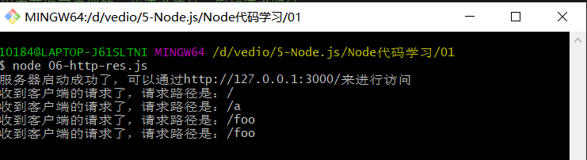

> 你在浏览器输入`http://127.0.0.1:3000/a`，会显示请求路径是/a。以此类推

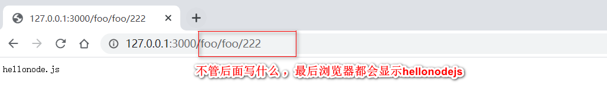

## 根据不同请求路径返回不同数据

~~~javascript
var http = require('http')

// 1.创建server
var server = http.createServer()

// 2.监听request请求事件，设置请求处理函数
// 这个就跟大家写onclick一样
server.on('request', function (req, res) { 
	// 因为是形参，所以简写更加方便一些
	// console.log("收到客户端的请求了,请求路径是" + req.url);
	// req有个url的属性

	// 服务器响应方法1：很傻
	// res.write('hello')
	// res.write(' world')
	// res.end()
	// 让服务器给浏览器发个响应，并且记得最后一定要写end

	// 但是上面write,write这样写比较麻烦，推荐使用更加简单的方式
	// 直接end的同时发送响应数据

	// 服务器响应方法2：更加简单
	// 这句话表示发送响应数据'hello world'同时结束响应
	// 我们几乎没有多次write的产品，基本上一个请求对应一个响应
	// res.end('hello world')

	// 根据不同的请求路径发送不同的响应结果
	// 2.1 首先要拿到请求路径
	// 	  注意：req.url获取到的是端口号之后的那一部分路径
	// 	  也就是说所有的url都是以 / (正斜杠)开头的
	// 2.2 判断路径处理响应
	var url = req.url
	// res.end(url)

	if (url === '/') {
		// 通常来讲网站的 /(杠) 就对应网站的首页
		res.end('index page')
	} else if (url == '/login') {
		res.end('login page')
		// 请求路径不一样，响应结果也不一样
	} else { 
		res.end('404 Not Found')
	}
	// 注意：每当你修改代码，一定要记得重启一下服务器！！！

	// 其实现在很多的人工智能，机器人很多都是设定了一系列的if...else...
	// 好多都是炒的概念
})

// 3.绑定端口号，启动服务
server.listen(3000, function () { 
	// 如果端口号写80，那么在端口号不被占用的情况下，端口号可以省略不写
	// 浏览器默认端口号就是80
	console.log("服务器启动成功，可以访问了。。。")
})
~~~

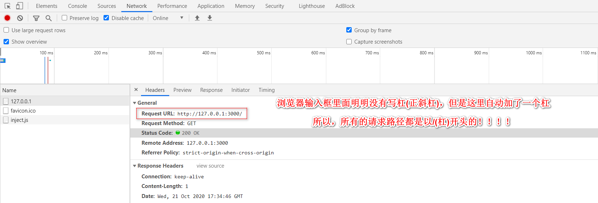

> 加斜杠的目的是为了格式，比如`127.0.0.1:3000abc`不加斜杠就没有办法区分了。
>
> `favicon.ico`是浏览器的默认请求，表示收藏夹的默认图标，这样用户可以更好去辨识。
>
> `inject.js`是我安装的某个插件。

[人工智能就是if...else... 吗？](https://www.zhihu.com/question/287091800/answer/455546621)

## 简版的商品数据

[JSON.parse()与JSON.stringify()的区别](https://www.cnblogs.com/goatling/p/6293692.html)

~~~javascript
var http = require('http')

var server = http.createServer()


server.on('request', function (req, res) { 
	
	var url = req.url

	if (url === '/product') { 
		var products = [
		  {
		  	name: '苹果X',
		  	price: 8888,
		  },
		  {
		  	name: '菠萝X',
		  	price: 5000,
		  },
		  {
		  	name: '小辣椒X',
		  	price: 1999,
		  }
		]
		// 这是一个数组，放到了if语句内部
		// 注意：服务器响应内容只能是二进制数据或者字符串
		// 数字、对象、数组、布尔值都不能作为响应内容！！！

		// res.end(123)
		// 响应内容为数字，是不行的！！！！！对象，数组，布尔值这些更不行！！！
		// 那如何转换呢？JSON有parse和stringify2种方法，都可以
		res.end(JSON.stringify(products))
		// 只有一个小小的问题：中文乱码了
		// 这个显示出来的东西和接口很像
	}
	
})

// 3.绑定端口号，启动服务
server.listen(3000, function () { 
	// 如果端口号写80，那么在端口号不被占用的情况下，端口号可以省略不写
	// 浏览器默认端口号就是80
	console.log("服务器启动成功，可以访问了。。。")
})
~~~

# Node中的JS

* ECMAScript

  * 没有DOM,BOM

* 核心模块

  ~~~javascript
  var fs = require('fs')
  // 左边的变量名可以随便起，但是最好要有一定的意义
  // 右边的核心模块名字(小括号里面有引号包裹的内容)是固定的，不能动！！！
  ~~~

* 用户自定义模块

  * require
  * exports

* 第三方模块

## Node中的模块系统

> 在Node里面，除了ECMAScript，绝大多数的API都被封装起来了，你要想用你得去加载才行。
>
> 不像浏览器，所以的东西都可以直接拿来就用。

### Node中的JS-核心模块

> 核心模块大概有十几个，但常用的不超过5个。

Node为Javascript提供了很多服务器级别的API，这些API绝大多数都被包装到了一个**具名**的核心模块中了。

例如文件操作的`fs`核心模块，http服务构建的`http`模块，`path`路径操作模块、`os`操作系统信息模块等等。

以后只要我说这个模块是一个核心模块，你就要马上想到如果想要使用它，就必须引用这些核心模块。

~~~javascript
var http = require('http')

// 用来获取当前机器的CPU信息
var os = require('os')
console.log(os.cpus());
// mem是memory(内存)的缩写
// 以整数的形式返回系统的内存总量（以字节为单位）。
console.log(os.totalmem());

// path用来操作路径的
// path专门用来处理路径，其他什么也不干
var path = require('path')
// extname是extension name的缩写,是扩展名的意思
console.log(path.extname('c:/a/b/c/d/hello.txt'));
~~~

### Node中的JS-模块系统

> Node中一个文件就相当于一个模块。

#### 基本使用

> 一个页面如何执行多个脚本文件？——你想执行哪个，用`<script>`引用哪个就可以了。
>
> 但是Node里面只能执行一个文件！！
>
> 像这样`node 01-没有BOM和DOM.js 02-读取文件.js`是不行的！！
>
> 它只会执行前面的第一个文件，后面的文件它是不会执行的！！

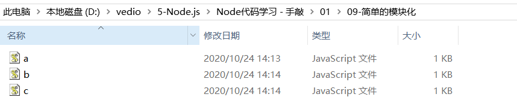

**a.js**

~~~javascript
// node同一时间不能同时去执行a.js和b.js

// 要想同时让Node执行a.js和b.js的解决方法如下：
// 让Node执行a.js,然后让a.js通过代码去执行b.js

// require是一个方法，它的作用就是来加载模块的
// 在Node中模块有三种：
//      1.具名的核心模块：例如fs,http(里面也有js文件，但是你看不见它)
//      2.用户自己编写的文件模块(说白了就是js文件)
//      3.老师没说了
// require除了可以加载系统内置的核心模块，还能加载自己编写的文件模块
// 自己写的文件模块因为不在浏览器环境里，也没有script标签了，所以必须要通过方法来加载

// 注意1：相对路径中的"./"不能省略，否则会报错！！！
// 因为如果你去除了./后系统会把require里面的东西当成核心模块！！！

// 注意2：可以省略后缀名
console.log('a start')

//require('./b.js')
//这种是完整的不省略后缀名的写法

require('./b')
//可以省略后缀名(前提是这个文件要存在，默认系统找的是后缀名为js的文件)
//推荐使用这种方法，简单

//require('b')
//不可以，省略了./后，系统会将b当成是一个模块名称，而模块里没有这个名称，会提示找不到这个模块，报错

console.log('a end');
~~~

**b.js**

~~~javascript
console.log("bbb");

console.log('b start');

require('./c.js')

console.log('b end');
~~~

**c.js**

~~~javascript
console.log("ccc");
~~~

**结果如下：**

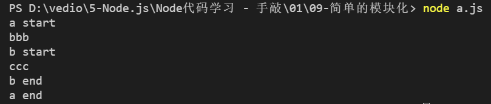

#### 模块作用域(不相往来)

> 在Node中没有全局作用域，只有**模块作用域**。
>
> 模块作用域，简单理解就是**文件作用域**，超出这个文件的都不管用。
>
> 比如：`a.js`文件中确实加载了`b.js`，但是`b.js`不会污染其他文件，它也不会访问外部文件。

**a.js**

~~~javascript
// 在Node中没有全局作用域，只有模块作用域
// 模块作用域：外部访问不到内部，内部也访问不到外部
// 完全就是一个文件里面，出了这个文件就无效了
// require加载也不管用，require顶多是用来执行一下，
// 但你也拿不到我的东西，同样的，我也拿不到你的东西。
var foo = 'aaa'

// 在加载b.js之前先定义一个add方法
function add(x,y) { 
    return x + y
}

require('./b.js')
// 即便通过require加载了b.js，b里面也调用不到a里面定义的add方法，
// b也无法覆盖掉a里面定义的变量foo
// a里面的foo和b里面的foo,就是名字一样而已，其他什么都不一样。
// 就像是平行世界里的2个完全不同的，只是名字一样的人。
// 绝对的互不影响，鸡犬之声相闻，老死不相往来。

console.log('foo的值是：' + foo);
~~~

**b.js**

~~~javascript
console.log(add(10, 20));
// 调用a.js里面定义的add方法是不行的！报错！add is not defined

var foo = 'bbb'
// 如果放到浏览器里面可能会认为b.js里面定义的变量foo会覆盖掉a.js里面的变量foo
~~~

#### 模块与模块之间的交流

> 假设咱们客户端浏览器，你之所以加载别的文件，你的目的是想要访问他里面的成员。
>
> 既然是模块作用域，作用域只在本文件里面有效，那么如果让**模块与模块之间**(默认都是封闭的)进行通信？？
>
> (比如前面的：如何让`b.js`访问`a.js`里面定义的add方法，让`b.js`也能够使用add方法？？)
>
> 因为有时候我们加载文件的目的，不是为了简简单单的执行里面的代码，更重要的是为了使用里面的某个成员，例如它里面有个方法，我想要用一下。

##### 这样是无法交流的：

**a.js**

~~~javascript
require('./b.js')

console.log(foo);
// 报错：foo is not defined
// 即便你加载了b文件，也不会打印出foo变量的！！
// 模块与模块之间老死不相往来的！
// 你根本就用不到！！
~~~

**b.js**

~~~javascript
var foo = "bbb";
// a.js是一个模块，b.js是另一个模块
// 默认a是肯定无法访问b里面的变量foo的
~~~

##### 这样开个小门才可以交流：

**a.js**

~~~javascript
// require方法有2个作用：
//    1.加载文件模块并执行里面的代码(但因为是模块作用域，虽然执行了，b依然也拿不到a里面的变量成员)
//所以这时候可以体现出它的第二个作用了
//    2.拿到被加载文件模块导出的接口对象

// 在每个文件模块中都提供了一个对象，叫做：exports(即require有返回值)
// exports默认是一个空对象({})
// 你要做的就是把所有需要被外部访问的成员挂载到这个exports对象中
var bExports = require('./b.js')

// bExports变量 === exports对象

console.log(bExports);
// 显示{}!!! 空对象！！！

console.log(bExports.foo);
// hello
// a.js里面的bExports变量就是b.js里面的exports对象

// 想使用b.js里面的add方法
console.log(bExports.add(10, 30));
// 40

// console.log(age)
// 这里是访问不到age的

console.log(bExports.age)
// Undefined
// 18
// 这个也不能，因为没有挂载
// 只有写了exports.age = age;这句话才可以被a.js用

bExports.readFile('./a.js')
// 文件路径：./a.js
// 注意：这里的readFile不是fs的那个readFile！！只是名字一样而已！！

var fs = require('fs')
fs.readFile('./a.js', function (err, data) { 
  if (err) {
    console.log('读取文件失败');
  } else { 
    console.log(data.toString());
    // 因为我读的就是a文件，所以显示的就是文件的源代码
  }
})
~~~

**b.js**

~~~javascript
var foo = "bbb";

console.log(exports);
// 也是空对象！ {}
// b.js里面的exports就是a.js里面的bExports
// 后面写了exports.foo = 'hello'就成了{ foo: 'hello' }了

exports.foo = 'hello'
// 动态的为这个对象添加了一个成员，名字叫foo,值是hello

console.log(exports);
// { foo: 'hello' }

exports.add = function (x, y) { 
  return x + y
}

// 得到的既不是foo也不是add,而是exports这个对象

var age = 18

exports.age = age;
// 只有写了这句话才可以被a.js用
function add(x, y) { 
  // a.js里面采用的add方法是上面的add，不是这个add方法！！！
  // 他们2个不是一个东西！！！
  return x - y
}

// 自己造一个readFile
exports.readFile = function (path, callback) { 
  console.log('文件路径：' + path);
}
~~~

# Web服务器开发

* IP地址用来定位计算机

* 端口号用来定位具体的应用程序

* 所有需要**联网通信**的应用程序都会占用一个端口号
* 端口号的范围是1-65536
* 计算机中有一些默认端口号，最好不要去使用
  * 例如提供HTTP服务的80端口
* 我们在开发过程中使用一些简单好记的端口号就可以了，例如3000,5000等没什么含义的端口号
* 可以同时开启多个服务，但一定要确保多个服务占用的端口号不一致
* 说白了，在一台计算机中，同一个端口号同一时间只能被一个程序占用

[如何理解IP地址和端口号](https://baijiahao.baidu.com/s?id=1660649148022444246&wfr=spider&for=pc)

[服务器的端口号](https://www.yisu.com/news/id_396.html)

## 端口号

* 应用程序有联网的能力，有的程序可以联网，有的不能联网。联网就能产生数据交互。

* 服务器是电脑，之所以叫服务器，是因为它能够24小时不关机。

* 服务器不在本地，如果你的电脑能做到24小时不关机，你能做到的话，你的电脑也是一台服务器。

* Apache本质是就是个软件，你把它装上就有，把它删了就没了。它本身提供Web服务。

* 可能同时有多个客户端把消息(数据)发过来。有的发QQ消息，有的发微信消息，那么怎么区分这2种消息呢？使用端口号。

* 相应来讲，双方(客户端，服务器)都要有端口号(你用你本地客户端浏览器和我服务器上的Node开启Web服务进行通信，你知道我(服务器)的端口号，但是我不知道你的，但是不知道你的端口号我怎么发给你呢？ )
* 对服务端编程来讲，API已经高度封装了，你不需要知道对方的IP地址和端口号，你直接发响应就可以了。它会找到当前请求我的客户端的地址和端口号的。
* 浏览器来跟我服务器通信，浏览器会自动开一个端口号跟我的服务器进行通信，这是它默认带的功能行为。

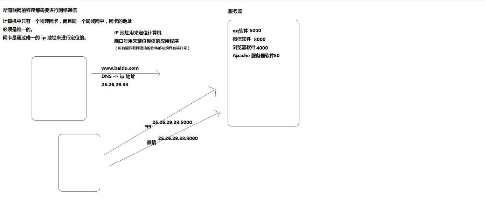

> 查看自己的局域网IP地址，然后启动Node服务器，你不仅可以使用`127.0.0.1:3000`访问，还可以通过`本地局域网IP地址:3000访问`！！！

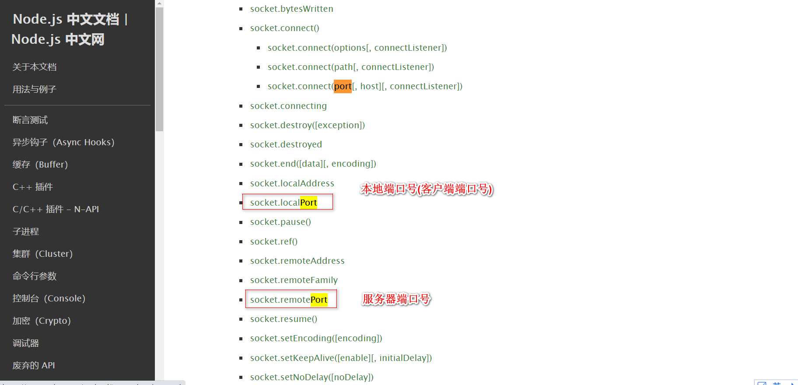

~~~javascript
var http = require('http')

// 1.创建Server
var server = http.createServer()

// 2.监听request请求事件，设置请求处理函数
server.on('request', function (req, res) { 
	console.log('收到请求了，请求路径是：' + req.url);
	// 在请求对象req中，我可以获取当前请求客户端的端口号
	console.log('请求我的客户端的端口号是：' + req.socket.remotePort);
	console.log('请求我的客户端的远程地址是：' + req.socket.remoteAddress);
	var url = req.url
	
	if (url === '/') {	
		res.end('index page')
	} else if (url === '/login') {
		res.end('login page')
	} else if(url === '/products'){
		var products = [
		  {
		  	name: '苹果X',
		  	price: 8888,
		  },
		  {
		  	name: '菠萝X',
		  	price: 5000,
		  },
		  {
		  	name: '小辣椒X',
		  	price: 1999,
		  }
		]
		res.end(JSON.stringify(products))
	}else { 	
		res.end('404 Not Found')
	}
})

server.listen(3000, function () { 

	console.log("服务器启动成功，可以访问了。。。")
})
~~~

## 中文乱码问题(Content-type)

> 我们用的Apache服务器软件，它会自动给你加`Content-type`，但是我们这边是自己写服务器代码，所以自己不写的话不会有`Content-type`这个东西的。
>
> 推荐一个网站:[OSCHINA](https://www.oschina.net/)

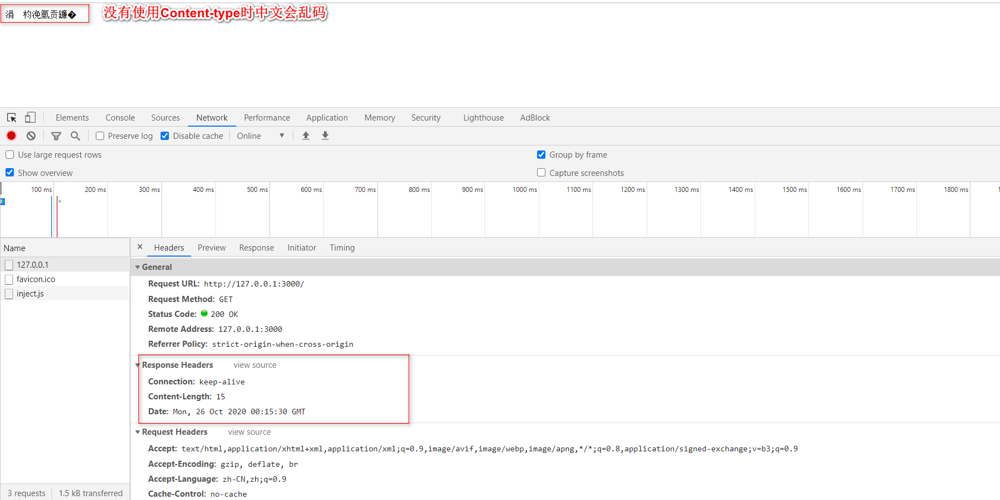

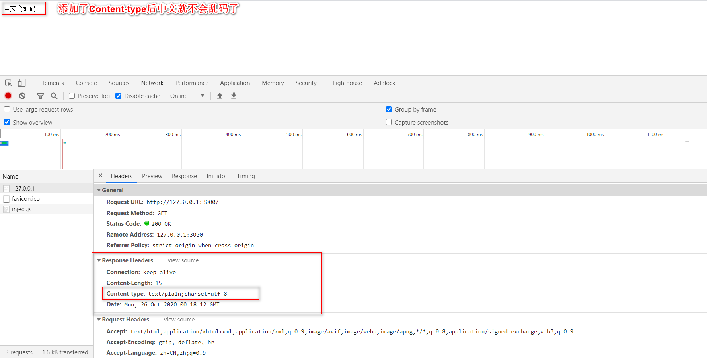

~~~javascript
//require
// 端口号
// 可以同时开启多个服务，但一定要确保多个服务占用的端口号不一致

var http = require('http')

var server = http.createServer()

server.on('request', function (req, res) { 
    // 在服务器默认发送的数据，其实是UTF8编码的内容
    // 但是浏览器不知道你是UTF8编码的内容
    // 浏览器在不知道服务器响应内容的编码的情况下会按照当前操作系统的默认编码去解析
    // 由于我是中文操作系统，默认用gbk解析。(你用的是英文，我却用汉语字典去查英文)
    // 解决方法就是正确的告诉浏览器我给你发送的内容是什么编码的
    // 在HTTP协议中，Content-type就是用来告知对方我给你发送的数据内容是什么类型的

    res.setHeader('Content-type', 'text/plain;charset=utf-8')
    // 把这句话注释了中文就会乱码
    // Content-type：内容类型，属于HTTP协议的一种
    // text/plain:文本类型/普通文本
    res.end('中文会乱码')
})

server.listen(3000, function () { 
    console.log('Server is running...');
})
~~~

## 不同地址的解析

~~~javascript
var http = require('http')

var server = http.createServer()

server.on('request', function (req, res) { 
    var url = req.url
    
    if (url === '/plain') {
        res.setHeader('Content-Type', 'text/plain;charset=utf-8')
        // 只有加了这个，才会进行解析
        // text/plain：就是普通文本的意思
        res.end('hello 世界')
    } else if (url === '/html') { 
        // res.end('<p>hello html</p>')
        // 这个本质是字符串，只有浏览器才会把它当成标签(Node眼里是字符串，浏览器眼里是p标签)
        // 服务器发的时候发的是字符串，才不关心你是p标签还是hello 世界呢

        res.setHeader('Content-Type', 'text/html;charset=utf-8')
        // html不是普通文本，而是带有一定格式的文本
        // 如果你发送的是html格式的字符串，则也要告诉浏览器我给你发送的是text/html格式的内容
        res.end('<p>hello html <a href="">点我</a></p>')
        // 浏览器确实把你当html进行解析了，但是中文依然有问题，还得加Content-type
    }
})

server.listen(3000, function () { 
    console.log('Server is running...');
})
~~~

## 服务器发送页面

新建一个resouce文件夹，里面有如下文件格式(除了图片，其他都是文本文件)

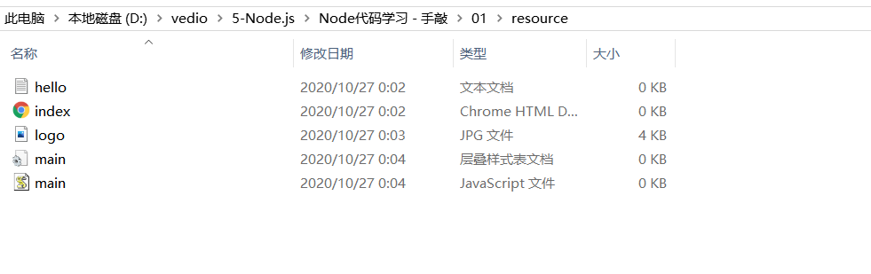

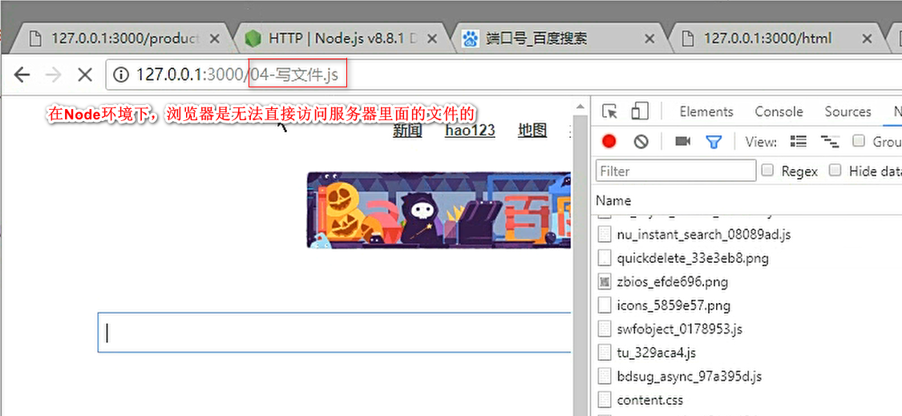


~~~javascript
// 需求：以前我们都是手写，服务器发送的是简单的字符串
// 如果我们想要服务器发送页面怎么办？？
// 比如你浏览器上输入百度，对方服务器上给你发送的是百度的页面，而不是什么字符串

//Content-type
//https://www.oschina.net/
//不同的资源对应的Content-Type是不一样的
//图片不需要指定编码
//一般只为字符数据才指定编码(如utf-8)
var http = require('http')

// 凡是读文件要引入fs
var fs = require('fs')

// 这里http和fs就结合起来了

var server = http.createServer()

server.on('request', function (req, res) { 
    var url = req.url
    // 服务器肯定要放HTML页面
    // HTML页面怎么发？不再是以前使用Apache服务器，文件往服务器一丢，浏览器就可以访问了
    // Node不行了，你开启了服务器，不能访问服务器里面的文件

    // 我们现在要用Node来创建Apache
    // 需求：输入 /    响应index.html
    if (url === '/') {
        // 被坑了，注意这里写的是'/'而不是'./'！！！！！

        // 方法1：字符串拼接(这肯定不是什么好方法)
        // res.end('<!DOCTYPE html><html lang="en"><head><meta charset="UTF-8"><meta name="viewport" content="width=device-width, initial-scale=1.0"><title>Document</title></head><body><h1>首页</h1></body></html>')

        // 我们要发送的还是在文件中的内容
        // 文件是不能发给客户端的，只能发字符串(要把文件里的字符串给读出来——使用fs)
        fs.readFile('./resource/index.html', function (err, data) {
            if (err) {
                res.setHeader('Content-Type', 'text/plain;charset=utf-8')
                res.end('文件读取失败，请稍后重试')
            } else {
                // data默认是二进制数据，可以通过.toString转为咱们可以识别的字符串
                // res.end()支持2种数据类型，一种是二进制，一种是字符串，所以这里你可以不用转
                res.setHeader('Content-Type', 'text/html;charset=utf-8')
                res.end(data)
            }
        })
    } else if (url === '/logo') { 
        // url的术语：统一资源定位符
        // 一个url最终还是要对应到一个资源的
          fs.readFile('./resource/logo.jpg', function (err, data) {
            if (err) {
                res.setHeader('Content-Type', 'text/plain;charset=utf-8')
                res.end('文件读取失败，请稍后重试')
            } else {
                // 图片就不需要指定编码了(utf-8去掉)，因为我们常说的编码一般指的是：字符编码
                res.setHeader('Content-Type', 'image/jpeg;')
                res.end(data)
            }
        })
    }
})

server.listen(3000, function () { 
    console.log('Server is running...')
})

// 不知道为什么这个服务器不显示东西
// 因为我'/'写成了'./'了！！！！！
~~~

> 现在这个服务器可以访问`'/'`和`'/logo'`这2个url了，会显示不同的页面。

## 代码风格

[JavaScript 语句后应该加分号么？](https://www.zhihu.com/question/20298345)

为了约定大家的代码风格，所以在社区中诞生了一些比较规范的代码风格规范，主要有2种：

* [Javascript standard style](https://standardjs.com/readme-zhcn.html)
* [Airbnb Javascript style](https://github.com/lin-123/javascript#arrays)

> 详细的代码风格规范我单独写了一篇博文《前端规范入门》。

当你采用了无分号的代码风格的时候，只需要注意以下情况就不会有问题了：

* 当一行代码是以**小括号**、**中括号**、**反引号**开头的时候，则在前面补上一个分号用于避免一些语法解析错误。

  > 反引号是ES6中新增的一种字符串包裹方式，叫做：模版字符串。它支持换行和非常方便的添加变量。
  >
  > 你会发现在一些第三方的代码中能看到一上来就以一个`;`开头。(有些人喜欢玩一些花哨的东西，比如前面加上`!`或`~`，也可以，但是不推荐这样用。)

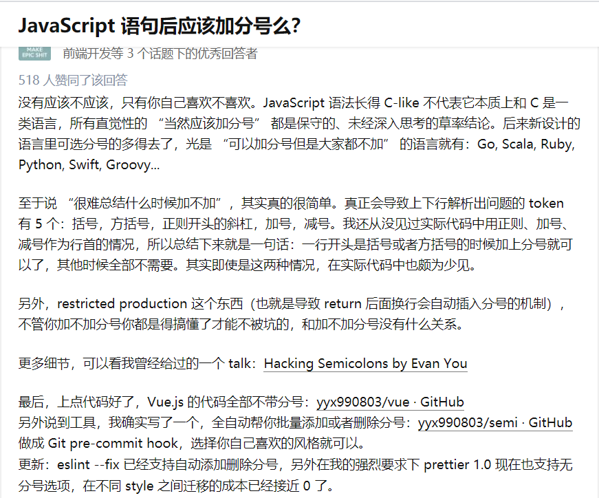

## 初步实现Apache功能

### 1.0版

~~~javascript
var http = require('http')

// 1.创建Server
var server = http.createServer()

// 2.监听Server的request请求事件，设置请求处理函数
//      请求
//          处理
//      响应
//          一个请求对应一个响应，如果在一个请求的过程中，已经结束响应了，则不能重复发送响应
//          没有请求就没有响应
server.on('request', function (req,res) { 
    // console.log(req.url);
    var url = req.url
    if (url === '/') {
        res.end('hello world')
    } else { 
        res.end('404 Not Found')
    }
})

// 3.绑定端口号，启动服务
server.listen(3000, function () { 
    console.log('running...');
})
~~~

### 2.0版

~~~javascript
var http = require('http')

// 读文件，要引入fs核心模块
var fs = require('fs')
// 1.创建Server
var server = http.createServer()

// 2.监听Server的request请求事件，设置请求处理函数
//      请求
//          处理
//      响应
//          一个请求对应一个响应，如果在一个请求的过程中，已经结束响应了，则不能重复发送响应
//          没有请求就没有响应

// 咱们以前使用过阿帕奇服务器软件，这个软件默认有一个WWW目录，
// 所有存放在WWW目录中的资源都可以通过网址来访问。
// 127.0.0.1:80/a.txt
// 127.0.0.1:80/index.html
// 127.0.0.1:80/apple/login.html
server.on('request', function (req,res) { 
    // console.log(req.url);
    var url = req.url
   
    if (url === '/') {
        fs.readFile('D:/vedio/5-Node.js/www/index.html', function (err, data) { 
            // 不喜欢写这样的代码
            // if (err) {
            //     res.end('404 Not Found')
            // } else { 

            // }
            if (err) {
                //  return有2个作用：
                //      1.方法的返回值
                //      2.阻止代码继续往后执行
                return res.end('404 Not Found')
            }
            res.end(data)
        })
        // 反斜杠在字符串里面是转义的意思，要把它换成正斜杠
    } else if (url === '/a.txt') { 
       fs.readFile('D:/vedio/5-Node.js/www/a.txt', function (err, data) { 
            if (err) {
                return res.end('404 Not Found')
            }
            res.end(data)
        })
    }else if (url === '/index.html') { 
          fs.readFile('D:/vedio/5-Node.js/www/index.html', function (err, data) { 
            if (err) {
                return res.end('404 Not Found')
            }
            res.end(data)
        })
    }else if (url === '/apple/login.html') { 
          fs.readFile('D:/vedio/5-Node.js/www/apple/login.html', function (err, data) { 
            if (err) {
                return res.end('404 Not Found')
            }
            res.end(data)
        })
    }
})

// 3.绑定端口号，启动服务
server.listen(3000, function () { 
    console.log('running...');
})
~~~

### 3.0版

~~~javascript
var http = require('http')
var fs = require('fs')

// 1.创建Server
var server = http.createServer()


var wwwDir = 'D:/vedio/5-Node.js/www/'
// 2.监听Server的request请求事件，设置请求处理函数
server.on('request', function (req,res) { 
    // console.log(req.url);
    var url = req.url 

    //      /           wwwDir + index.html
    //      /a.txt      wwwDir + a.txt
    //      /apple/login.html   wwwDir + apple/login.html
    //      /img/ab1.jpg        wwwDir + /img/ab1.jpg
    var filePath = 'index.html'
    
    if (url !== '/') { 
        filePath = url
    }
    fs.readFile(wwwDir + filePath, function (err, data) { 
        if (err) { 
            return res.end('404 Not Found')
        }
        res.end(data)
    })
    // console.log(filePath,wwwDir + filePath)
})

// 3.绑定端口号，启动服务
server.listen(3000, function () { 
    console.log('running...');
})
~~~

## Apache目录列表

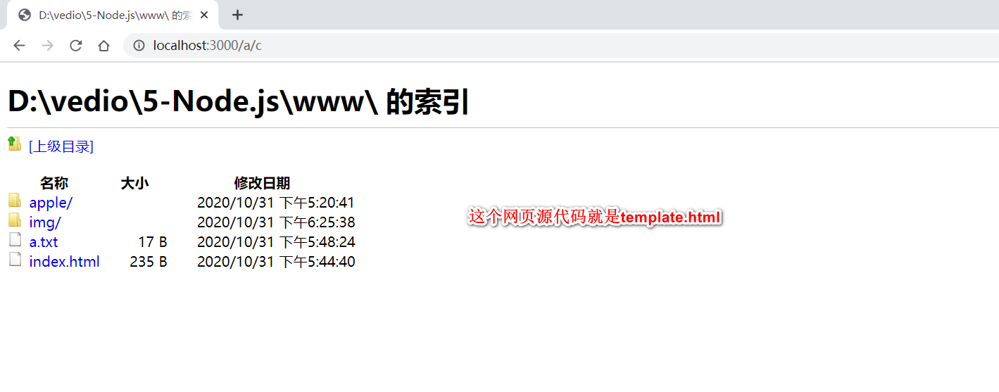

### 1.0版

~~~javascript
var http = require('http')
var fs = require('fs')

// 1.创建Server
var server = http.createServer()


var wwwDir = 'D:/vedio/5-Node.js/www/'
// 2.监听Server的request请求事件，设置请求处理函数
server.on('request', function (req,res) { 
    // console.log(req.url);
    var url = req.url 
    
    fs.readFile('./template.html', function (err, data) { 
        if (err) { 
            return res.end('404 Not Found')
        }

        // 如何得到wwwDir目录列表中的文件名和目录名
        //      fs.readdir
        // 如何将得到的文件名和目录名替换到template.html中
        //      模板引擎
        // 只要你做了这2件事，那这个问题就解决了
        res.end(data)
    })
})

// 3.绑定端口号，启动服务
server.listen(3000, function () { 
    console.log('running...');
})
~~~

### 2.0版

> 但是这种方式不太好，字符串处理太麻烦了。

~~~javascript
var http = require('http')
var fs = require('fs')

var server = http.createServer()

var wwwDir = 'D:/vedio/5-Node.js/www/'


server.on('request', function (req, res) {
  var url = req.url
  fs.readFile('./template.html', function (err, data) {
    if (err) {
      return res.end('404 Not Found.')
    }
    // 1. 如何得到 wwwDir 目录列表中的文件名和目录名
    //    fs.readdir
    // 2. 如何将得到的文件名和目录名替换到 template.html 中
    //    2.1 在 template.html 中需要替换的位置预留一个特殊的标记（就像以前使用模板引擎的标记一样）
    //    2.2 根据 files 生成需要的 HTML 内容
    // 只要你做了这两件事儿，那这个问题就解决了
    fs.readdir(wwwDir, function (err, files) {
      if (err) {
        return res.end('Can not find www dir.')
      }

      // 2.1 生成需要替换的内容
      var content = ''
      files.forEach(function (item) {
        // 在 EcmaScript 6 的 ` 字符串中，可以使用 ${} 来引用变量
        content += `
          <tr>
            <td data-value="apple/"><a class="icon dir" href="/D:/Movie/www/apple/">${item}/</a></td>
            <td class="detailsColumn" data-value="0"></td>
            <td class="detailsColumn" data-value="1509589967">2017/11/2 上午10:32:47</td>
          </tr>
        `
      })

      // 2.3 替换
      data = data.toString()
      data = data.replace('^_^', content)

      // 3. 发送解析替换过后的响应数据
      res.end(data)
    })
  })
})
server.listen(3005, function () {
  console.log('running...')
})
~~~

## Node中实现模版引擎

> 模版引擎这个东西我就只听说过几次，完全不熟悉。这里主要学的模版引擎是`art-template`
>
> 模版引擎的本质就是字符串的解析替换。

[ART-TEMPLATE模版引擎](https://aui.github.io/art-template/zh-cn/)

[JavaScript 的模板引擎是什么](https://www.zhihu.com/question/53133191/answer/133637554)

### 在浏览器中使用模版引擎

~~~javascript
<!DOCTYPE html>
<html lang="en">

<head>
    <meta charset="UTF-8">
    <meta name="viewport" content="width=device-width, initial-scale=1.0">
    <title>在浏览器中使用art-template</title>
</head>

<body>
    <!-- 注意：在浏览器中需要引用lib/template-web.js文件 -->
    <!-- 强调：模版引擎不关心你的字符串内容，只关心自己能认识的模版标记语法，例如{{}} -->
    <!-- {{}}语法被称之为mustache语法，也叫胡子语法 -->
    <script src="../node_modules/art-template/lib/template-web.js"></script>
    <script type="text/template" id="tpl">
        <!-- 大家好，我叫:{{name}}
        我今年{{age}}岁了
        我来自{{province}}
        我喜欢：{{each hobbies}}{{$value}}{{/each}} -->

    <!DOCTYPE html>
    <html lang="en">

    <head>
        <meta charset="UTF-8">
        <meta name="viewport" content="width=device-width, initial-scale=1.0">
        <title>Document</title>
    </head>

    <body>
        <p>大家好，我叫:{{name}}</p>
        <p>我今年{{age}}岁了</p>
        <p>我来自{{province}}</p>
        <p>我喜欢：{{each hobbies}}{{$value}}{{/each}}</p>
    </body>

    </html>
    </script>
    <script>
        var ret = template('tpl', {
            name: 'Jack',
            age: 18,
            province: '北京市',
            hobbies: [
                '写代码',
                '唱歌',
                '打游戏'
            ]
        })
        console.log(ret);
    </script>
</body>

</html>
~~~

### 在Node中使用模版引擎

~~~javascript
// art-template
// art-template不仅可以在浏览器使用，也可以在node中使用

// 使用art-template第一步：安装  npm install art-template
// 改命令在哪执行就会把包下载到哪里。默认下载到node_modules目录中
// node_modules不要改，也不支持改

// 在Node中使用art-template模版引擎
// 模版引擎最早就是诞生于服务器领域，后来才发展到了前端。

// 1.安装 npm install art-template
// 2.在需要使用的文件模块中加载art-template
//   只需要使用过require方法加载就可以了 require('art-template')
//   参数中的art-template就是你下载的包的名字
//   也就是说你install的名字是什么，则你require中的就是什么
// 3.查文档，使用模版引擎的API

var template = require('art-template')

var fs = require('fs')
fs.readFile('./tpl.html', function (err, data) { 
    if (err) { 
        return console.log('读取文件失败了');
    }

// 默认读取到的data是二进制数据
// 而模版引擎的render方法需要接收的是字符串
// 所以我们在这里需要把data二进制数据转为字符串才可以给模版引擎使用
// template.render('模版字符串',解析替换的对象)
// var ret = template.render(tplStr, {
// var ret = template.render(data, {
var ret = template.render(data.toString(), {
        name: 'Jack',
        age: 18,
        province: '北京市',
        hobbies: [
            '写代码',
            '唱歌',
            '打游戏'
    ],
        title:'个人信息'
    }) 
    console.log(ret);

})
// template('script标签id', {对象})
// 这里不是浏览器，这样用是不行的

// var tplStr = `
    
//     <!DOCTYPE html>
//     <html lang="en">

//     <head>
//         <meta charset="UTF-8">
//         <meta name="viewport" content="width=device-width, initial-scale=1.0">
//         <title>Document</title>
//     </head>

//     <body>
//         <p>大家好，我叫:{{name}}</p>
//         <p>我今年{{age}}岁了</p>
//         <p>我来自{{province}}</p>
//         <p>我喜欢：{{each hobbies}}{{$value}}{{/each}}</p>
//     </body>

//     </html>
// `
~~~

**tpl.html**

~~~javascript
<!DOCTYPE html>
<html lang="en">

<head>
    <meta charset="UTF-8">
    <meta name="viewport" content="width=device-width, initial-scale=1.0">
    <title>{{title}}</title>
</head>

<body>
    <p>大家好，我叫:{{name}}</p>
    <p>我今年{{age}}岁了</p>
    <p>我来自{{province}}</p>
    <p>我喜欢：{{each hobbies}}{{$value}}{{/each}}</p>

    <script>
        var foo = '{{title}}'
    </script>
</body>

</html>
~~~

### 在Apache服务器中加入模版引擎

~~~javascript
var http = require('http')
var fs = require('fs')
var template = require('art-template')

// 1.创建Server
var server = http.createServer()


var wwwDir = 'D:/vedio/5-Node.js/www/'

// 2.监听Server的request请求事件，设置请求处理函数
server.on('request', function (req,res) { 
    // console.log(req.url);
    var url = req.url 
    
    fs.readFile('./template-apache.html', function (err, data) { 
        if (err) { 
            return res.end('404 Not Found')
        }

        // 1.如何得到wwwDir目录列表中的文件名和目录名
        //      fs.readdir
        // 2.如何将得到的文件名和目录名替换到template.html中
        //      模板引擎(后面用)
        //      2.1 在template.html中需要替换的位置预留一个特殊的标记(就像以前使用模版引擎的标记一样)
        //      2.2 根据files生成需要的HTML内容(就是字符串拼接)
        // 只要你做了这2件事，那这个问题就解决了

        
    fs.readdir(wwwDir, function (err, files) { 
        if (err) { 
            return res.end('Can not find wwwDir.')
                // Apache服务器中你把www目录删了就完了
        }


        // 这里只需要使用模版引擎解析替换data中的模版字符串就可以了
        // 数据就是files
        // 然后去你的template.html文件中编写你的模版语法就可以了
        var htmlStr = template.render(data.toString(), {
            // data.toString()是原始数据
            // files:files是模版数据
            // 模版数据要进行解析替换到原始数据中
            title: '哈哈哈',
            files:files
        })
        // 3.发送解析替换过后的响应数据
        res.end(htmlStr)
        })
    })
})

// 3.绑定端口号，启动服务
server.listen(3004, function () { 
    console.log('running...');
})
~~~

**template-apache.html**

~~~javascript
<!DOCTYPE html>

<html dir="ltr" lang="zh">

<head>
    <meta charset="utf-8">
    <meta name="google" value="notranslate">
    <title id="title">{{title}}</title>

    <style>
        h1 {
            border-bottom: 1px solid #c0c0c0;
            margin-bottom: 10px;
            padding-bottom: 10px;
            white-space: nowrap;
        }

        table {
            border-collapse: collapse;
        }

        th {
            cursor: pointer;
        }

        td.detailsColumn {
            -webkit-padding-start: 2em;
            text-align: end;
            white-space: nowrap;
        }

        a.icon {
            -webkit-padding-start: 1.5em;
            text-decoration: none;
            user-select: auto;
        }

        a.icon:hover {
            text-decoration: underline;
        }

        a.file {
            background: url(" ") left top no-repeat;
        }

        a.dir {
            background: url(" ") left top no-repeat;
        }

        a.up {
            background: url(" ") left top no-repeat;
        }

        html[dir=rtl] a {
            background-position-x: right;
        }

        #parentDirLinkBox {
            margin-bottom: 10px;
            padding-bottom: 10px;
        }

        #listingParsingErrorBox {
            border: 1px solid black;
            background: #fae691;
            padding: 10px;
            display: none;
        }
    </style>


</head>

<body>
    <h1 id="header">D:\vedio\5-Node.js\www\ 的索引</h1>

    <div id="parentDirLinkBox" style="display:none">
        <a id="parentDirLink" class="icon up">
            <span id="parentDirText">[上级目录]</span>
        </a>
    </div>

    <table>
        <thead>
            <tr class="header" id="theader">
                <th id="nameColumnHeader" tabindex="0" role="button">名称</th>
                <th id="sizeColumnHeader" class="detailsColumn" tabindex="0" role="button">
                    大小
                </th>
                <th id="dateColumnHeader" class="detailsColumn" tabindex="0" role="button">
                    修改日期
                </th>
            </tr>
        </thead>
        <tbody id="tbody">
            {{each files}}
            <tr>
                <td data-value="apple/"><a class="icon dir" href="/D:/vedio/5-Node.js/www/apple/">{{$value}}/</a></td>
                <td class="detailsColumn" data-value="0"></td>
                <td class="detailsColumn" data-value="1604136041">2020/10/31 下午5:20:41</td>
            </tr>
            {{/each}}
        </tbody>
    </table>

</body>

</html>
~~~

## 服务端渲染和客户端渲染

[捋一捋服务器端渲染和客户端渲染的区别](https://segmentfault.com/a/1190000019331019)

首选我们要明白这两种技术出现的原因，假如我们只是需要一个完全静态的**页面**，没有任何数据变动，比如a.html那我们只需要把这个a.html扔到服务器上进行访问就可以了，但是现实工作我们的页面要复杂的多，各种数据变动交互，而你不可能为每一个变动的数据都写一个视图，那么我们就只能把数据和视图分离，然后通过一种技术将数据塞进视图里面，这种技术就叫做渲染。

**如果这个技术由浏览器来实现就叫客户端渲染，如果是由服务器来实现就叫做服务器端渲染。**

> 这里要特别注意一点，这篇文章说的渲染和浏览器渲染HTML没有任何关系，这里的渲染是指生成html文档的过程，新手小白要特别注意不要弄混了.

下面我们用一个表格来总结下浏览器和服务器端渲染端却别和优缺点

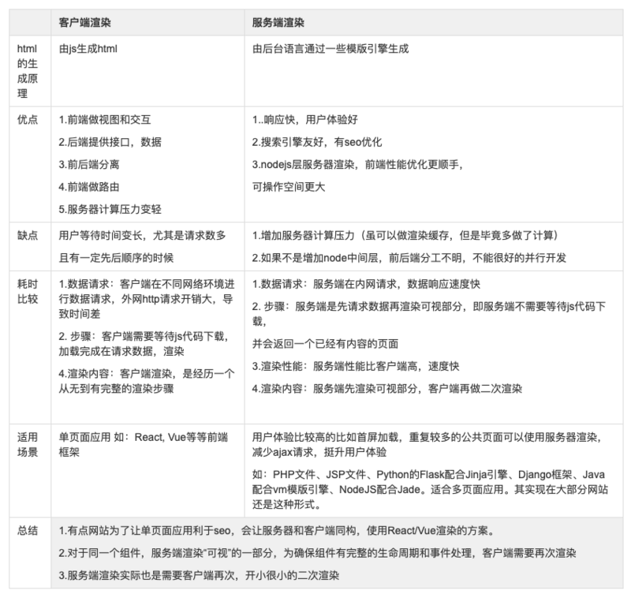

再看下客户端和服务器端渲染路线，下图左侧是客户端渲染，右侧是服务器端渲染。

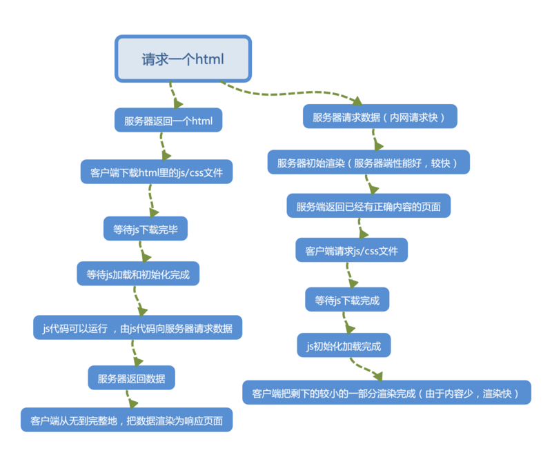

绝大多数网站既有服务端渲染的地方(比如商品列表)，也有客户端渲染的地方(比如商品评价)，主要是考虑到了SEO问题。(异步AJAX渲染的数据(客户端渲染，比如商品评价)爬虫爬不到)

所以你会发现真正的网站既不是纯异步也不是纯服务器渲染出来的，而是两者结合来做的。

例如京东的商品列表就采用的是服务端渲染，目的了为了SEO搜索引擎优化。

而它的商品评论列表为了用户体验，而且也不需要SEO优化，所以采用是客户端渲染。

(如果有一天搜索引擎都可以爬取或抓到异步渲染的数据的话，那么可能所有网站都是异步的了，但是目前来说是不可能的。)

异步(AJAX)体验好，开发方式也简单，就是不利于SEO。

### 服务端渲染(1次请求)

[AJAX怎么做到SEO友好](https://blog.csdn.net/wenshu12321/article/details/73741013)

服务端渲染说白了就是在服务端使用模版引擎，模版引擎最早诞生于服务端，后来才发展到了前端。

服务端渲染更快，响应的就是最终的结果，客户端不需要再做任何的处理。

服务端渲染是可以被爬虫抓取到的，有利于SEO。

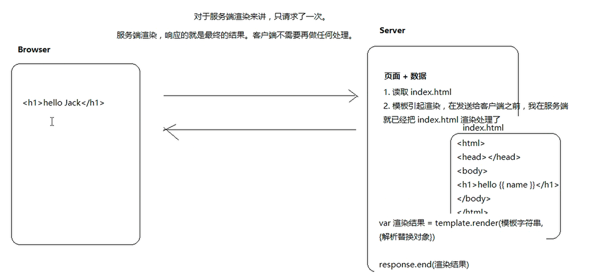

### 客户端渲染(至少2次请求)

客户端渲染有一个好处，你可以尽早的看到数据，虽然里面是空的，有一个等待的过程。

但是客户端渲染不利于SEO,搜索引擎优化。

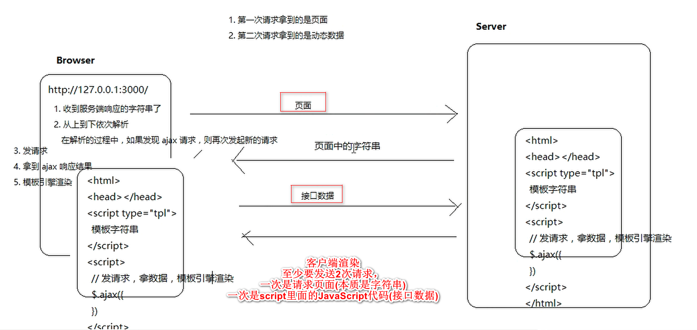

## 案例：留言板

[node.js中的url.parse方法使用说明](https://blog.csdn.net/swimming_in_IT_/article/details/77439975)

> 你的整个页面是一个请求，此外页面中的每一个资源都是一个请求。
>
> 老师说：Node不适合从来没有接触过服务端的人学习(因为它太灵活了)，如果想要真正的学好服务端，还是老牌的Java,PHP这些平台。
>
> Node不是特别适合入门服务端，但不代表Node不强大。
>
> Node很厉害，具有经验的人可以玩的非常的牛。
>
> 不适合新手的原因就在于比较偏底层，而且太灵活。
>
> Java,PHP好入门的原因就在于这些平台屏蔽了一些底层。
>
> Node如果入门入好了，是不亚于Java,PHP的。
>
> 我们学Node既有好处，也有不好的地方。好处是你可以了解底层，不好的地方在于它真的太偏底层了，真的不太适合新手去学。
>
> 但是难，我们也要认真去做。
>
> 而且等我们明天上了框架，就不用再考虑这些底层细节了，一个API搞定。

**url模块.js**

~~~javascript
var url = require('url')

var obj = url.parse('/pinglun?name=大家分开了思考&message=圣诞节风口浪尖的考虑')

var obj2 = url.parse('/pinglun?name=大家分开了思考&message=圣诞节风口浪尖的考虑',true)

console.log(obj);

console.log(obj2);
console.log(obj2.query);
// [Object: null prototype] { name: '大家分开了思考', message: '圣诞节风口浪尖的考虑' }
console.log(obj2.pathname);
// /pinglun
~~~

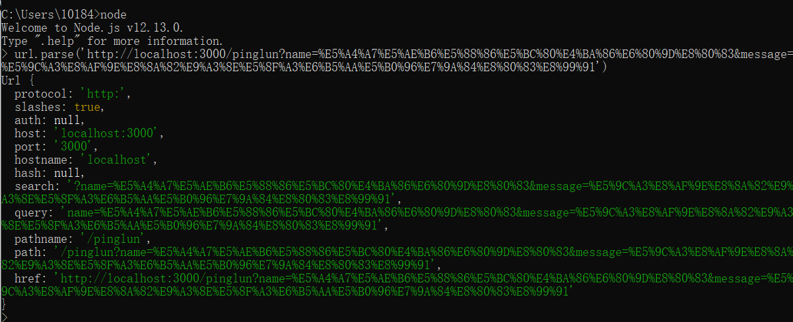

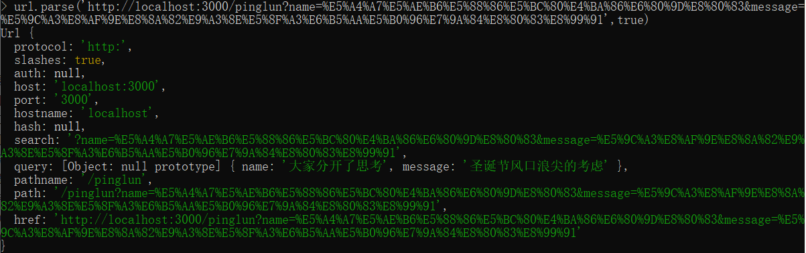

###  留言板源代码

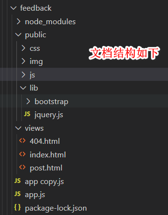

**app.js**

~~~javascript
// app application 应用程序
// 把当前模块所有的依赖项都声明在文件模块最上面，这是一个好的习惯
// 不要用的时候再声明，这样比较乱，集中写在一起比较好
// 为了让目录结构保持统一清晰，所以我们约定把所有的HTML文件都放到views(视图)目录中

// 我们为了方便的统一处理这些静态资源，所以我们约定把所有的静态资源都存放在public目录中
// 哪些资源能被用户访问，哪些资源不能被用户访问，我现在可以通过代码来进行非常灵活的控制
// Apache服务器则很难做到，Apache服务器里面的东西都是公共开放的，想访问谁就访问谁
// 而真实的服务器是不会那么干的

//  /表示index.html
//  public表示整个public目录中的资源都允许被访问。

// 前后端融会贯通了之后，什么都是你说了算，你就可以为所欲为了。
var http = require('http')
var fs = require('fs')

var url = require('url')
// 引入pathname模块
// 但是下面我们还有个pathname变量，这样名字会重复

var template = require('art-template')
// 引入remplate模版引擎
// 完整写法：
// var server = http.createServer()
// server.on('request', function (req, res) {

// }
// server.listen(3004, function () { 
//     console.log('running...');
// })

// 简写方式：不需要单独写一个变量server了
// 这样写更加方便

var comments = [
  {
    name: '张三',
    message: '今天天气不错！',
    dateTime: '2015-10-16'
  },
  {
    name: '张三2',
    message: '今天天气不错2！',
    dateTime: '2015-10-16'
  },
  {
    name: '张三3',
    message: '今天天气不错3！',
    dateTime: '2015-10-16'
  },
  {
    name: '张三4',
    message: '今天天气不错4！',
    dateTime: '2015-10-16'
  },
  {
    name: '张三5',
    message: '今天天气不错5！',
    dateTime: '2015-10-16'
  }
]

// /pinglun?name=大家分开了思考&message=圣诞节风口浪尖的考虑
// 对于这种表单提交的请求路径，由于其中具有用户动态填写的内容，
// 所以你不可能通过判断完整的pathname路径来处理这个请求。

// 结论：对于我们来讲，其实只需要判定，如果你的请求路径是/pinglun的时候，
// 那我就认为你提交表单的请求过来了。
http
  .createServer(function (req, res) { 
    // 使用pathname.parse方法将路径解析为一个方便操作的对象，
    // 第二个参数为true表示直接将查询字符串转为一个对象(通过query属性来访问)
    var parseObj = url.parse(req.url,true)
    // res.end('hello')

    // 单独获取不包含查询字符串的路径部分(改路径不包含?之后的内容)
    var pathname = parseObj.pathname;

    // var pathname = req.pathname;
    // 有了parseObj和pathname，这个时候就不需要这个语句了

    if (pathname === '/') {
      // 这个时候就不要再判定url了，因为判定url满足不了我们的需求了
      fs.readFile('./views/index.html', function (err, data) {
        if (err) {
          return res.end('404 Not Found')
        }
        var htmlStr = template.render(data.toString(), {
          comments:comments
        })
        res.end(htmlStr)
        // data既可以接收二进制，又可以接收字符串
        // 那什么情况下把data转成二进制，什么情况下又不用转呢？
        // 当你需要操作字符串(比如模版引擎渲染)的时候，你才需要去转它
        // 我们这里不操作字符串，所以不用将data转成字符串
      })
    }else if (pathname === '/post') { 
          fs.readFile('./views/post.html', function (err, data) {
        if (err) {
          return res.end('404 Not Found')
        }
        res.end(data)
      })

    }else if (pathname.indexOf('/public/') === 0) {
      // public/css/main.css
      // public/js/main.js
      // public/lib/jquery.js
      // 统一处理：
      //     如果请求路径是以/public/开头的，则我认为你要获取public中的某个资源
      //     所以我们就直接可以把请求路径文件路径来直接进行读取
      // console.log(url);
      fs.readFile('.' + pathname, function (err, data) {
        if (err) {
          return res.end('404 Not Found')
        }
        res.end(data)
      })
      // .表示localhost:3000,不能少了
    } else if (pathname === '/pinglun') { 
      // 注意：这个时候无论/pinglun?xxx之后是什么，我都不用担心了，
      // 因为我的pathname是不包含?之后的那个路径的
      // console.log('收到表单请求了', parseObj.query);

      // res.end(JSON.stringify(parseObj.query))
      // 注意：一次请求对应一次响应，响应结束这次请求也就结束了
      // 虽然代码继续往后执行，但是你再发送请求也纠结不管用了
      // 要把这个res.end给注释掉，不然下面的res.end()不管用了

      // 我们已经使用url模块的parse方法把请求路径中的查询字符串给解析成一个对象了
      // 所以接下来要做的就是：
      //    1.获取表达提交的数据    parseObj.query
      //    2.生成日期到数据对象中，然后存储到数组中
      //    3.让用户重定向跳转到首页  /
      //      当用户重新请求  / 的时候，我数组中的数据已经发生变化了，所以用户看到的页面也变了
      var comment = parseObj.query
      comment.dateTime = '2017-11-02 17:30:20'
      comments.unshift(comment)
      // 服务端这个时候已经把数据存储好了，接下来就是让用户重新请求 / 首页，就可以重新看到最新的留言内容了

      // 这个时候让它重新回到首页，要用到服务器重定向这个概念(3开头的状态码都是重定向的)
      // 如果通过服务器让客户端重定向?
      //   1.状态码设置为302:临时重定向(301为永久重定向)
      //        statusMessage
      //   2.在响应头中通过Location告诉客户端往哪儿重定向
      //        setHeader(用于写响应头的内容的)
      // 如果客户端发现收到服务器的响应的状态码是302,就会自动去响应头中找Location
      // 然后对该地址发起新的请求
      // 所以你就能看到客户端自动跳转了，一句代码都不用写
      res.statusCode = 302
      res.setHeader('Location', '/')
      // 直接写个/就可以了，不用写127.0.0.1:3000/的，浏览器会自动补齐的
      res.end()
    }else { 
      // 其他的都处理成404，找不到页面
      fs.readFile('./views/404.html', function (err, data) { 
        if (err) { 
          return res.end('404 Not Found')
          // 万一404.html文件都没有，就发送一句话404 Not Found
        }
        res.end(data)
      })
    }
  })
  .listen(3000, function () { 
    console.log('running...');
  })

// 1.   /  index.html
// 2.   开放public目录中的静态资源
//      当请求/public/xxx的时候，读取响应public目录中的具体资源
// 3.   /post post.html
// 4.   /pinglun
//       4.1接收表单提交数据
//       4.2存储表单提交的数据
//       4.3让表单重定向到/
//          statusCode
//          setHeader

// 明天：模块系统
//Express（第三方Web开发框架）
//这两做的事儿，在框架里面就是一个API的事儿
// 使用框架的目的就是让我们更加专注于业务，而不是底层细节
~~~

**index.html**

~~~html
<!DOCTYPE html>
<html lang="en">

<head>
  <meta charset="UTF-8">
  <title>留言本</title>
  <!-- 
    浏览器收到 HTML 响应内容之后，就要开始从上到下依次解析，
    当在解析的过程中，如果发现：
      link
      script
      img
      iframe
      video
      audio
    等带有 src 或者 href（link） 属性标签（具有外链的资源）的时候，浏览器会自动对这些资源发起新的请求。
    (a链接的href是你只有点它才发请求，所以不是a链接的href)
   -->
  <!-- 
      注意：在服务端中，文件中的路径就不要去写相对路径了。
      (写再多的if...else也是写不完的)

      因为这个时候所有的资源都是通过 url 标识来获取的
      我的服务器开放了 /public/ 目录
      所以这里的请求路径都写成：/public/xxx
      / 在这里就是 url 根路径的意思。
      浏览器在真正发请求的时候会最终把 http://127.0.0.1:3000 拼上

      不要再想文件路径了，把所有的路径都想象成 url 地址
    -->
  <link rel="stylesheet" href="/public/lib/bootstrap/bootstrap.css">
  <!-- 这个文件资料里没有， -->
  <!-- <link rel="stylesheet" href="css/main.js"> -->

  <!-- 这个是编的不存在的文件路径(资源标签) -->
  <!-- 你的页面是一个请求，页面中的每一个资源都是一个请求。 -->
  <!-- 这个main.js会产生一个请求 -->
  <!-- <link rel="stylesheet" href="/public/css/main.css"> -->
</head>

<body>
  <!--  -->

  <div class="header container">
    <div class="page-header">
      <h1>Example page header <small>Subtext for header</small></h1>
      <a class="btn btn-success" href="/post">发表留言</a>
    </div>
  </div>
  <div class="comments container">
    <ul class="list-group">
      {{each comments}}
      <li class="list-group-item">{{ $value.name }}说：{{ $value.message }} <span
          class="pull-right">{{ $value.dateTime }}</span></li>
      {{/each}}
    </ul>
  </div>
  <!-- <script src="/public/js/main.js"></script> -->
  <!-- 不要再想文件路径了，把所有的路径都想象成 url 地址 -->
</body>

</html>
~~~

**post.html**

~~~html
<!DOCTYPE html>
<html lang="en">

<head>
  <meta charset="UTF-8">
  <title>Document</title>
  <link rel="stylesheet" href="/public/lib/bootstrap/bootstrap.css">
</head>

<body>
  <div class="header container">
    <div class="page-header">
      <h1><a href="/">首页</a> <small>发表评论</small></h1>
    </div>
  </div>
  <div class="comments container">
    <!-- 
      以前表单是如何提交的？
      表单中需要提交的表单控件元素必须具有 name 属性
      表单提交分为：
        1. 默认的提交行为
        2. 表单异步提交

        action 就是表单提交的地址，说白了就是请求的 url 地址
        method 请求方法
            get
            post
     -->
    <form action="/pinglun" method="get">
      <div class="form-group">
        <label for="input_name">你的大名</label>
        <input type="text" class="form-control" required minlength="2" maxlength="10" id="input_name" name="name"
          placeholder="请写入你的姓名">
      </div>

      <div class="form-group">
        <label for="textarea_message">留言内容</label>
        <textarea class="form-control" name="message" id="textarea_message" cols="30" rows="10" required minlength="5"
          maxlength="20"></textarea>
      </div>

      <button type="submit" class="btn btn-default">发表</button>
      <!-- 日期是服务端生成的，你发表评论的时候是不写日期的 -->
    </form>
  </div>
</body>

</html>
~~~

**404.html**

~~~html
<!DOCTYPE html>
<html lang="en">
<head>
  <meta charset="UTF-8">
  <title>Document</title>
</head>
<body>
  <h1>抱歉!  您访问的页面失联啦...</h1>
</body>
</html>
~~~

> `bootstrap.css`是自己在Github上下载的，太长了，就不贴了。

# 第二天反馈

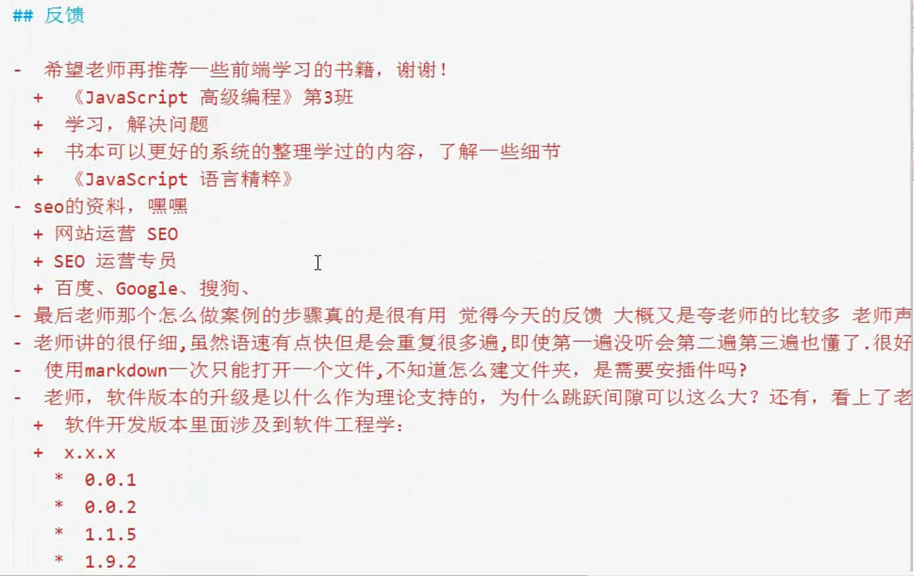

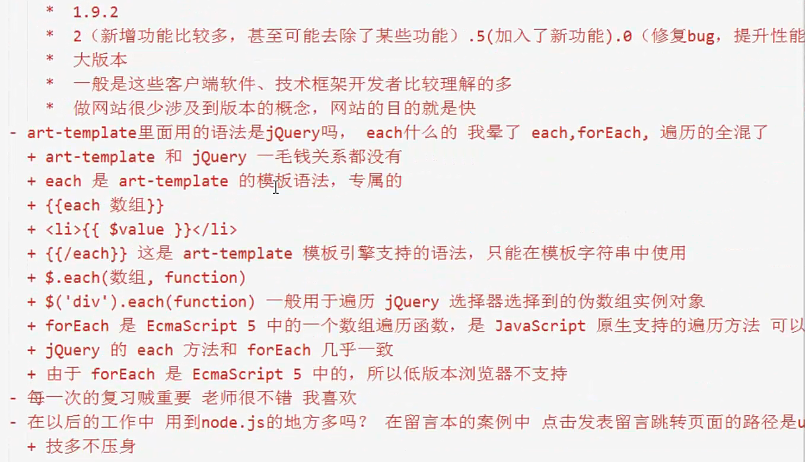

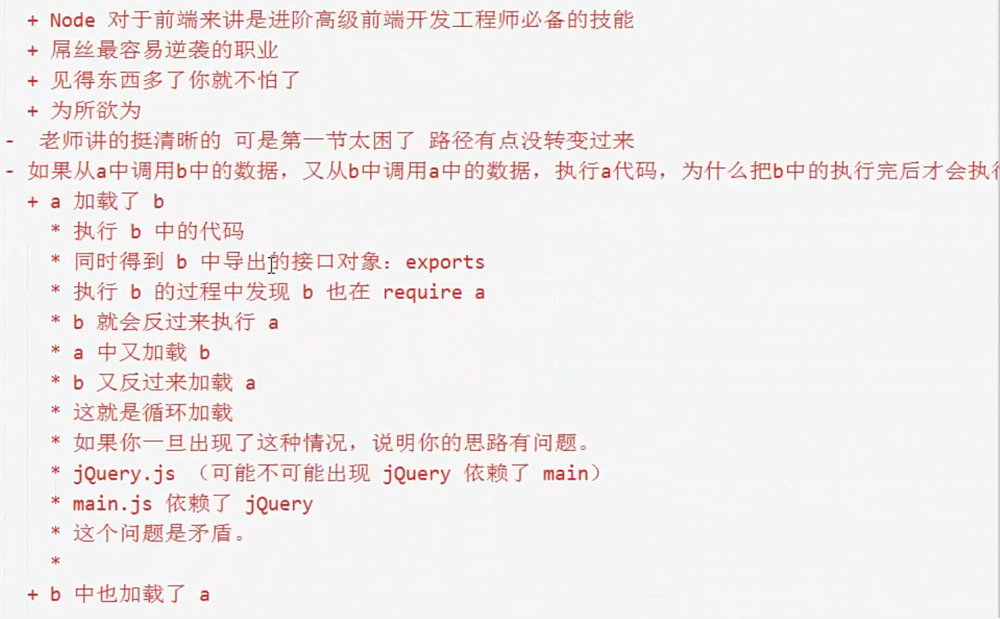

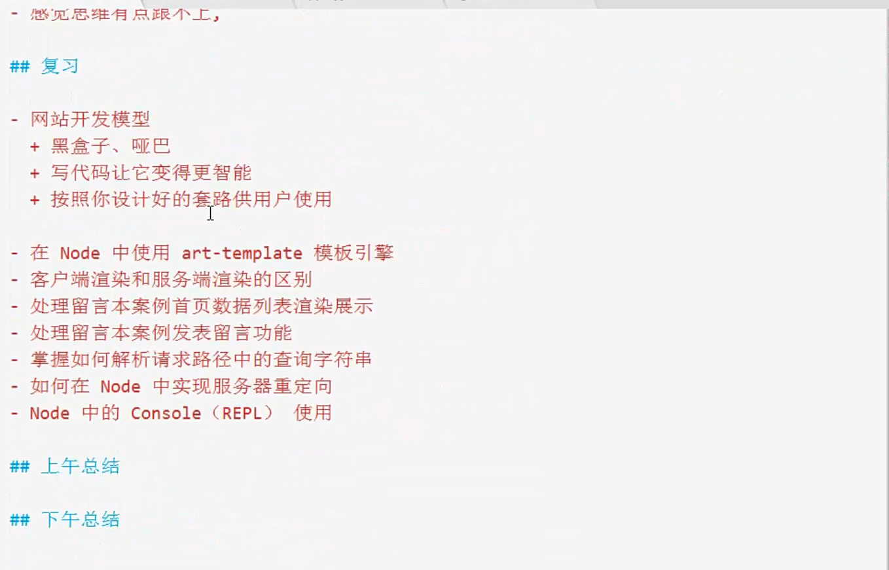

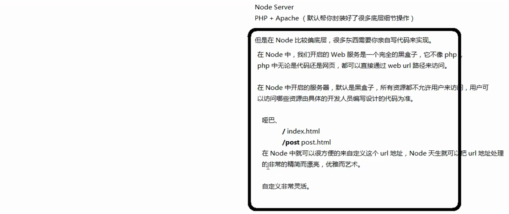

> 在Node中，服务器就是一个哑巴，你想让哑巴说话，就得自己写代码。

# Node中的模块系统

> 这是第三天课程了，总共是7天的课程。我前2天的课程不知不觉看了一个月了。。。。卧槽，这效率。。。

使用Node编写应用程序主要就是在使用：

* ECMAScript语言
  * 和浏览器不一样，在Node中没有BOM和DOM
* 核心模块(Node内置)
  * 文件操作的fs
  * http服务的http
  * url路径操作模块等
  * path路径处理模块
  * OS操作系统信息模块
  * 就是一系列的API
* 第三方模块(要引入)
  * `art-template`模版引擎
  * 必须通过NPM下载才可以使用
* 咱们自己写的模块(自己创建)
  * 自己创建的文件

## 什么是模块化

如果一个平台支持：

* 文件作用域
  * 不会有变量污染的情况
* 通信规则
  * 加载 require
  * 导出 

那我就可以说它符合模块化。

## CommonJS模块规范

在Node中的JavaScript还有一个很重要的概念：模块系统。

* **模块作用域**(和浏览器相比它不是全局作用域，它是模块作用域。默认模块中的所有成员不能被外部访问。)
* **使用require方法来加载模块**(没有script标签，不能通过script标签来加载文件)
* **使用exports接口对象用来导出模块中的成员**

### 案例1

**main.js**

~~~javascript
// 默认得到的是对象
// 使用对象中的成员还必须要用点(.)某个成员出来，比较麻烦
// 有时候，对于一个模块，我仅仅就是希望导出一个方法就可以了
// (比如只想导出一个add,但我还必须要fooExports.a才能出来add函数)
var fooExports = require('./foo')
// 已经加载了foo模块
// console.log(foo);
// ReferenceError: foo is not defined

// 但是即便你加载了我，你也得不到我，因为模块作用域的关系
// 你只能得到我(foo模块)想给你的东西(要export)
// 我们之间确实开了一扇小门，但是我自己不主动给你东西，你不能直接过来抢

console.log(fooExports);

console.log(exports);
~~~

**foo.js**

~~~javascript
var foo = 'bar'

function add(x, y) { 
    return x + y;
}

// 只能得到我想要给你的成员
// 这样做的目的是为了解决变量命名冲突的问题
// exports.a = add;
// 给exports对象动态添加参数
// 这个时候main模块可以通过a来访问foo里面的add函数

// exports就是个对象,我们可以通过多次给该对象添加成员实现对外导出多个内部成员

exports.str = 'hello'

// 现在我有一个需求：
// 我希望加载得到的直接就是一个

//  方法
//  字符串
//  数字
//  数组


// 错误方法：
// exports = add
// 你可以认为在每个模块的最后return了这个exports
// 这里exports等于了这个add,main是不是可以直接访问add函数了呢
// 打印fooExports和exports，都显示{},表名是一个空对象，所以这个不行

// 正确方法：这样是可以的
// 如果一个模块需要直接导出某个成员，而非挂载的方式
// 那这个时候必须使用module.xx = xx的方式
module.exports = add
~~~

### 加载`require`

语法：

~~~javascript
var 自定义变量名 = require('模块')
~~~

两个作用：

* 执行被加载模块中的代码
* 得到被加载模块中的`exports`导出接口对象

### 导出`exports`

* Node中是**模块作用域**，默认文件中**所有的成员只在当前文件模块有效**
* 对于希望可以被其他模块访问的成员，我们就需要把这些**公开的成员**都挂载到`exports`接口对象中就可以了

导出方式有2种：

* 导出多个成员

  * 必须是对象，对方拿到的也是对象。要想访问必须要**点(.)**出对象当中的某个成员。

    ~~~javascript
    exports.a = 123;
    exports.b = 'hello';
    exports.c = function(){
      console.log('ccc')
    }
    exports.d = {
      foo:'bar'
    }
    ~~~

* 导出单个成员

  * 拿到的就是函数或者字符串

    ~~~javascript
    module.exports = 'hello'
    //前面的'hello'被覆盖了
    
    module.exports = function(){}
    //如果写2个module.exports，则后面会覆盖前面的。
    ~~~

  * 也可以通过`module.exports`来导出多个成员

    ~~~javascript
    modules.exports = {
      add:function(x,y){
        return x + y
      },
      str:'hello'
    }
    ~~~

### 原理解析

> 这个我看视频听懂了。

`exports`是`module.exports`的一个引用，最终return 的是`module.exports`,如果给`exports(太监)`重新赋值(叛变)，则`exports`无法引用`module.exports`了，如果`module.exports`重新赋值了(皇上不干了)，那么`exports`不论怎么引用也没用了。

~~~javascript
module.exports.foo = 'bar'
//等价于
exports.foo 'bar'

console.log(module.exports === exports);		//true
~~~

### `exports`和`module.exports`的区别

[Node.js模块里exports与module.exports的区别?](https://www.zhihu.com/question/26621212/answer/58946177)

* 每个模块中都有一个`module`对象
* `module`对象中有一个`exports`对象
* 我们可以把需要导出的成员都挂载到`module.exports`接口对象中
* 也就是：`moudle.exports.xxx = xxx`的方式
* 但是每次都`moudle.exports.xxx = xxx`很麻烦，点儿的太多了
* 所以Node为了你方便，同时在每一个模块中都提供了一个成员叫：`exports`
* `exports === module.exports`结果为true 
* 所以对于：`moudle.exports.xxx = xxx`的方式完全可以：`expots.xxx = xxx`
* 当一个模块需要导出单个成员的时候，这个时候必须使用：`module.exports = xxx`的方式
* 不要使用`exports = xxx`，因为不管用
* 因为每个模块最终向外return的是`module.exports`
* 而`exports`只是`module.exports`的一个引用
* 所以即便你为`exports = xx`重新赋值，也不会影响`module.exports`
* 但是有一种赋值方式比较特殊：`exports = module.exports`这个用来重新建立引用关系的
* 之所以让大家明白这个道理，是希望可以更灵活的去用它

知乎问答摘录：

**用一句话来说明就是，require方能看到的只有module.exports这个对象，它是看不到exports对象的，而我们在编写模块时用到的exports对象实际上只是对module.exports的引用。**

如果你能理解上面这句话，那么下面的都是废话，可以不用看了，因为是用来解释上面这句话的。

关于引用，可以用下面的例子来让你搞得请清楚楚的：

首先说一个概念：

ECMAScript的变量值类型共有两种：

基本类型 (primitive values) ： 包括Undefined, Null, Boolean, Number和String五种基本数据类型；

引用类型 (reference values) ： 保存在内存中的对象们，不能直接操作，只能通过保存在变量中的地址引用对其进行操作。

我们今天要讨论的exports和module.exports属于Object类型，属于引用类型。

看下面的例子：

~~~javascript
var module = {
    exports:{
        name:"我是module的exports属性"
    }
};
var exports = module.exports;  
//exports是对module.exports的引用，也就是exports现在指向的内存地址和module.exports指向的内存地址是一样的

console.log(module.exports);    //  { name: '我是module的exports属性' }
console.log(exports);   //  { name: '我是module的exports属性' }


exports.name = "我想改一下名字";


console.log(module.exports);    //  { name: '我想改一下名字' }
console.log(exports);   //  { name: '我想改一下名字' }
//看到没，引用的结果就是a和b都操作同一内存地址下的数据


//这个时候我在某个文件定义了一个想导出的模块
var Circle = {
    name:"我是一个圆",
    func:function(x){
        return x*x*3.14;
    }
};

exports = Circle;  
//看清楚了，Circle这个Object在内存中指向了新的地址，所以exports也指向了这个新的地址，和原来的地址没有半毛钱关系了
~~~

回到nodejs中，module.exports初始的时候置为{},exports也指向这个空对象。

那么，这样写是没问题的：

~~~javascript
exports.name = function(x){
    console.log(x);
};

//和下面这个一毛一样，因为都是修改的同一内存地址里的东西


module.exports.name = function(x){
    console.log(x);
};
~~~

但是这样写就有了区别了：

~~~javascript
exports = function(x){
    console.log(x);
};

//上面的 function是一块新的内存地址，导致exports与module.exports不存在任何关系，而require方能看到的只有module.exports这个对象，看不到exports对象，所以这样写是导不出去的。

//下面的写法是可以导出去的。说句题外话，module.exports除了导出对象，函数，还可以导出所有的类型，比如字符串、数值等。
module.exports = function(x){
    console.log(x);
};
~~~

### 案例2

**main.js**

~~~javascript
var fooExports = require('./foo')

console.log(fooExports);

// 如果你实在分不清楚exports和module.exports，你可以选择忘记exports,只使用module.exports也没问题
// module.exports.xxx = xxx
// module.exports = {} //这个是重新赋值了，以重新赋值的为准

// 老师这里讲了面向对象的有关只是
// var obj = {}
// var obj1 = obj

// obj1.foo = 'bar'
// obj.foo = 'hello'

// obj1 = {}
// obj1.foo = 'world'
// console.log(obj.foo);
// 结果是hello
~~~

**foo.js**

~~~javascript
// 在Node中，每个模块内部，都有自己的module对象
// 该module对象中有一个成员exports,也是一个对象，只不过是一个空对象
// module对象里还有别的成员，暂且不表

// 也就是说。如果你需要对外导出成员，只需要把导出的成员挂载到module.exports中

// 我们发现，每次导出接口成员的时候，都要通过module.exports.xxx = xxx的方式很麻烦
// 所以，Node为了简化你的操作，专门提供了一个变量，exports = module.exports

// 也就是说，在模块中，还有这么一句代码：
// var exports = module.exports

// var module = {
//     exports: {
//         foo:'bar',
//         add:function(){
//              return x + y    
//}
//     }
// }
// 上面的代码是Node底层的，你看不见的

// 默认在代码最后有一句：
// return module.exports   这个你同样也看不见
// 一定要记住：最后return的是module.exports，而不是exports


// 当一个模块需要单个成员的时候
// 直接给exports赋值是不管用的,会丢失module.exports的引用关系
// exports = 'hello'
// 这样写不管用(最后return的是module.exports，而不是exports)

// 接下来谁来require我，谁就得到module.exports

// module.exports.foo = 'bar'
// exports在module里面的
// 但是这种点太多实在是不方便

// module.exports.add = function (x, y) { 
//         return x + y
// }

console.log(exports === module.exports);
// 2者一致，那就说明我可以使用任意一方来导出内部成员
// exports只是module.exports的一个引用，如果单独给exports赋值，则它会指向新的对象了
// 那么exports就跟module.exports没关系了

// exports.a = 123

// 重新赋值之前(exports = {}之前上面的代码是有效的，下面的就没有效果了)
// exports = {}
// 后面的exports代码都没用了

// exports.foo = 'bar'

// exports.add = function (x, y) { 
//     // 这个是在里面添加成员
//     return x + y
// }

// module.exports.b = 456
// 这个不会受exports的影响，写这个总是没错的
// module.exports是皇上，永远是对的
// exports是大臣，当他依附于(指向皇上)的时候，他就是对的，改变指向的时候，他就叛变了

// module.exports = 'hello'
// 给exports赋值会断开和module.exports之间的引用
// 同理，给module.exports

// 这里导致exports !== module.exports
// module.exports = {
//     foo:'bar'
// }

// 但是这里又重新建立了两者的引用关系
// exports = module.exports

// exports.foo = 'world'

// {foo:bar}
exports.foo = 'bar'

// {foo:bar,a:123}
module.exports.a = 123

// 在这里exports重新引用了
// exports !== module.exports了
// 最终return的是module.exports
// 所以无论你exports里面的成员是什么，都没有用了
exports = {
    a:456
}

// {foo:haha,a:123}
module.exports.foo = 'haha'

// 这里没用，混淆
exports.c = 456

// 这里重新建立了和module.exports的引用关系
exports = module.exports

// 由于在上面建立了引用关系，所以这里是生效的
// {foo:haha,a:789}
exports.a = 789

// 这样一写，用JS角度来说是module.exports被重新赋值了，前面的全部死掉了
module.exports = function () { 
    console.log('hello')
}

// 真正去使用的时候：
//      导出多个成员：exports.xxx = xxx(多次这么来写)
//      导出多个成员也可以：    module.exports = { 
//                             }
//      导出单个成员：module.exports(只写这一次就可以了)
~~~

### 第三天上午总结

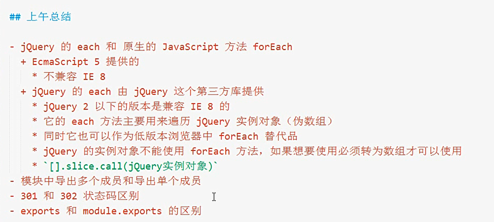

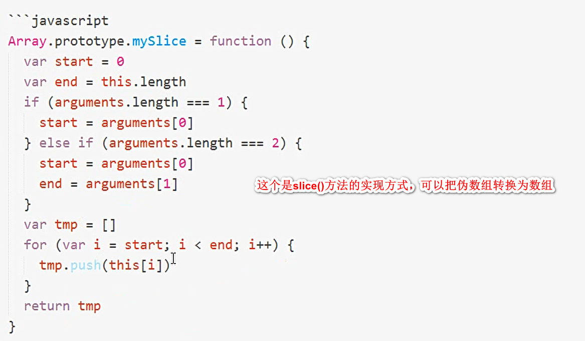

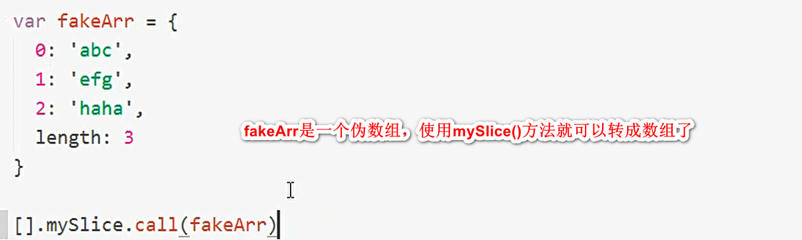

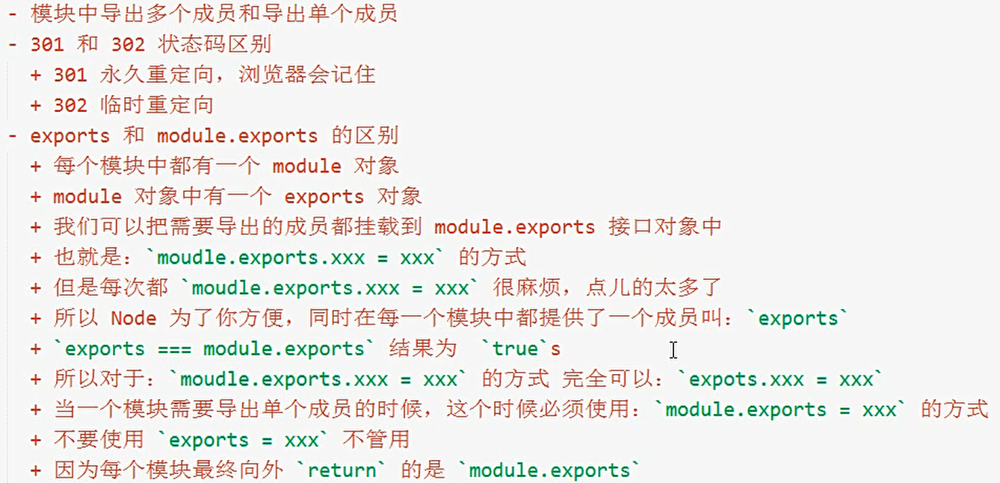

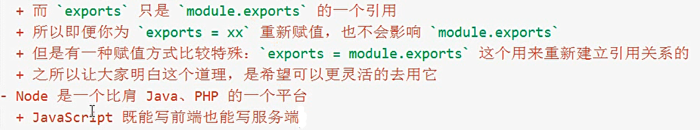

### require方法加载规则

* 核心模块

  * 模块名

* 第三方模块

  * 模块名

* 用户自己写的

  * 路径

#### 加载规则


* 优先从缓存加载
* 判断模块标识

  * 核心模块
  * 第三方模块
  * 自己写的模块

~~~javascript
blog 
		a
    		node_modules
        	art-template
				foo.js
    b
    	  ../a/foo,js
				a中的第三方包是不能通过require('art-template')方式来加载的
        require('../a/node_modules/art-template/index.js') 这样是可以的  
        //但是你这样写那一大套加载规则就没什么用了
~~~

> Node搞这么一大套加载规则，目的就是为了让你少写一点路径。

#### 案例

**main.js**

~~~javascript
// 如果是非路径形式的模块标识
// require('模块标识')

// require('foo.js')
// 这样写是不会把它当作路径的，可能会把它当成核心模块，也可能会把它当成第三方模块

// 路径形式的模块必须以
//   ./     当前目录，不可省略
//   ../    上一级目录，也不可省略
//   /xxx      /xxx几乎不用
//   d:/a/foo.js    这个是绝对路径，也几乎不用(项目的代码跟着项目走，而不是跟着你的电脑走)
// 这样的开头
// 首位的 / 在这里表示的是当前文件模块所属磁盘根路径

// 但是.js后缀名可以省略

require('./foo.js')


// 核心模块
// 核心模块的本质也是文件
// 核心模块文件已经被编译到了二进制文件中了，我们只需要按照名字来加载就可以了
// require('fs')
// require('http')

// 第三方模块
// 凡是第三方模块都必须通过第三方模块进行下载
// 使用的时候就可以通过require(包名)来进行加载才可以使用
// 不可能有任何一个第三方包和核心模块的名字是一样的
// 既不是核心模块也不是路径形式的模块
//      先找到当前文件所属目录中的node_modules目录
// 只要你装包，node_modules目录会被自动创建出来
//      node_modules/art-template
//      node_modules/art-template/package.json文件
//      node_modules/art-template/package.json文件中的main属性
//      main属性中就记录了art-template中的入口模块
//      然后加载使用这个第三方包
//      实际上最终加载的还是文件

//      如果package.json文件不存在，或者main指定的入口模块也没有
//      则node会自动找该目录下的index.js
//      也就是说index.js会作为一个默认备选项

//      如果以上所有任何一个条件都不成立，则会进入上一级的node_modules目录查找
//      如果上级还没有，则继续往上上级去查找
//      如果直到当前磁盘根目录还找不到，最后报错：can not find module xxx
var template = require('art-template')

require('a')

//注意：我们一个项目有且只有一个node_modules，放在项目根目录中
// 这样的话项目中所有子目录都会加载到第三方包
// 不会出现多个node_modules
// 模块查找机制 
//      优先从缓存加载
//      核心模块
//      路径形式的文件模块
//      第三方模块
~~~

## NPM

全称：Node Package Manage

### NPM网站

[NPM官方网站](https://www.npmjs.com/)

### NPM命令行工具

NPM的第二层含义就是一个命令行工具，只要你安装了Node,就已经同时安装了NPM。

NPM也有版本这个概念。

* 查看版本：

~~~shell
npm --version
~~~

* 主动升级NPM：

~~~shell
npm install --global npm
~~~

### 常用命令

* `npm init`：初始化项目，生成`package.json`文件
  * `npm init -y`可以跳过向导，快速生成项目

* `npm install`

  * 一次性把`dependencies`选项中的依赖项全部安装

  * 简写：`npm i`

* `npm install 包名`

  * 纯粹的装包

* `npm install --save`包名
  * 下载并且保存依赖项(`package.json`文件中的`dependencies`)
  * 简写：`npm i -S 包名`(必须要是大S)
* `npm uninstall 包名`
  * 只删除，如果有依赖项会依然保存
* `npm uninstall --save 包名 `
  * 删除的同时也会把依赖信息也去除
  * 简写：`npm un -S 包名`(必须要是大S)
* `npm help`
  * 查看使用帮助
* `npm 命令 --help`
  * 查看指定命令的使用帮助
  * 例如：`npm uninstall --help`，此时它就会显示`uninstall`的用法了

### 解决NPM被墙问题

[淘宝镜像](https://developer.aliyun.com/mirror/NPM?from=tnpm)

NPM存储包文件的服务器在遥远的国外，有时候会被墙(其实不管墙不墙，速度都比较慢），所以我们需要解决这个问题。

淘宝的开发团队把NPM在国内做了一个备份(同步频率目前为 **10分钟** 一次以保证尽量与官方服务同步)。

安装淘宝的CNPM：

~~~shell
#在任意目录执行都可以！！！
#--global表示安装到全局，而非当前目录，所以你在哪里安装都可以
#--global不能省略，否则不管用
npm install --global cnpm
~~~

接下来你安装包的时候把之前的`npm`替换成`cnpm`。

举个例子：

~~~shell
#这里还是走国外的npm服务器，速度比较慢
npm install jquery

#使用cnpm就会通过淘宝的服务器来下载jquery
cnpm install jquery
~~~

> `cnpm`安装好后，`npm`还是可以继续用的，只不过`npm`依旧是用的国外的服务器。

如果不想安装`cnpm`又想使用淘宝的服务器来下载各种包：

~~~shell
npm install 包名 registry=https://r.npm.taobao.org
#举例
npm install jquery registry=https://r.npm.taobao.org
~~~

但是每次手动这样加参数很麻烦，所以我们可以把这个选项加到配置文件中：

~~~shell
npm config set registry=https://r.npm.taobao.org

#查看npm配置信息
npm config list
~~~

只要经过了上面命令的配置，则你以后所有的`npm install`都会默认通过淘宝的服务器来下载。

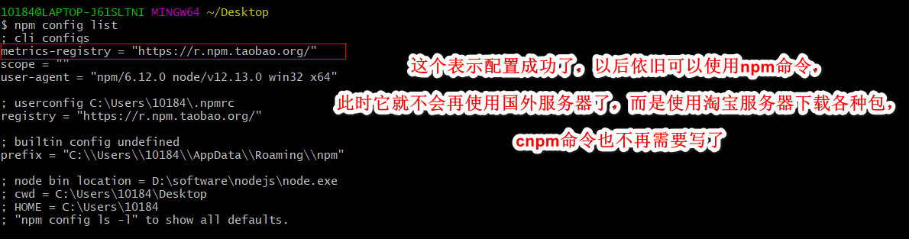

## Package.json

[package.json文件](https://javascript.ruanyifeng.com/nodejs/packagejson.html)

> 建议每次装包时都加上`--save`，它就会自动在`package.json`里面新增你安装的包的信息。

单独的`nodu_modules`里面的东西实在是太多了，你从里面很难看出来你这个项目里依赖哪些包。而`package.json`就是你这个项目的说明书，可以用来描述你这个项目依赖了某些第三方包，你的项目叫什么名字，作者是谁。

我们建议每一个项目都要有一个`package.json`文件(一般称为包描述文件,就像产品的说明书一样)，给人踏实的感觉。

这个文件可以通过`npm init`的方式自动的初始化出来。`npm init`会通过向导的方式(问你一句，你答一句)来创建项目。

~~~javascript
$ npm init
This utility will walk you through creating a package.json file.
It only covers the most common items, and tries to guess sensible defaults.

See `npm help json` for definitive documentation on these fields
and exactly what they do.

Use `npm install <pkg>` afterwards to install a package and
save it as a dependency in the package.json file.

Press ^C at any time to quit.
package name: (npm-demo)
version: (1.0.0) 0.0.1
description: 这是一个测试项目
entry point: (main.js) main.js
test command:
git repository:
keywords:
author: liming
license: (ISC)
About to write to C:\Users\10184\Desktop\npm-demo\package.json:

{
  "name": "npm-demo",
  "version": "0.0.1",
  "description": "这是一个测试项目",
  "main": "main.js",
  "scripts": {
    "test": "echo \"Error: no test specified\" && exit 1"
  },
  "author": "liming",
  "license": "ISC"
}


Is this OK? (yes) y
~~~

对于咱们目前来讲，最有用的是那个`dependencies`选项，可以用来帮我们保存第三方包的依赖信息。

* 建议每个项目的根目录下都有一个`package.json`文件
* 建议执行`npm install 包名`的时候都加上`--save`这个选项，目的是用来保存依赖项信息。

在你有了`package.json`的情况下，如果你的`node_modules`被误删了，可以执行`npm install`再把`node_modules`再装回来。这个命令会找到`package.json`文件，在里面找到`dependencies`这个选项，找到里面的依赖项，一个一个把它们全部装进来。

> `npm install`可以简写为`npm i`

## package-lock.json

npm5以前是不会有`package-lock.json`这个文件的。

npm5以后才加入了这个文件。

当你安装包的时候，npm都会生成或者更新`package-lock.json`这个文件。

* npm5以后的安装包不需要加`--save`参数，他会自动保存依赖。
* 当你安装包的时候，会自动创建或者更新`package-lock.json`这个文件。
* `package-lock.json` 保存了`node_modules`整个包的依赖树信息(包括下载地址)。   当你把`node_moodules`文件夹删除后，如果你有`package-lock.json`这个文件，当你`npm i`重新下载`node_modules`时，下载速度比没有`package-lock.json`更快(直接解析`package-lock.json`这个文件就可以瞬间得到所有包的下载地址，会更快)
* 从文件来看，有一个`lock`称之为锁
  * 这个`lock`是用来锁定版本的。
  * 如果项目依赖了`1.1.1版本`，如果你重新`npm i`其实会下载最新版本，而不是1.1.1版本
  * 我们的目的就是希望可以锁住1.1.1这个版本，`package-lock.json`这个文件的另一个作用就是锁定版本号，防止第三方依赖自动升级新版(升级新版后可能包会出现问题。)
  * 举例：没有`package-lock.json`的时候，`package.json`里面显示`"jquery":"^1.11.1"`，前面的`"^"`表示1.11.1之上的任何版本都可以，所以实际你安装的jquery版本不一定是1.11.1。而在`package-lock.json`中它是真实保持了你下载的版本。

## path路径操作模块

> 参考文档：https://nodejs.org/dist/latest-v14.x/docs/api/path.html#path_path_dirname_path

* `path.basename`
  * 获取一个路径的文件名(默认包含扩展名)
* `path.dirname`
  * 获取一个路径中的目录部分
* `path.extname`
  * 获取一个路径中的扩展名部分
* `path.parse`
  * 把一个路径转为对象
    * root：根路径
    * dir：目录
    * base：包含后缀名的文件名
    * ext：后缀名
    * name：不包含后缀名的文件名
* `path.join`
* `path.join`
  * 当你需要进行路径拼接的时候，推荐使用这个方法，避免自己手动写会拼错路径
* `path.isAbsolute`
  * 判断一个路径是否是绝对路径

## Node中的其他成员

在每个模块中，除了`require`,`exports`等模块相关的API之外，还有两个特殊的成员：

- `__dirname`，是一个成员，可以用来**动态**获取**当前文件模块所属目录**的**绝对路径**
- `__filename`，可以用来**动态**获取当前文件的**绝对路径**（包含文件名）
- `__dirname`和`filename`是不受执行node命令所属路径影响的

在文件操作中，使用相对路径是不可靠的，因为node中文件操作的路径被设计为相对于执行node命令所处的路径。

所以为了解决这个问题，只需要把相对路径变为绝对路径（绝对路径不受任何影响）就可以了。

就可以使用`__dirname`或者`__filename`来帮助我们解决这个问题

在拼接路径的过程中，为了避免手动拼接带来的一些低级错误，推荐使用`path.join()`来辅助拼接

```javascript
var fs = require('fs');
var path = require('path');

// console.log(__dirname + 'a.txt');
// path.join方法会将文件操作中的相对路径都统一的转为动态的绝对路径
fs.readFile(path.join(__dirname + '/a.txt'),'utf8',function(err,data){
	if(err){
		throw err
	}
	console.log(data);
});
```

> 补充：模块中的路径标识和这里的路径没关系，不受影响（就是相对于文件模块）

> **注意：**
>
> **模块中的路径标识和文件操作中的相对路径标识不一致**
>
> **模块中的路径标识就是相对于当前文件模块，不受node命令所处路径影响**

# Express

[Express官网](http://expressjs.com/)

* 第三方Web开发框架
* 高度封装了http模块
* 更加专注于业务，而非底层细节
* 知其所以然

原生的HTTP在某些方面表现不足以应对我们的开发需求，所以我们就需要使用框架来加快我们的开发效率，框架的目的就是提高效率，让我们的代码更高度统一。

在Node中，有很多Web开发框架，我们这里以学习`express`为主。

## 起步

### 安装

~~~shell
npm install --save express
~~~

### hello world

~~~shell
var express = require('express')

// 1.创建app
var app = express()

app.get('/', function (req, res) { 
    // res.write('hello')
    // res.write('world')
    // res.end()

    // res.end('hello world')

    // 上面的，以前的东西也是可以用的，只不过比较麻烦，推荐用下面的

    res.send('hello world!')
})

app.get('/login', function (req, res) { 
    // 代码是平行的，不像if...else...,比较的美观
    res.send('login page')
})
app.listen(3000, function () { 
    console.log('express app is running...');
})
~~~

### 基本路由

路由其实就是一张表，表里面有基本的映射关系。主要包括三个部分：

* 请求方法
* 请求路径
* 请求处理函数

#### get

~~~javascript
//当你以GET方法处理 / 请求的时候，执行对应的处理函数
app.get('/', function (req, res) { 
    res.send('hello world!')
})
~~~

#### post

~~~javascript
//当你以POST方法处理 / 请求的时候，执行对应的处理函数
app.post('/', function (req, res) { 
    res.send('hello world!')
})
~~~

### 静态服务

~~~javascript
// /public资源
app.use(express.static('public'))

// /files资源
app.use(express.static('files'))

//必须public/xxx
app.use('/public',express.static('public'))

//必须/static/xxx
app.use('/static',express.static('public'))

app.use('/static',express.static(path.join(_dirname,'public')))
~~~

#### 具体案例

~~~javascript
var express = require('express')

// 1.创建app
var app = express()

// 当以/public/开头的时候，去./public/目录中查找对应的资源
// 这种方式更容易辨识，推荐这种方式
app.use('/public/',express.static('./public/'))

// app.use(express.static('./public/'))
// 当省略第一个参数的时候，则可以通过省略/public的方式来访问
// 这样可以简化路径的操作，可以少写一个/public
// 这种方式的好处就是可以省略/public/


// app.use('/a/', express.static('./public/'))
// 这种表示必须是/a/public目录中的资源具体路径
// 你可以将a理解为public的别名

// app.use('/a/b',express.static('./public/'))
// 这样也行

app.get('/', function (req, res) { 
    // res.write('hello')
    // res.write('world')
    // res.end()

    // res.end('hello world')

    // 上面的，以前的东西也是可以用的，只不过比较麻烦，推荐用下面的

    res.send('hello world!')
})

app.get('/login', function (req, res) { 
    // 代码是平行的，不像if...else...,比较的美观
    // res.send('login page')
    res.send(`
        <!DOCTYPE html>
<html lang="en">

<head>
    <meta charset="UTF-8">
    <title>Document</title>
</head>

<body>
  <h1>Hello Login</h1>
</body>

</html>
    `)
})

app.listen(3000, function () { 
    console.log('express app is running...');
})
~~~

## express小案例

* 新建一个`express-demo`文件夹(public文件夹里面空的，没东西)

* 使用`npm init -y`来快速初始化一个项目
* 使用`npm i -S express`来安装express
* 新建以下文件

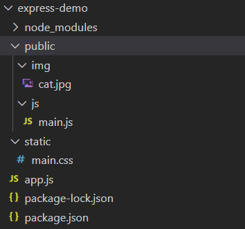

**app.js**

~~~javascript
// 0.安装express
// 1.引包

const express = require('express')

// 2.创建你的服务器应用程序
//   也就是原来的http.createServer

// express()方法就相当于在createServer
const app = express()

// 公开指定目录
// 在express中开放资源就是一个API的事情
// 就是模版引擎在API中也是一个API的事情

// 只要这样做了，你就可以直接通过/public/xx的方式访问public目录中的所有资源了
app.use('/public/', express.static('./public/'))

// 这个static文件夹里面的内容也被完全公开了,nodu_modules同理
app.use('/static/', express.static('./static/'))
app.use('/node_modules/', express.static('./node_modules/'))


// 下面的app.get代码是并行的，平滑的，不像以前要用if...else判断
// express其实也要判断，但是它给你封装的让你感受不到那个判断
// 当服务器收到get请求 / 的时候，执行回调处理函数
app.get('/', function (req, res) { 
    res.send('hello express!')
})

app.get('/about', function (req, res) { 
    res.send('关于我——express!')
})

app.get('/hello', function (req, res) {
  res.send(`
<!DOCTYPE html>
<html lang="en">
  <head>
    <meta charset="UTF-8" />
    <title>Document</title>
  </head>
<body>
  <h1>hello Express！你好</h1>
</body>
</html>
`)
})


// 相当于server.listen
app.listen(3000, function () { 
    console.log('app is running at port 3000.');
})
~~~

**main.js**

~~~javascript
window.alert('hello express!!!!')
~~~

**main.css**

~~~css
body {
  background-color: pink;
}
~~~

## 修改完代码自动重启功能(使用热加载工具)

我们这里可以使用一个第三方命令行工具，`nodemon`来帮我们解决频繁修改代码需要重启服务器问题。

`nodemon`是一个基于Node.js开发的一个第三方命令行工具，我们使用的时候需要独立安装。

~~~shell
#在任意目录执行该命令都可以
#也就是说，所有需要--global来安装的包都可以在任意目录执行
npm install --global nodemon
~~~

安装完毕之后，使用：

~~~shell
node app.js

#使用nodemon
nodemon app.js
~~~

只要是通过`nodemon app.js`启动的服务，则它会监视你的文件变化，当文件发生变化的时候，自动帮你重启服务器。

## 文件操作路径和模块标识路径

### 文件操作路径

~~~javascript
// 在文件操作的相对路径中
// ./data/a.txt     相对于当前目录
//  data/a.txt      相对于当前目录
//  /data/a.txt     当前文件模块所属磁盘根目录
//  C:/XX/XX...     绝对路径

fs.readFile('/data/a.txt', function (err, data) { 
    // 这个就比上面的少写了一个点
    // 没有点的话，/就表示磁盘根目录(我这里就是D盘了)
    // 它就会在D盘的根目录下找data文件下的a.txt文件
    if (err) { 
        console.log(err);
        return console.log('读取失败');
    }
    console.log(data.toString());
})
~~~

### 模块标识路径

~~~javascript
// 这里如果忽略了点，则也是磁盘根目录
require('/data/foo.js')

// 相对路径
require('./data/foo.js')

//模块加载的路径中的相对路径不能省略 ./(点杠) 
~~~

## 使用Express重写留言板

* 新建一个`feed-express`这个文件夹

* 先`npm init -y`初始化这个项目
* 把之前写的留言板的`public`、`views`这2个文件夹复制到这里
* 再`npm i -S express`安装express（会创建`node_modules`文件夹）
* 在`feed-express`文件夹下再创建一个`app.js`这个目录

### 在Express中配置使用模版引擎

* [art-template仓库](https://github.com/aui/art-template)
* [art-template官方文档]()

安装：

~~~shell
npm install --save art-template
npm install --save express-art-template
~~~

> 也可以`npm install --save art-template express-art-template`一次性安装多个包。

配置：

~~~javascript
app.engine('art', require('express-art-template'));
~~~

> 我们实际用的时候还是习惯第一个参数由`art`改为`html`。

使用：

~~~javascript
app.get('/', function (req, res) {
  //express默认会去项目中的views目录找404.html
  res.render('404.html',{
    title:'hello world'
  })
}
~~~

> 其实就是这么简单：装一下，配一下，用一下。
>
> 如果你第一个参数是`art`的话，`404.html`要改为`404.art`才行。

如果希望修改默认的`views`视图渲染存储目录，可以：

~~~javascript
//注意：第一个参数views千万不能写错
app.set('views',目录路径)
~~~

### 在Express中获取表单GET请求参数

Express内置了一个API，可以直接通过`req.query`来获取

~~~javascript
req.query
~~~

### 在Express中获取表单POST请求体数据

> 要结合第三方插件来做。

在Express中没有内置获取表单POST请求体的API，这里我们需要使用一个第三方包：`body-parse`。

安装：

~~~shell
npm install --save body-parser
~~~

配置：

~~~javascript
var express = require('express')
//0. 引包
var bodyParser = require('body-parser')

var app = express()

//配置body-parser
//只要加入这个配置，则在req请求对象上会多出来一个属性：body
//也就是说你就可以直接通过req.body来获取表单POST请求体数据了

// parse application/x-www-form-urlencoded
app.use(bodyParser.urlencoded({ extended: false }))

// parse application/json
app.use(bodyParser.json())
~~~

使用：

~~~javascript
app.use(function (req, res) {
  res.setHeader('Content-Type', 'text/plain')
  res.write('you posted:\n')
  //可以通过req.body来获取表单POST请求体数据
  res.end(JSON.stringify(req.body, null, 2))
})
~~~

# 小案例：增删改查

> 这里我们不用数据库，而是使用文件来保存数据(锻炼异步编码)
>
> 直接上数据库不太合适，因为数据库真的很"简单"，所有方法都封装好了。

* 先建立一个`crud`文件夹
* 再执行`npm init -y`初始化项目
* 再`npm i -S express`
* 再安装模版引擎`npm install --save art-template`
* 再来一个这个：`npm install --save express-art-template`
* 再装bootstrap：`npm i -S bootstrap `

## 起步

* 初始化
* 安装依赖
* 模块处理

## 路由设计

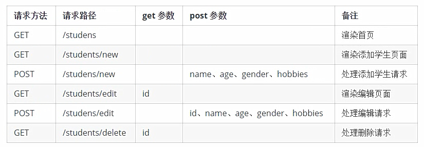

## 提取路由模块

router.js：

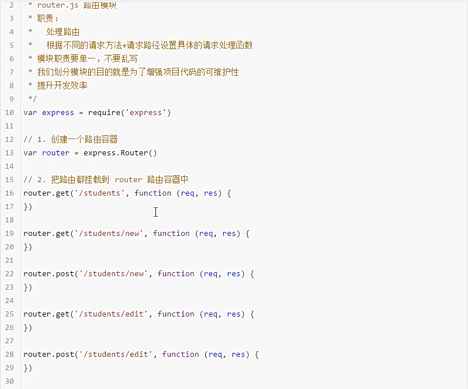

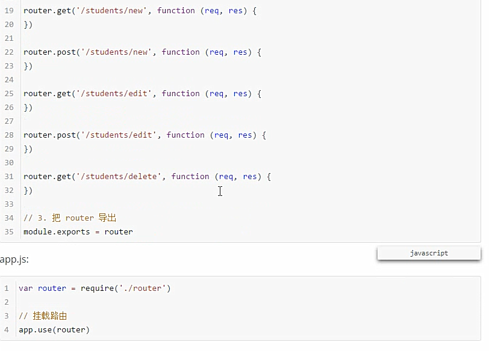

## 设计操作数据的API文件模块

~~~javascript
// 这个文件不关心业务，就是纯粹的对文件封装至少4个API(增删改查)

/**
 * student.js
 * 数据操作文件模块
 * 职责：操作文件中的数据，只处理数据，不关心业务(如怎么处理表单数据，怎么给用户发送响应)
 */

var fs = 
/**
 * 获取所有学生列表
 * return []
 */

exports.find = function () {

}
/**
 * 添加保存学生
 */
exports.save = function () {

}
/**
 * 更新学生
 */
exports.update = function () {

}
/**
 * 删除学生
 */
exports.delete = function () {

}
~~~

## 获取异步操作API的结果

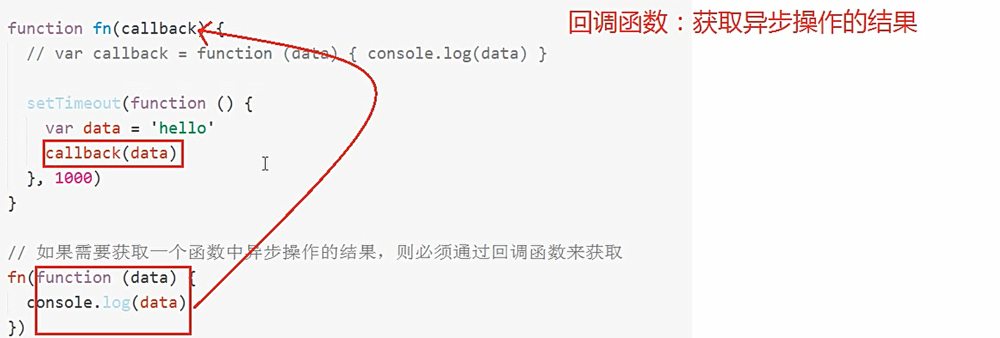

## 自己编写的步骤

* 处理模版
* 配置开放静态资源
* 配置`art-template`模版引擎
* 配置简单路由,`/students`渲染静态页出来
* 路由设计 
* 提取路由模块
* 由于接下来的一系列的业务操作都需要处理文件数据，所以我们需要封装`student.js`
* 先写好`student.js`文件结构
  * 查询所有学生列表的API
  * findById
  * save
  * undateById
  * deleteById
* 关注细节，实现具体功能
  * 通过路由收到请求
  * 接收请求中的数据(get,post)
    * req.query——get
    * req.body——post
  * 调用数据操作API处理数据
  * 根据操作结果给客户端发送响应
* 业务功能顺序
  * 列表
  * 添加
  * 编辑
  * 删除

# MongoDB数据库

> 注意：MongoDB是不需要设计表的，但是我们实际在操作的时候，还是要设计的，毕竟我们在操作数据库的时候，总不能乱填数据吧。

## 关系型数据库和非关系型数据库

* 表就是关系，或者说表与表之间存在关系 
* 所有的关系型数据库都需要通过`sql`语言来操作
* 所有的关系型数据库在操作之前都需要设计表结构
* 而且数据表还支持约束(约束是为了保持数据的完整性)
  * 唯一的
  * 主键
  * 默认值
  * 非空 
* 非关系型数据库非常的灵活，有的非关系型数据库就是`key-value`键值对，没有表的概念。
* 但是MongoDB是长的最像关系型数据库的非关系型数据库。
  * 数据库 ——> 数据库
  * 数据表 ——>集合(数组)
  * 表记录——>(文档对象)
* MongoDB不需要设计表结构
* 也就是说你可以任意的往里面存数据，没有结构性这么一说。

## 启动和关闭数据库

启动：

~~~shell
# mongodb默认使用执行mongod命令所处盘符根目录下的/data/db作为自己的数据存储目录
# 所以在第一次执行该命令之前先自己手动新建一个/data/db
mongod
~~~

如果想要修改默认的数据存储目录，可以：

~~~shell
mongod --dbpath=数据存储目录路径
# 但是改了挺麻烦，建议还是使用默认的
~~~

停止：

~~~shell
#在开启服务的控制台，直接ctrl + c即可停止
~~~

## 连接和退出数据库

* 在连接数据库之前一定要确保数据库已经开启了。

连接(数据库要是没有开，那就肯定连不上)：

~~~shell
# 改命令默认连接本机的MongoDB服务
mongo
~~~

退出：

~~~shell
# 在连接状态输入exit退出连接
exit
~~~

## 基本命令

* `show dbs`

  * 查看显示所有数据库
* `db`
  * 查看当前操作的数据库
  * 默认是`test`，但是它是空的，所以你`show dbs`时是没有test这个选项的。只有你修改了test数据库，它才会显示。

* `use 数据库名称`

  * 切换到指定的数据库(如果没有会新建)

* 插入数据

  ~~~shell
  show dbs
  use itcast(没有会新建)
  db 
  show dbs
  db.students.insertOne({"name":"jack"})
  show dbs
  show collections
  db.students.find()
  ~~~

## 在Node中如何操作MongoDB数据库

## 使用官方的MongoDB包(原生，我们不用)

> https://github.com/mongodb/node-mongodb-native

## 使用第三方mongoose来操作MongoDB数据库

> https://mongoosejs.com/

第三方包：`mongoose`基于MongoDB官方做了一层封装，所以更加的简单，我们做项目用这个。

### 使用前的准备

~~~javascript
const mongoose = require('mongoose');

//1.连接数据库
mongoose.connect('mongodb://localhost:27017/itcast', {
    //itcast这个数据库不用你自己创建，如果没有的话，它会自动帮你创建的
    //当你插入第一条数据之后会自动创建出来
    useNewUrlParser: true,
    useUnifiedTopology: true
});

//2.设计集合结构(表结构)
// 字段名称就是表结构中的属性名称
// 约束的目的是为了保证数据的完整性，不要有脏数据
const userSchema = new mongoose.Schema({
    username: {
        type: String,
        required: true // 必须有
    },
    password: {
        type: String,
        required: true
    },
    email: {
        type: String
    }
});

// 3. 将文档结构发布为模型
//    mongoose.model 方法就是用来将一个架构发布为 model
//    第一个参数：传入一个大写名词单数字符串用来表示你的数据库名称
//                 mongoose 会自动将大写名词的字符串生成 小写复数 的集合名称
//                 例如这里的 User 最终会变为 users 集合名称
//    第二个参数：架构 Schema
//   
//    返回值：模型构造函数
const User = mongoose.model('User', userSchema);
~~~

当我们有了模型构造函数之后，就可以使用这个构造函数对 users 集合中的数据为所欲为了（增删改查）

### 添加数据

~~~javascript
const admin = new User({
  // 这个只是被new出来了，还没有被持久化存储起来
  username: 'zs',
  password: '123456',
  email: 'admin@admin.com'
})

admin.save(function (err, ret) {
    // admin.save就可以持久化数据到数据库里面了
  if (err) {
    console.log('保存失败')
  } else {
    console.log('保存成功')
    console.log(ret)
  }
})
~~~

### 查询数据

#### 查询所有

~~~javascript
// **********************
// #region /查询数据
// **********************
//这个是查询所有
User.find(function (err, ret) {
  if (err) {
    console.log('查询失败')
  } else {
    console.log(ret)
  }
})


~~~

#### 按条件查询所有

~~~javascript
User.find({
  username: 'lisi'
}, function (err, ret) {
  if (err) {
    console.log('查询失败')
  } else {
    console.log(ret)
  }
})
~~~

#### 按条件查询单个

~~~javascript
User.findOne({
    //findOne表示只找匹配的第一个
    username: 'lisi ',
    password: '123456789'
    //表示查询用户名是lisi，并且密码是123456789的第一个人
}, function (err, ret) {
  if (err) {
    console.log('查询失败')
  } else {
    console.log(ret)
  }
})
~~~

### 删除数据

~~~javascript
// **********************
// #region /删除数据
// **********************
User.remove({
  username: 'zs'
}, function (err, ret) {
  if (err) {
    console.log('删除失败')
  } else {
    console.log( '删除成功')
    console.log(ret)
  }
})
~~~

### 更新数据

~~~javascript
// **********************
// #region /更新数据
// **********************
User.findByIdAndUpdate('60b71e2c4bc9313d40daf9a8', {
  password: '123'
}, function (err, ret) {
  if (err) {
    console.log('更新失败')
  } else {
    console.log('更新成功')
  }
})
~~~

# 使用Node操作MySQL数据库

安装：

~~~javascript
npm i --save mysql
~~~

使用：

~~~javascript
var mysql = require('mysql');

//1.创建连接
var connection = mysql.createConnection({
    host: 'localhost',
    user: 'root',
    password: '123456',
    database: 'users'   //对不起，我一不小心把数据库名字和表名起存储成一样的了
});

//2.连接数据库(打开冰箱门)
connection.connect();

//3.执行数据操作(把大象放进冰箱)
//所有的增删改查都在这里写！！
connection.query('SELECT * FROM `users`', function (error, results, fields) {
    if (error) throw error;
    console.log('The solution is: ', results);
});

// connection.query('INSERT INTO users VALUES(NULL,"admin","123456")', function (error, results, fields) {
//     //ID不能漏，第一个参数NULL表示使用自动生成的id
//     if (error) throw error;
//     console.log('The solution is: ', results);
// });

//关闭连接(关闭冰箱门)
connection.end();
~~~

# 异步编程

## 回调函数

不成立的情况1：

~~~javascript
function add(x, y) {
    console.log(1);
    setTimeout(function () {
        var ret = x + y;
        return ret
        // 这里的return你是不可能拿到的
    }, 1000)
    console.log(3);
    //到这里就结束了，不会等到前面的定时器，所以直接就返回了默认值undefined
}

console.log(add(10, 20));
// 1
// 3
//undefined
// 它不会等待，到3函数就结束了，不会管你异步操作的。函数默认你没有显示return,所以函数默认返回的就是undefined
~~~

不成立的情况2：

~~~javascript
function add2(x, y) {
    var ret;
    console.log(1);
    setTimeout(function () {
        console.log(2);
        ret = x + y;
    }, 1000);
    console.log(3);
    return ret
    //3完了马上就return 这个ret,是undefined(因为定时器还没有执行到)
    //然后再等1秒后，再打印2
}

console.log(add2(10, 20));
//1
//3
//undefined
//2
~~~

可以成立的情况1(但是没有什么意义)：

~~~javascript
var ret
// 这个ret是全局变量
function add3(x, y) {
    console.log(1);
    setTimeout(function () {
        console.log(2);
        ret = x + y;
        //函数一秒之后针对全局变量进行了赋值，这个是可以的
        //一秒后就能拿到全局变量ret，那我再写一个回调函数，等个2秒，就可以拿到ret了
    }, 1000);
    console.log(3);
}

setTimeout(function () {
    console.log(ret);
    // 我2秒后再获取全局变量，这个时候是可以获取到的
    // 但是这样写，函数就没有封装性了，你把这个函数写到外面了，就没有什么意义了。
},2000)

console.log(add3(10, 20));

//1
//3
//undefined
//2(1秒后)
//30(2秒后)
~~~

注意：

~~~javascript
// 注意：凡是需要得到一个函数内部异步操作的结果
//    setTimeout
//    readFile
//    writeFile
//    ajax
//   这种情况必须通过：回调函数
//  什么是回调函数呢？你送你女朋友回家，你女朋友说她回家了以后给你打电话，她现在还没打，因为她还没到家，但是她到家了以后肯定会给你打的，她到家给你打电话这件事情就叫回调。
~~~

可以成立的情况2之回调函数：

老师的话：

如果我讲到这种程度了，你还不太懂，说明一个问题，没有认知能力（哈哈哈，稍微打击了一下同学们）。

如何熟练到像定义一个变量一样来封装一个带有回调函数的方法。

主要原因在于写得少，这是JavaScript编程的一大特色：异步编程。

甚至很多具有服务端开发经验的都不太容易熟悉这种方式。

~~~javascript
function add4(x, y, callback) {
    //callback就是回调函数
    //var x = 10;
    //var y = 20;
    //var callback = function(ret){console.log(ret)}
    console.log(1);
    setTimeout(function () {
        var ret = x + y
        callback(ret)
        // 等异步操作结束之后调用callback函数，传入的参数是ret这个结果
    },1000)
}

add4(10, 20, function (ret) {
    console.log(ret);
    //我现在拿到这个结果之后可以做任何操作，这个就是封装函数的意义。
    //通常情况下封装函数都会出来一个结果，我们用这个结果来做一些事情。
})

//1
//30
~~~

基于原生XMLHTTPRequest封装get方法。(使用`hs -o`命令打开http服务器)

~~~javascript
<!--
 * @Author: liming
 * @Date: 2021-05-24 15:19:29
 * @LastEditTime: 2021-05-24 15:57:33
 * @FilePath: \LearnNode.js\03-黑马李鹏周代码\02-Node代码学习-手敲\05\01-封装ajax方法.html
-->
<!DOCTYPE html>
<html lang="en">

<head>
    <meta charset="UTF-8">
    <meta http-equiv="X-UA-Compatible" content="IE=edge">
    <meta name="viewport" content="width=device-width, initial-scale=1.0">
    <title>Document</title>
</head>

<body>
    <script>
        // setTimeout
        // readFile
        // wirteFile
        // readdir
        // ajax
        // 往往异步 API 都伴随有一个回调函数
        // var ret = fn() ——一般方法这么写的
        // $.get('dsadas', fucntion () {})——回调函数这么写的
        // var ret = $.get()

        // 一：未封装写法
        // var xhr = new XMLHttpRequest()
        // xhr.open('GET', 'data.json')
        // xhr.send()

        // // 和onreadystatechange功能相同的方式：
        // // 写法1：
        // xhr.onload = function () {
        //     console.log(xhr);
        //     console.log(xhr.responseText);
        // }

        // 写法2：
        //   xhr.onreadystatechange = function(){
        //       if(xhr.readyState === 4){
        //           if(xhr.status >= 200 && xhr.status < 300){
        //               console.log(xhr.responseText);
        //           }
        //       }
        //   }


        // 二：现在开始来封装代码了
        function get(url,callback) {
            var xhr = new XMLHttpRequest()

            xhr.open('GET', url)

            xhr.send()

            // 和onreadystatechange功能相同的方式：
            // 写法1：
            // 当请求加载成功之后要调用指定的函数
            xhr.onload = function () {
                //注意：我现在需要得到这里的xhr.responseText
                // console.log(xhr.responseText);
                callback(xhr.responseText)
            }
        }
        get('data.json',function(data){
            console.log(data);
        })
    </script>
</body>

</html>
~~~

# Promise

> 只有异步编程才涉及到这些。

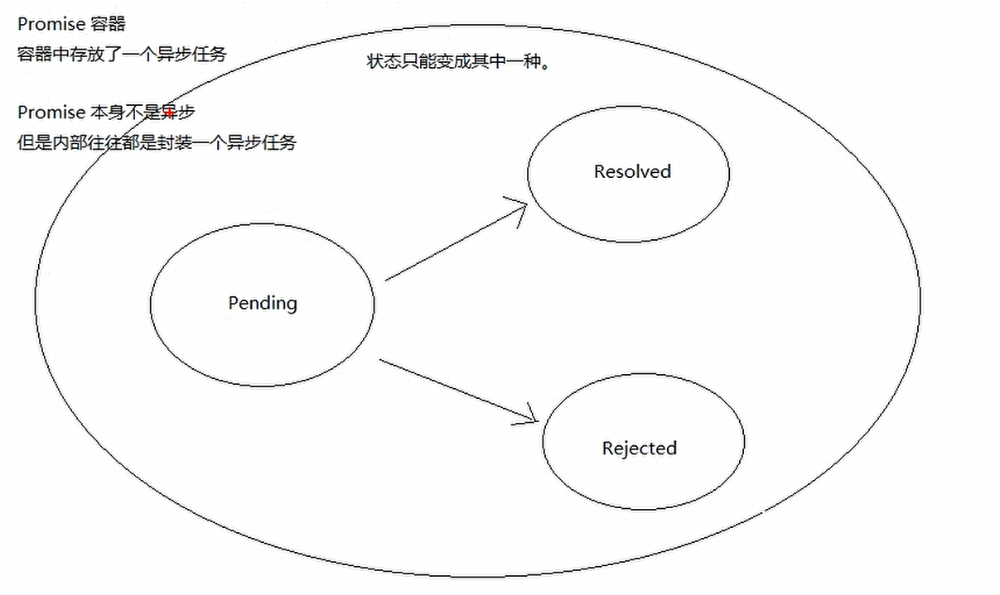

## 回调地狱

无法保证顺序的代码：

~~~javascript
var fs = require('fs')

fs.readFile('./data/a.txt', 'utf8',function (err, data) {
    if (err) {
        // return console.log("读取失败")
        throw err
        //表示抛出异常，这个代码有2个作用：
        //1.阻止程序的执行
        //2.把错误消息打印到控制台
    }
    console.log(data);
})

fs.readFile('./data/b.txt', 'utf8', function (err, data) {
    if (err) {
        // return console.log("读取失败")
        throw err
        //表示抛出异常，这个代码有2个作用：
        //1.阻止程序的执行
        //2.把错误消息打印到控制台
    }
    console.log(data);
})

fs.readFile('./data/c.txt', 'utf8', function (err, data) {
    if (err) {
        // return console.log("读取失败")
        throw err
        //表示抛出异常，这个代码有2个作用：
        //1.阻止程序的执行
        //2.把错误消息打印到控制台
    }
    console.log(data);
})

//现在这3段代码你无法保证它们的读取顺序的！！
~~~

可以通过回调**嵌套的方式**来保证顺序：

~~~javascript
var fs = require('fs')

fs.readFile('./data/a.txt', 'utf8', function (err, data) {
    if (err) {
        // return console.log("读取失败")
        throw err
        //表示抛出异常，这个代码有2个作用：
        //1.阻止程序的执行
        //2.把错误消息打印到控制台
    }
    console.log(data);
    fs.readFile('./data/b.txt', 'utf8', function (err, data) {
        if (err) {
            // return console.log("读取失败")
            throw err
            //表示抛出异常，这个代码有2个作用：
            //1.阻止程序的执行
            //2.把错误消息打印到控制台
        }
        console.log(data);
        fs.readFile('./data/c.txt', 'utf8', function (err, data) {
            if (err) {
                // return console.log("读取失败")
                throw err
                //表示抛出异常，这个代码有2个作用：
                //1.阻止程序的执行
                //2.把错误消息打印到控制台
            }
            console.log(data);
        })
    })
})

// 这样写就可以保证顺序了。
// 但是这样写一层套一层很不好看
~~~

为了解决以上编码方式带来的问题(回调地狱嵌套)，所以在ES6中新增了一个API，叫`Promise`构造函数。

* Promise的英文就是承诺，保证的意思。(I Promise you)
* 读取文件，文件越大，读取速读就越慢，至于什么什么可以读取完成，你是说不准的。
* Promise你可以把它理解成一个容器，容器中存放了一个异步任务。

**代码1.0：**

~~~javascript
var fs = require("fs")

// 在ES6中新增了一个API叫Promise
// Promise是一个构造函数。

console.log(1);
// 创建Promise容器
// 第1步：给别人一个承诺 I Promise you
// 在容器里面把你的任务写到里面，接收一个function
// Promise容器一旦创建，就可以执行里面的代码(function里面的代码)
// 但因为是异步的，它也不是立即就能得到结果(注意：承诺本身不是异步的(new一个Promise哪来的异步啊！！！)，承诺里面的任务是异步的)
// 比如读取文件，是需要时间的，经过一段时间后才能确定你是读取成功了还是失败了
new Promise(function () {
    console.log(2);
    fs.readFile('./data/a.txt', 'utf8', function (err, data) {
        if (err) {
            //失败了，承诺容器中的任务失败了
        } else {
            //承诺容器中的任务成功了
            console.log(3);
            console.log(data);
        }
    })
})

console.log(4);

// 最终执行结果为：
// 1  
// 2  ——承诺本身不是异步的，所以按顺序执行到console.log(2);再接下来发现一个异步任务readFile函数，这个才是异步的
// 4
// 3 ——承诺里面的异步任务完成才会打印出3
// hello aaa
~~~

**代码2.0：**

~~~javascript
var fs = require("fs")

// 在ES6中新增了一个API叫Promise
// Promise是一个构造函数。

// console.log(1);
// 创建Promise容器
// 第1步：给别人一个承诺 I Promise you
// 在容器里面把你的任务写到里面，接收一个function
// Promise容器一旦创建，就可以执行里面的代码(function里面的代码)
// 但因为是异步的，它也不是立即就能得到结果(注意：承诺本身不是异步的(new一个Promise哪来的异步啊！！！)，承诺里面的任务是异步的)
// 比如读取文件，是需要时间的，经过一段时间后才能确定你是读取成功了还是失败了
var p1 = new Promise(function (resolve, reject) {
    // resolve, reject是形参，名字是随便起的
    // console.log(2);
    fs.readFile('./data/a.txt', 'utf8', function (err, data) {
        if (err) {
            //失败了，承诺容器中的任务失败了
            // console.log(err);

            // 调用reject就相当于调用then方法的第二个参数函数
            reject(err)
            //把容器的Pending状态变为Rejected 
        } else {
            //承诺容器中的任务成功了
            // console.log(3);
            // console.log(data);
            // 把容器的Pending状态变为Resolved
            // 也就是说这里调用的resolve方法实际上就是then方法传递的那个function
            resolve(data)
        }
    })
})

// console.log(4);

// p1就是那个承诺
// 当p1成功了，然后(then)做指定的操作
// then方法接收2个参数(都是可选的)
// 第一个参数接收的function就是容器中的resolved函数
// 第二个参数接收的function就是容器中的reject函数
p1
    .then(function (data) {
       console.log(data);
    }, function (err) {
        console.log('读取文件失败了' + err);
    })
~~~

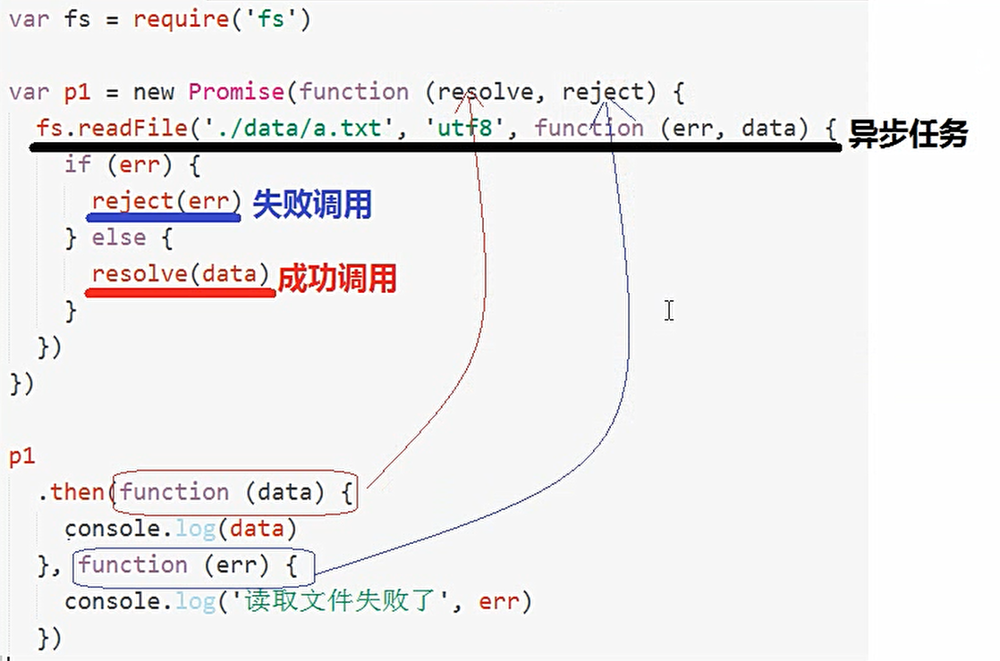

**代码3.0：**

~~~javascript
var fs = require("fs")
var p1 = new Promise(function (resolve, reject) {
    fs.readFile('./data/a.txt', 'utf8', function (err, data) {
        if (err) {
            reject(err)

        } else {

            resolve(data)
        }
    })
})

var p2 = new Promise(function (resolve, reject) {
    fs.readFile('./data/b.txt', 'utf8', function (err, data) {
        if (err) {
            reject(err)

        } else {

            resolve(data)
        }
    })
})

var p3 = new Promise(function (resolve, reject) {
    fs.readFile('./data/c.txt', 'utf8', function (err, data) {
        if (err) {
            reject(err)

        } else {

            resolve(data)
        }
    })
})


p1
    .then(function (data) {
        console.log(data);
        // 当p1读取成功的时候，
        // return 123
        // 这里return 123,后面console.log(data);就可以打印出123
        // 如果没有return，后面收到的就是undefined
        // 当前函数中return的结果就可以在后面的then中function接收到

        // 上面说的那些return的数据(比如return 123)没什么卵用
        // 真正有用的是return一个Promise对象(比如return p2)
        // 当return一个Promise对象的时候，后续的then中的方法的第一个参数会作为p2的resolve，第二个参数会作为p2的reject
        return p2
    }, function (err) {
        console.log('读取文件失败了' + err);
    })
    .then(function (data) {
        console.log(data);
        return p3
    })
    .then(function (data) {
        console.log(data);
        console.log('end');
    })
    // 这个就是then的链式调用
~~~

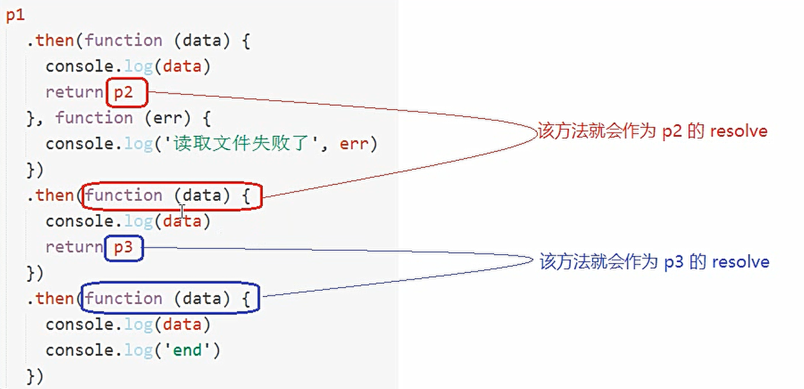

这里p1,p2,p3的代码高度重合，我们可以把代码进行封装一下。

~~~javascript
var fs = require('fs')

// var p1 = new Promise(function (resolve, reject) {
//     fs.readFile('./data/a.txt', 'utf8', function (err, data) {
//         if (err) {
//             reject(err)

//         } else {

//             resolve(data)
//         }
//     })
// })

function pReadFile(filePath,) {
 return  new Promise(function (resolve, reject) {
        fs.readFile(filePath, 'utf8', function (err, data) {
            if (err) {
                reject(err)

            } else {

                resolve(data)
            }
        })
    })
}

pReadFile('./data/a.txt')
    .then(function (data) {
        console.log(data);
        return pReadFile('./data/b.txt')
    })
    .then(function (data) {
        console.log(data);
        return pReadFile('./data/c.txt')
    })
    .then(function (data) {
        console.log(data);
    })
~~~


